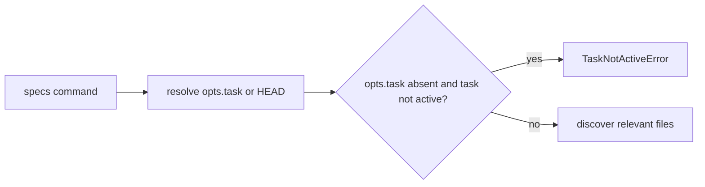
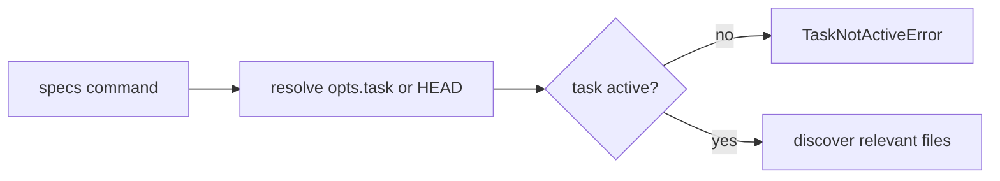

# Issue 225 specs completed task guard

## Scope

Add the same active-task lifecycle guard to `playspec specs --task <taskId>` that the HEAD-based `playspec specs` path already applies. Keep the change limited to the `specs` command and focused CLI regression coverage.

Out of scope: redesigning task resolution, archive lookup, prompt/phase/next/use/link/add-context/rollback/desync/migrate/create behavior, or adding a read-only completed-task inspection mode.

## Use Case Alignment

`playspec specs` is an active-workflow helper for discovering and printing/copying files relevant to the current task and phase. A caller may pass `--task` to inspect an active task other than HEAD without changing HEAD. The command should not allow a completed task to drive active prompt context behavior, regardless of whether the task is selected through HEAD or `--task`.

## Current Implementation Summary

Verified:

- `src/cli/commands/specs.ts` resolves either `opts.task` or HEAD through `ActiveTaskResolver.resolveTask(opts.task)`.
- The current guard only throws `TaskNotActiveError` when `opts.task` is absent and the resolved task is not active.
- When `opts.task` is present, completed tasks continue into workflow loading, phase resolution, and relevant-file discovery.
- `TaskNotActiveError` already contains the required message and recovery hint.
- `tests/cli.test.ts` has active-task coverage for `specs --task` preserving HEAD, plus path-only, print, binary/large, missing-path, and interactive coverage.

Inferred:

- Completed tasks remaining under `.playspec/tasks/active/<taskId>/task.yaml` can be loaded by the explicit resolver path until archived, so the bypass does not require archive lookup changes.

## Relevant Files Reviewed

- `src/cli/commands/specs.ts`: active command entry point and current conditional active guard.
- `src/core/active-task-resolver.ts`: explicit task ID bypasses HEAD and loads a task record directly.
- `src/core/errors.ts`: `TaskNotActiveError` message and active-task recovery hint.
- `tests/cli.test.ts`: focused CLI test area for `specs` command behavior.

## Active Entry Points And Bypasses

Verified active entry point:

- `runSpecs(workspaceRoot, opts)` is used by the CLI `specs` command.

Verified bypass:

- `opts.task` causes the current guard `if (!opts.task && task.status !== 'active')` to skip completed-task rejection.

No alternate active path was found in the CLI tests or command implementation for `specs`.

## Proposed Direction

Change the `specs` guard to reject any non-active resolved task:

```ts
if (task.status !== 'active') {
  throw new TaskNotActiveError(task.id, task.status);
}
```

This preserves the existing error type and recovery hint, rejects before discovery or output modes run, and keeps active explicit task behavior unchanged.

## File-By-File Plan

`src/cli/commands/specs.ts`

- Remove the `!opts.task` condition from the active-task guard.
- Leave all discovery, warning, path-only, print, copy, large-file, and binary-file handling unchanged.

`tests/cli.test.ts`

- Add a regression next to `resolves specs --task without changing HEAD`.
- Create an active task and relevant spec file.
- Mark that task completed through `YamlTaskStore.updateTask`.
- Run `specs --task <completedTaskId> --path-only` in non-interactive mode.
- Assert exit code is non-zero, stderr contains `Task "<id>" is not active`, and stdout does not include the relevant spec path.

## Risks And Open Questions

Risk: users who used `specs --task <completed>` for ad hoc inspection will lose that convenience. This is intentional per issue scope; completed task inspection should use explicit read-only artifacts or a future dedicated command.

Open question: the GitHub issue title mentions workflow phase IDs in completion artifact filenames, but the issue body, acceptance criteria, and tests describe `specs --task <completed>` lifecycle behavior. This implementation follows the detailed body and acceptance criteria.

## Reader Aids

Verified current flow:



Proposed flow:


