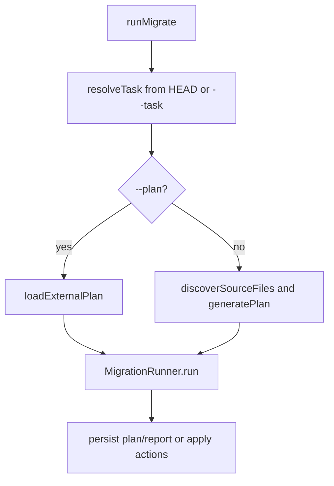
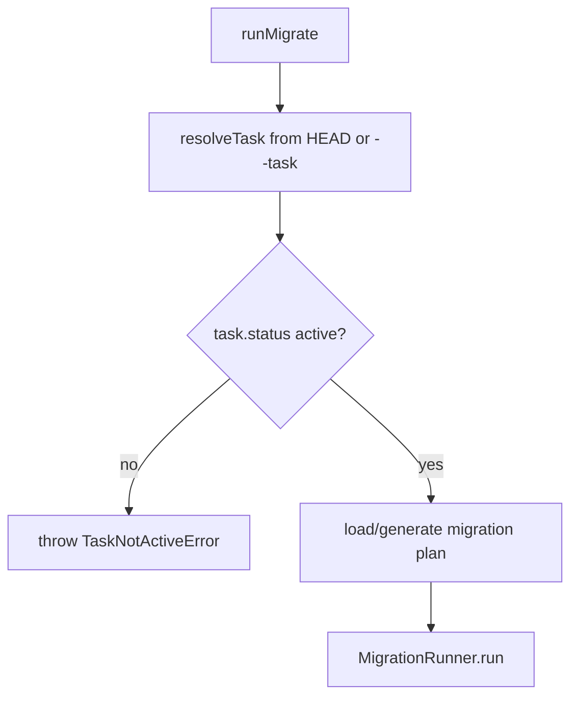

# Issue #232 migrate completed task guard

## Scope

Add lifecycle safety to the deprecated `playspec migrate` CLI command only. `runMigrate()` must reject a resolved task whose status is not `active` before loading an external migration plan, discovering source files, generating a plan, creating migration artifacts, creating backups, or invoking `MigrationRunner`.

Out of scope: migration schema changes, action semantics changes for active tasks, workflow wording changes, and any viewer/archive redesign.

## Use Case Alignment

Users can select a task for migration implicitly through `.playspec/HEAD` or explicitly through `playspec migrate --task <id>`. Completed tasks may still exist under `.playspec/tasks/active`, but lifecycle-closed task artifacts must not be mutated by active-context commands. `migrate` should follow the same completed-task rejection model as `next`, `prompt`, `add-context`, `phase`, `rewind`, and `use`.

## High-Level Current Implementation Summary

Verified behavior:

- `src/cli/commands/migrate.ts` resolves the target task with `ActiveTaskResolver.resolveTask(options.task)`.
- It does not check `task.status` before external plan loading or source discovery/plan generation.
- `MigrationRunner.run()` validates plans, checks archive flags, and blocks non-dry-run task-mutation actions against inactive tasks before persisting the plan.
- The runner guard does not cover all CLI acceptance criteria because completed tasks still reach plan loading/generation, dry-run plans, and non-task migration actions.

Inferred behavior:

- A completed HEAD task with no source documents currently exits successfully after printing "No source documents found."
- A completed task with dry-run migration actions can persist plan/report artifacts because the runner's inactive-task guard skips `dry-run`.

## Relevant Files Reviewed

- `src/cli/commands/migrate.ts`: command entry point and missing lifecycle guard.
- `src/migration/migration-runner.ts`: downstream validation/persistence and existing task-mutation guard.
- `src/core/errors.ts`: `TaskNotActiveError` message and hint.
- `src/cli/commands/next.ts`, `src/cli/commands/use.ts`, `src/cli/commands/add-context.ts`: examples of CLI-level active-task guards.
- `tests/cli.test.ts`: CLI harness, migrate compatibility test, and existing completed-task migrate regression for auto task mutations.

## Active Entry Points And Bypasses

Active entry point:

- `playspec migrate [--task <id>] [--plan <file>] [--mode <mode>]`

Bypass paths:

- HEAD path: no `--task`, so `ActiveTaskResolver` reads HEAD and returns the task record regardless of status.
- Explicit path: `--task <id>` resolves that task record regardless of status.
- External plan path: `--plan` can be read after resolving a completed task.
- Generated plan path: source discovery and generated `add_context_ref` actions can run after resolving a completed task.

## Current Architecture

Verified flow:



Proposed flow:



## Verified Behavior

- `TaskNotActiveError` formats the existing safety language as `Task "<id>" is not active (status: <status>).`
- Existing active-task migrate compatibility expects `playspec migrate` to remain callable and to print the deprecation warning.
- Existing CLI test coverage already checks one completed explicit `--task` task-mutation plan path, but it does not cover HEAD-based completed-task rejection or pre-run artifact prevention for dry-run/non-mutating paths.

## Problems

- `runMigrate()` lacks the same active-task guard used by other lifecycle-sensitive CLI commands.
- Rejection is delegated too far downstream and only for a subset of migration plans.
- Completed task rejection should happen before plan loading/generation and before `MigrationRunner.run()`.

## Proposed Direction

Import `TaskNotActiveError` in `src/cli/commands/migrate.ts` and add a local guard immediately after:

```ts
const task = await resolver.resolveTask(options.task);
```

If `task.status !== 'active'`, throw `new TaskNotActiveError(task.id, task.status)`.

## File-By-File Plan

- `src/cli/commands/migrate.ts`: add the active-task guard after resolution.
- `tests/cli.test.ts`: add HEAD-based completed-task rejection and explicit `--task` completed rejection that use dry-run plans to prove no plan/report artifacts are created and task YAML remains unchanged.

## Risks And Open Questions

Risks:

- Low. The command is deprecated/hidden and the change only rejects inactive tasks earlier.

Open questions:

- None for the requested scope.

## Reader Aids

The acceptance criteria are best verified at the CLI layer because the bug is command orchestration order, not runner mutation semantics. The runner's existing guard should remain as a defensive lower-level check.
