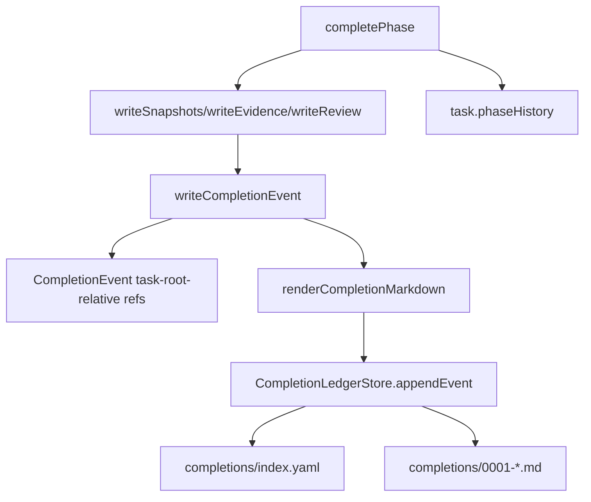
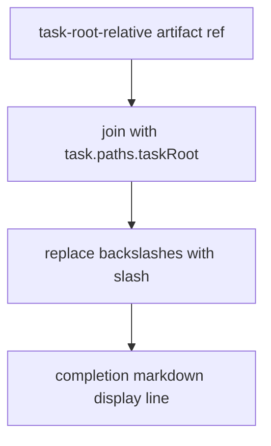

# Issue #241: Completion Ledger POSIX Artifact Display Paths

## Scope

Normalize completion ledger markdown artifact display paths to workspace-relative POSIX-style strings. The change applies only to human-readable completion markdown generated by `renderCompletionMarkdown()` for evidence, snapshot, and review artifact sections.

Out of scope:

- Completion ledger storage redesign.
- Artifact file location changes.
- Evidence, snapshot, review, rollback, or repeated-visit naming semantics.
- Any persisted task-root-relative artifact reference normalization.

## Use Case Alignment

Users and automation copy artifact references from completion markdown. Those paths should be portable workspace-relative strings using `/` separators, regardless of whether the completion ran on macOS, Linux, or Windows.

## High-Level Current Implementation Summary

Verified behavior:

- `PlaySpecCore.completePhase()` writes snapshots, evidence, optional review artifacts, a rollback safe point, a completion ledger event, and task history.
- `writeCompletionEvent()` stores `CompletionEvent.evidenceFiles`, `snapshotFiles`, `reviewFile`, and `markdownFile` as task-root-relative strings.
- `renderCompletionMarkdown()` maps those task-root-relative strings into display paths by joining each artifact path with `task.paths.taskRoot`.
- `CompletionLedgerStore.appendEvent()` persists the markdown file and appends the typed event to `completions/index.yaml`.

Inferred behavior:

- On Windows, `path.join(task.paths.taskRoot, taskRootRelativePath)` can render markdown display paths with backslashes even when persisted event references remain POSIX-like task-root-relative strings.

## Relevant Files Reviewed

- `src/core/playspec-core.ts`
  - `completePhase()`
  - `writeCompletionEvent()`
  - `renderCompletionMarkdown()`
  - evidence/snapshot/review artifact writers
- `src/storage/completion-ledger-store.ts`
  - `appendEvent()`
  - `readMarkdown()`
- `src/core/types.ts`
  - `CompletionEvent`
  - `CompletionResult`
- `src/core/schemas.ts`
  - `CompletionEventSchema`
- `tests/integration/completion-engine.test.ts`
  - completion ledger event and markdown assertions
- `tests/cli.test.ts`
  - CLI completion markdown read path coverage

## Active Entry Points And Bypasses

Active entry points:

- `PlaySpecCore.completePhase(taskId, options)`
- CLI `playspec complete`
- CLI `playspec show-completion`
- CLI `playspec log --markdown`

Bypasses and alternate paths:

- `CompletionLedgerStore.readMarkdown()` reads stored markdown as-is. It should not rewrite existing markdown at read time.
- `CompletionLedgerStore.appendEvent()` persists the typed event and markdown provided by core. It should not normalize the event's artifact arrays.
- Task history receives artifact references from completion artifact writer return values, not from markdown rendering.

## Current Architecture

Verified flow:

## Verified Behavior

- `writeCompletionEvent()` assigns event artifact fields directly from completion artifact writer results.
- Existing tests assert stored event values like `evidence/phase1_git_status.txt`, `snapshots/phase1_before_complete.yaml`, and `reviews/phase1_review.yaml`.
- Existing markdown tests assert workspace-relative paths in the generated markdown, but only under the host platform path behavior.

## Problems

- `renderCompletionMarkdown()` currently relies on platform-specific `path.join()` for display paths.
- The markdown path contract is workspace-relative POSIX-style strings, but Windows runtime can produce `\` separators.
- Current tests do not simulate Windows-style path joining on a non-Windows host.

## Proposed Direction

Add a small display helper in `renderCompletionMarkdown()` or nearby core-local scope that:

- joins `task.paths.taskRoot` with the task-root-relative artifact reference,
- normalizes all path separators in the display string to `/`,
- is used only for evidence, snapshot, and review markdown display lines.

The helper must not mutate:

- `CompletionEvent.evidenceFiles`
- `CompletionEvent.snapshotFiles`
- `CompletionEvent.reviewFile`
- `TaskRecord.phaseHistory` artifact references
- `completions/index.yaml` event artifact references

Proposed display flow:

## File-By-File Plan

- `src/core/playspec-core.ts`
  - Update completion markdown display path rendering to normalize separators to `/`.
  - Keep completion event construction unchanged.
- `tests/integration/completion-engine.test.ts`
  - Add focused regression coverage that simulates Windows-style joining without depending on host OS.
  - Assert evidence plus snapshot or review markdown display paths contain `/` and no `\`.
  - Assert persisted completion event and ledger artifact references remain task-root-relative.

## Risks And Open Questions

Risks:

- Accidentally normalizing persisted event or task history artifact references instead of markdown display only.
- Over-broad path normalization could alter unrelated markdown content if applied outside artifact display lines.

Open questions:

- None. The issue scope is narrow and the current code path is direct.

## Reader Aids

Key invariant: completion artifact storage remains task-root-relative; only completion markdown display paths become POSIX workspace-relative strings.
