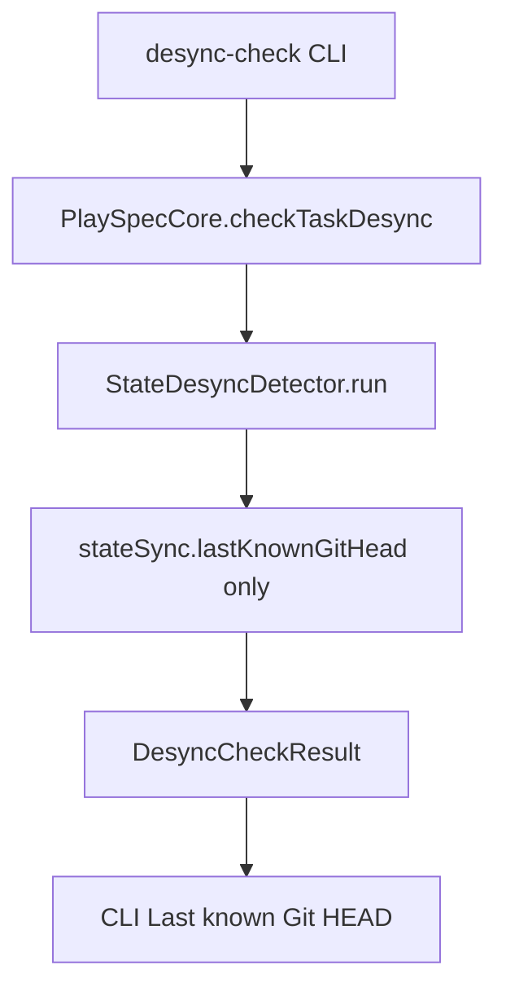
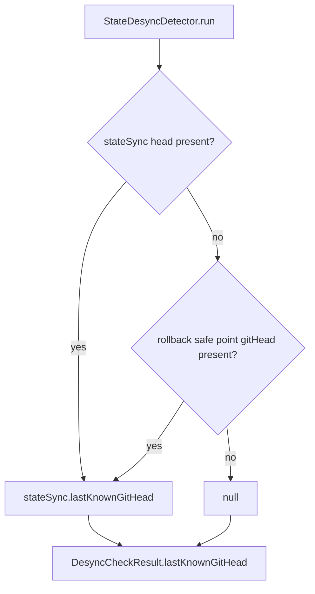

# Issue 243: desync-check rollback safe point fallback

## Scope

Fix `playspec desync-check` baseline resolution for active task records where `stateSync.lastKnownGitHead` is missing but `rollback.lastSafePoint.gitHead` is present. Keep the behavioral change inside `StateDesyncDetector.run()` and add focused CLI regression coverage.

Out of scope: migration redesign, rollback execution changes, completion ledger changes, workflow registry changes, and unrelated completed-task guards.

## Use Case Alignment

Operators may continue older, partially migrated, or manually repaired tasks that still have rollback safe point metadata but lack `stateSync`. In that case, `desync-check` should use the rollback safe point Git head as the last known safe baseline so it can warn about commits made after the safe point.

## High-Level Current Implementation Summary

Phase completion writes the same current Git head into `task.stateSync.lastKnownGitHead` and `task.rollback.lastSafePoint.gitHead`. Rollback planning already treats the rollback safe point Git head as the baseline. Desync checking does not: it reads only `task.stateSync?.lastKnownGitHead ?? null`, which makes committed diff collection and HEAD-change severity unavailable when `stateSync` is absent.

## Relevant Files Reviewed

- `src/core/state-desync-detector.ts`: active desync classifier and source of `DesyncCheckResult.lastKnownGitHead`.
- `src/cli/commands/desync-check.ts`: CLI printer for detector results.
- `src/core/rollback-manager.ts`: rollback planning baseline uses `safePoint.gitHead`.
- `src/core/types.ts`: `TaskRecord`, `TaskStateSync`, `TaskRollbackState`, `RollbackSafePoint`, and `DesyncCheckResult`.
- `src/core/schemas.ts`: nullable `stateSync.lastKnownGitHead` and `rollback.lastSafePoint.gitHead`.
- `tests/cli.test.ts`: existing `desync-check` and rollback regression tests.

## Active Entry Points And Bypasses

Verified active path:

1. `playspec desync-check [--task]`
2. `src/cli/commands/desync-check.ts` resolves an active task.
3. `PlaySpecCore.checkTaskDesync(task.id)` loads the task.
4. `StateDesyncDetector.run(task)` builds the result.
5. CLI prints `Last known Git HEAD: ${result.lastKnownGitHead ?? 'none'}`.

Bypass path:

- `StateDesyncDetector.run()` can also be called by core/MCP flows. Fixing the detector, rather than only CLI printing, keeps all callers consistent.

## Current Architecture

Verified:

- `StateDesyncDetector.run()` computes `lastKnownGitHead` from `task.stateSync?.lastKnownGitHead ?? null`.
- The detector only returns "No completion safe point exists yet." when no `lastKnownGitHead` and no `task.rollback?.lastSafePoint` exist.
- If a rollback safe point exists with a Git head but `stateSync` is absent, the detector skips `git diff --name-status` style committed diff collection because `lastKnownGitHead` is null.
- The same missing baseline prevents the existing "Git HEAD changed since the last safe point." reason and high severity classification.
- `RollbackManager.plan()` already returns `lastKnownGitHead: safePoint.gitHead` and compares current Git state against `safePoint.gitHead`.

Inferred:

- A task with only rollback metadata is a valid recovery shape for partially migrated or manually repaired task records because both type and schema allow optional `stateSync` and nullable rollback safe point heads.

## Verified Behavior

- Normal completed-phase tasks have both `stateSync.lastKnownGitHead` and `rollback.lastSafePoint.gitHead`.
- CLI output does not need separate fallback logic because it prints `result.lastKnownGitHead`.
- Existing CLI tests cover normal tracked changes, untracked files, and completed-task rejection for `desync-check`, but not the missing-`stateSync` rollback-safe-point case.

## Problems

- `StateDesyncDetector.run()` has two concepts of safe point: it checks for rollback safe point existence to avoid the "No completion safe point" message, but does not use the safe point Git head as a comparison baseline.
- The result can print `Last known Git HEAD: none` even when `rollback.lastSafePoint.gitHead` is available.
- Later commits after a rollback safe point can be missed because committed diff collection is gated on the state sync head.

## Proposed Direction

Resolve the desync baseline in one place:

```ts
const lastKnownGitHead =
  task.stateSync?.lastKnownGitHead
  ?? task.rollback?.lastSafePoint?.gitHead
  ?? null;
```

This preserves `stateSync` priority, uses only a non-null rollback safe point Git head as fallback, and keeps the existing no-baseline behavior when both values are null or absent.

## File-By-File Plan

- `src/core/state-desync-detector.ts`
  - Change `lastKnownGitHead` initialization to prefer `stateSync.lastKnownGitHead`, then fall back to `rollback.lastSafePoint.gitHead`, then null.
  - Leave severity, reasons, changed/deleted/renamed/untracked collection, and recommendations unchanged.

- `tests/cli.test.ts`
  - Add a regression near the existing desync CLI tests.
  - Create and complete an active task to produce both metadata values.
  - Remove `stateSync` from the stored task while preserving `rollback.lastSafePoint.gitHead`.
  - Commit a later tracked change.
  - Assert `playspec desync-check` exits successfully, prints high severity, prints the fallback Git head in `Last known Git HEAD:`, prints the current Git head, and includes the existing Git HEAD change reason.

## Risks And Open Questions

- Low risk: the fallback is read-only and scoped to detector result construction.
- The fallback must not convert a deliberately null safe point in a repository without a Git HEAD into a false baseline. The nullish fallback keeps null when both `stateSync.lastKnownGitHead` and `rollback.lastSafePoint.gitHead` are null.
- No schema migration is needed because both fields already allow null and `stateSync` is optional.

## Reader Aids

Verified flow today:



Proposed flow:


