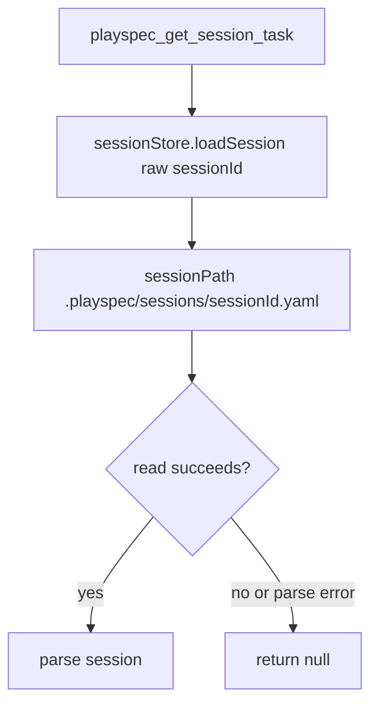
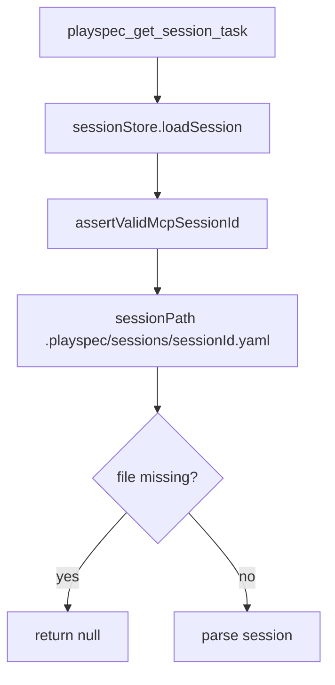

# Issue #247 Session ID Validation Spec

## Scope

Validate MCP session identifiers before `playspec_get_session_task` can interpolate them into session file paths. Keep valid missing-session behavior unchanged: a well-formed nonexistent session returns `{ session: null, task: null }`.

Out of scope: `.playspec/HEAD` fallback for MCP tools, task ID prefix semantics, session schema/storage redesign, workspace-root handling changes, and unrelated MCP behavior.

## Use Case Alignment

MCP clients can ask which task is bound to a session through `playspec_get_session_task`. The tool should behave consistently with the rest of MCP task-context routing: malformed session IDs are invalid input, not missing files.

## High-Level Current Implementation Summary

Verified code behavior:

- `src/mcp/server.ts` registers `playspec_get_session_task` with `{ sessionId: z.string() }`.
- The handler passes `args.sessionId` directly to `McpSessionStore.loadSession()`.
- `src/mcp/session-store.ts` constructs `.playspec/sessions/${sessionId}.yaml` in `sessionPath()`.
- `loadSession()` currently catches every error and returns `null`, so malformed IDs can be treated like missing sessions.
- `setSessionTask()` validates session IDs through `assertValidMcpSessionId()` before loading/saving.
- `resolveMcpTaskId()` validates non-empty session context through `assertValidMcpSessionId()` before loading.

## Relevant Files Reviewed

- `src/mcp/server.ts`: registered MCP tool handlers and `playspec_get_session_task` entry point.
- `src/mcp/session-store.ts`: MCP session path construction, load, save, and bind behavior.
- `src/mcp/validation.ts`: existing identifier validation helper.
- `src/mcp/errors.ts`: existing invalid-session MCP error and hint text.
- `src/mcp/context.ts`: resolver path that already validates session IDs.
- `tests/integration/mcp-server.test.ts`: session store, resolver, and MCP handler integration coverage.
- `package.json`: validation commands are `pnpm build` and `pnpm test`.

## Active Entry Points And Bypasses

Active entry points:

- `playspec_get_session_task` -> `McpSessionStore.loadSession()`.
- `playspec_use_session_task` -> task prefix resolution -> `McpSessionStore.setSessionTask()`.
- MCP task-context tools -> `resolveMcpTaskId()` -> `McpSessionStore.loadSession()`.

Bypass:

- `playspec_get_session_task` bypasses `assertValidMcpSessionId()` today.

## Current Architecture

Verified flow:

Proposed flow:

## Verified Behavior

- Valid missing sessions already return `null` from `McpSessionStore.loadSession()`, and the registered MCP read handler maps that to `{ session: null, task: null }`.
- Existing resolver tests cover malformed session IDs for task-context routing.
- Existing binding tests cover unsafe session IDs for `playspec_use_session_task`.

## Problems

- `loadSession()` accepts a raw string and builds a filesystem path before validation.
- The broad `catch` in `loadSession()` would also convert validation errors to `null` if validation were placed inside the existing `try` block.
- The registered `playspec_get_session_task` handler lacks focused malformed-session coverage.

## Proposed Direction

Centralize session ID validation in `McpSessionStore.loadSession()` before file path construction and outside the missing-file catch. This protects every load path, including `playspec_get_session_task`, while preserving valid nonexistent session behavior.

Expected behavior:

- Invalid IDs such as `../mcp.codex`, `mcp:codex`, control characters, empty strings, null bytes, backslashes, and overlong values throw `McpInvalidSessionIdError`.
- Registered MCP handlers convert that `PlaySpecError` to an `isError: true` response with the existing invalid-session message and hint.
- Valid nonexistent IDs still return `null` from the store and `{ session: null, task: null }` from the MCP tool.

## File-By-File Plan

- `src/mcp/session-store.ts`: call `assertValidMcpSessionId(sessionId)` at the top of `loadSession()` before `sessionPath()`.
- `tests/integration/mcp-server.test.ts`: add store coverage proving malformed load IDs reject with `McpInvalidSessionIdError`, and add MCP handler coverage proving `playspec_get_session_task` returns invalid-session errors for representative malformed IDs.
- No production change is expected in `server.ts` if validation is centralized in the store.

## Risks And Open Questions

Risk: centralizing validation changes lower-level `loadSession()` callers that may have relied on malformed IDs returning `null`. Reviewed in-tree callers already either validate before calling or should receive invalid input errors. This aligns with the issue acceptance criteria.

Open question: none for the current scope.

## Reader Aids

The key invariant is: no MCP session ID may reach `.playspec/sessions/${sessionId}.yaml` path construction until it has passed `assertValidMcpSessionId()`.
