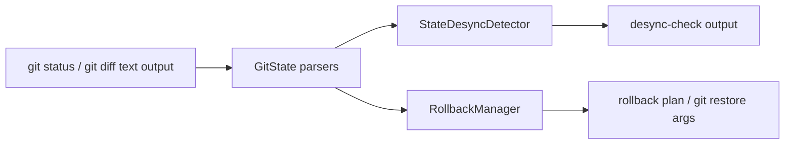
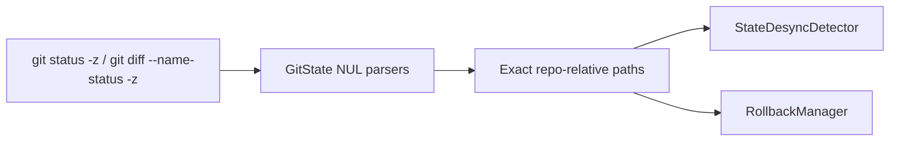

# Issue 249 Quoted Git Paths Technical Spec

## Scope

Fix Git path fidelity for rollback and desync checks. The implementation should keep the change inside Git state collection/parsing and existing rollback/desync consumers, without redesigning rollback behavior or changing unrelated workflow, migration, MCP, or command surfaces.

## Use Case Alignment

Users can have valid repository-relative paths that Git quotes in human-readable output, such as `src/quote"file.ts`, paths containing tabs, or paths containing UTF-8 characters encoded as octal byte escapes. PlaySpec must report, compare, and pass the exact repository path, not Git's quoted display token.

## High-Level Current Implementation Summary

Verified behavior:

- `GitState.getWorkspaceState()` gathers `git status --short --branch --untracked-files=all` for branch text and `git status --porcelain --untracked-files=all` for file entries.
- `parsePorcelain()` currently decodes C-style quoted path tokens and rename `old -> new` pairs.
- `GitState.listNameStatusSince()` gathers `git diff --name-status <base>..HEAD`.
- `parseNameStatus()` still parses line-oriented name-status output with `line.split('\t')` and does not decode Git-quoted paths.
- `StateDesyncDetector` consumes `GitState` paths directly for changed, deleted, renamed, and untracked lists.
- `RollbackManager` consumes the same paths for rollback plans, untracked conflict checks, and `git restore -- <targetFiles>` arguments.

Inferred behavior:

- Quoted paths from current `parseNameStatus()` can still propagate into committed change detection when Git quotes path fields in `git diff --name-status` output.
- Moving both status and name-status to `-z` formats would reduce custom parser exposure, but requires careful parsing because rename records encode multiple path fields.

## Relevant Files Reviewed

- `src/core/git-state.ts`: Git command collection and status/name-status parsing.
- `src/core/state-desync-detector.ts`: Desync classification and output data collection.
- `src/core/rollback-manager.ts`: Rollback planning, safety checks, and `git restore` execution.
- `src/cli/commands/desync-check.ts`: CLI rendering for desync lists.
- `src/cli/commands/rollback.ts`: CLI rendering for rollback plans/results.
- `tests/unit/git-state.test.ts`: Existing parser coverage for porcelain quoted paths.
- `tests/cli.test.ts`: CLI coverage for desync and rollback behavior.
- `tests/integration/completion-engine.test.ts`: Core desync coverage.

## Active Entry Points And Bypasses

Active entry points:

- CLI `desync-check` calls `PlaySpecCore.checkTaskDesync()`, which calls `StateDesyncDetector.run()`.
- CLI `rollback` calls `PlaySpecCore.planRollback()` or `executeGitRollback()`, which delegates to `RollbackManager`.
- MCP desync and rollback tools call the same `PlaySpecCore` methods and therefore share the same Git path source.

Bypasses:

- The branch status string from `git status --short --branch` remains display-only for divergence checks. It should not be used for path parsing.
- Core consumers should continue to receive normalized repository-relative paths from `GitState`; rollback/desync should not add their own Git unquoting logic.

## Current Architecture

`GitState` is the boundary between Git command output and PlaySpec's typed path lists. Downstream components assume `GitStatusEntry.path`, `GitStatusEntry.originalPath`, `GitNameStatusEntry.path`, and `GitNameStatusEntry.originalPath` are exact repository-relative paths.

## Verified Behavior

- Porcelain parser tests already cover quoted tabs, octal UTF-8 bytes, ordinary renames, and quoted rename fields.
- Name-status parsing has no equivalent quoted-path tests and currently does no decode step.
- Rollback target computation uses set/array comparisons on parsed string values, so any quoted token corruption changes safety behavior.

## Problems

- `parseNameStatus()` can return Git display tokens rather than exact paths.
- `getWorkspaceState()` still depends on human-readable porcelain lines and a custom unquoter for status entries. The current parser may pass existing tests, but `-z` parsing is the safer Git interface.
- CLI coverage verifies ordinary desync and rollback paths, but not exact quoted path propagation through user-visible output and rollback plans.

## Proposed Direction

Prefer machine-safe Git output at the `GitState` boundary:

- Use `git status --porcelain -z --untracked-files=all` for workspace entries and parse NUL-delimited porcelain records.
- Use `git diff --name-status -z <base>..HEAD` for committed name-status entries and parse NUL-delimited records.
- Keep line-oriented parser tests only if compatibility helpers remain exported; otherwise update tests around the new parser behavior.
- Add focused CLI/core tests with `src/quote"file.ts` for untracked desync output and rollback untracked conflict planning.
- Add name-status rename coverage with a quoted path if `parseNameStatus()` changes.

## File-By-File Plan

- `src/core/git-state.ts`: Change Git commands and parser helpers to accept exact NUL-delimited path fields. Preserve public `GitStatusEntry` and `GitNameStatusEntry` shapes.
- `tests/unit/git-state.test.ts`: Add/adjust unit tests for NUL-delimited status and name-status, including quotes and rename records.
- `tests/cli.test.ts`: Add desync output coverage for `src/quote"file.ts` and rollback conflict/plan coverage that proves exact paths are compared.
- Optional `tests/integration/completion-engine.test.ts`: Add core-level committed rename/name-status coverage if the CLI tests do not cover it cleanly.

## Risks And Open Questions

- Risk: `git status --porcelain -z` rename field order differs from human-readable `old -> new` text. Tests must lock the intended `originalPath` and `path` mapping.
- Risk: NUL-delimited output may require preserving trailing empty fields carefully.
- Open question: whether to keep exported `parsePorcelain(output: string)` compatible with old line-oriented tests or replace it with the exact `-z` parser. Because it is exported and already tested, a conservative migration can add `parsePorcelainZ()` and leave the old parser until callers are moved.

## Reader Aids

Verified current flow:

Proposed flow:

