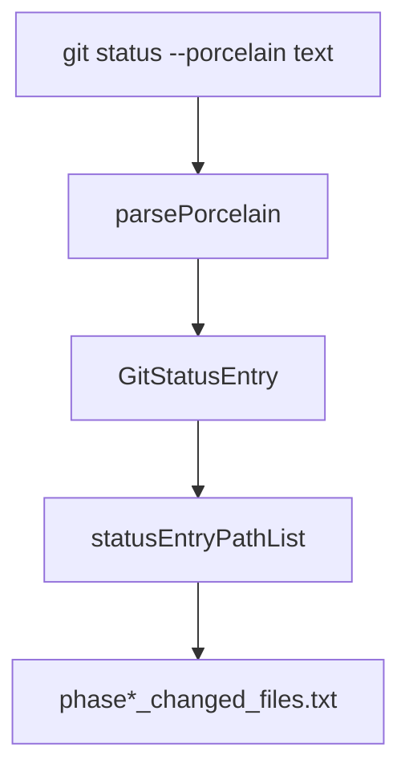
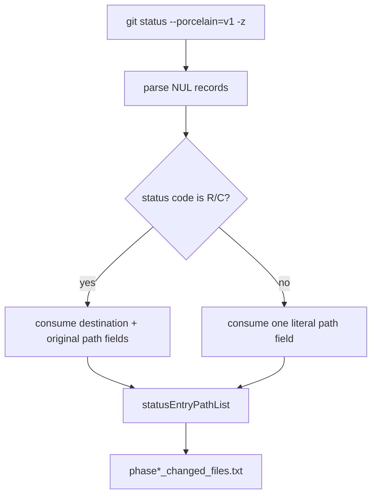

# Issue 251: Unambiguous Git Status Path Parsing

## Scope

Fix changed-files evidence so a normal changed path containing ` -> ` is emitted as the literal path. Preserve existing evidence filenames and keep real rename entries serialized as `original -> destination`.

Out of scope: completion ledger markdown formatting, task artifact storage redesign, MCP behavior, rollback redesign, and state-desync semantics beyond any incidental shared use of `GitState.getWorkspaceState()`.

## Use Case Alignment

Reviewers and follow-up agents read `.playspec/tasks/active/<task>/evidence/phase*_changed_files.txt` to identify workspace paths touched during a PlaySpec phase. A file like `docs/source -> target.md` is a valid non-rename path and must not be split into fabricated `docs/source` and `target.md` entries.

## Current Implementation Summary

Verified behavior:

- `PlaySpecCore.writeEvidence()` writes `phase*_changed_files.txt` from `statusEntryPathList(workspaceState.entries)`.
- `GitState.getWorkspaceState()` currently runs `git status --porcelain --untracked-files=all` and passes display text to `parsePorcelain()`.
- `parsePorcelain()` slices the two-character status code and path display field, then tries to detect renames from the path text.
- `statusEntryPathList()` preserves the current artifact shape: plain `path` for normal entries and `originalPath -> path` for rename entries.

Inferred behavior:

- Because non-quoted path token parsing treats ` -> ` as a separator, ordinary unquoted paths containing that text can be truncated before evidence serialization.

## Relevant Files Reviewed

- `src/core/git-state.ts`: Git status collection, `parsePorcelain()`, path token decoding, and `statusEntryPathList()`.
- `src/core/playspec-core.ts`: `writeEvidence()` evidence artifact writer.
- `tests/unit/git-state.test.ts`: parser coverage for ordinary paths, quoted paths, UTF-8 escapes, and renames.
- `tests/integration/completion-engine.test.ts`: manual evidence creation and existing rename changed-files regression.
- `package.json`: validation scripts are `pnpm build` and `pnpm test`.

## Active Entry Points And Bypasses

Active evidence path:

`PlaySpecCore.collectEvidence()` / `PlaySpecCore.completePhase()` -> `writeEvidence()` -> `GitState.getWorkspaceState()` -> `parsePorcelain()` -> `statusEntryPathList()` -> `evidence/phase*_changed_files.txt`.

Related shared consumers:

- `StateDesyncDetector` and `RollbackManager` also consume `GitState.getWorkspaceState()`. The parser fix should keep their entry shape compatible.
- `GitState.listNameStatusSince()` uses a separate `git diff --name-status` parser and is not part of this issue.

Bypass risk:

- Updating only `statusEntryPathList()` would not fix downstream consumers of parsed status entries.
- Adding only a completion-engine assertion without changing parser input format would leave shell-sensitive and delimiter-containing paths ambiguous.

## Current Architecture

## Verified Behavior

- Existing rename integration test uses `git mv src/old-name.ts src/new-name.ts`, collects manual evidence, and expects `src/old-name.ts -> src/new-name.ts`.
- Existing unit tests expect `parsePorcelain('R  src/old-name.ts -> src/new-name.ts')` to expose `originalPath` and destination `path`.
- Existing unit tests decode quoted C-style paths emitted by non-NUL porcelain.

## Problems

- Text porcelain is a display format. The ` -> ` delimiter is meaningful for rename display but also valid in a filename.
- Current non-quoted token parsing truncates unquoted normal paths at ` -> ` before `statusEntryPathList()` writes evidence.
- The parser decides rename shape from path text instead of the Git status code and unambiguous path boundaries.

## Proposed Direction

Use NUL-delimited porcelain for workspace status collection:

- Change `GitState.getWorkspaceState()` to call `git status --porcelain=v1 -z --untracked-files=all`.
- Update `parsePorcelain()` to parse NUL-delimited records when NULs are present.
- For NUL porcelain rename/copy entries, use the status code to consume two path records. Git emits the destination path in the status record and the original path as the following NUL-delimited field for v1 `-z`; return `{ code, originalPath, path }`.
- Keep text porcelain support in `parsePorcelain()` for direct unit coverage and compatibility, but prefer status-code-aware rename handling over delimiter guessing where possible.
- Leave `statusEntryPathList()` output unchanged.

Proposed flow:

## File-by-file Plan

- `src/core/git-state.ts`
  - Request `--porcelain=v1 -z` in `getWorkspaceState()`.
  - Refactor `parsePorcelain()` to detect NUL-delimited output and parse records by status code.
  - Keep current text parsing behavior for existing tests, but correct non-rename text paths containing ` -> ` if practical.

- `tests/unit/git-state.test.ts`
  - Add NUL porcelain coverage for untracked/modified paths containing ` -> `.
  - Add NUL porcelain coverage for tracked renames preserving original and destination paths.

- `tests/integration/completion-engine.test.ts`
  - Add a manual evidence regression that creates a non-renamed changed file whose path contains ` -> ` and asserts `phase1_manual_changed_files.txt` contains the exact path.
  - Keep the existing rename evidence test passing.

- `docs/features/issue_251_parse_git_status_paths_unambiguously/result.md`
  - Record implementation summary, tests run, and residual risk after validation.

- `docs/features/issue_251_parse_git_status_paths_unambiguously/pr.md`
  - Capture the draft PR body required for issue automation.

## Risks And Open Questions

- Git porcelain v1 `-z` rename ordering differs from display porcelain. Tests must prove the returned `originalPath` and `path` match existing evidence output.
- `parsePorcelain()` currently accepts plain text strings in unit tests. Keeping text support avoids making the helper harder to test and limits compatibility risk.
- Paths containing newlines are better represented by NUL parsing, but changed-files evidence remains newline-delimited by design. This issue does not redesign the artifact format.

## Reader Aids

- Expected normal evidence line: `docs/source -> target.md`
- Expected rename evidence line: `src/old-name.ts -> src/new-name.ts`
- Primary acceptance check: the normal line above must be produced without setting `originalPath`.
