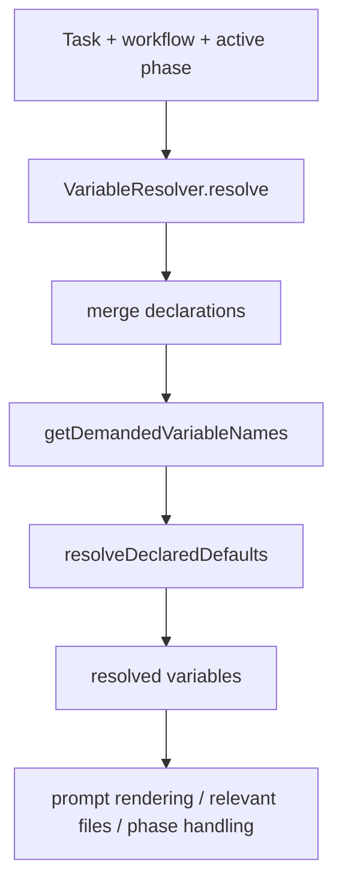

# Issue 255 Output Placeholder Demand Spec

## Scope

Fix `VariableResolver` demand calculation so placeholders inside active phase `outputs` are treated as demanded variable names during declaration default resolution.

In scope:
- `src/template/variable-resolver.ts`
- focused regression tests in `tests/unit/variable-resolver.test.ts`

Out of scope:
- workflow output schema changes
- artifact or evidence semantics
- MCP, rollback, migration, viewer, or broad workflow engine behavior
- requiring built-in workflows to duplicate output placeholder variables in `requiredVariables`

## Use Case Alignment

Workflow authors can declare output paths as templates, for example `outputs: ["{{ARTIFACT_FILE}}"]`, and declare `ARTIFACT_FILE` with a default. The resolver must resolve that default because downstream prompt rendering, relevant-file discovery, and phase completion treat outputs as workflow path templates.

If a demanded output variable default depends on an unknown placeholder, the resolver should fail during required variable/default validation rather than allowing an unresolved or empty output path to propagate.

## High-Level Current Implementation Summary

Verified behavior:
- `VariableResolver.resolve()` builds engine variables, merges workflow and phase variable declarations, computes demanded variable names, resolves declaration defaults, then overlays non-empty task variables.
- `resolveDeclaredDefaults()` suppresses `UnknownVariableDefaultError` only for defaults whose owning variable is not demanded.
- `getDemandedVariableNames()` currently demands required declarations, active phase variable declarations unless `required: false`, `definition.requiredVariables`, and each `definition.outputs` string.
- `src/core/relevant-files.ts` resolves each phase output through `resolveWorkflowPathValue()`, so output values are interpreted as path templates, not plain declaration names.

Inferred behavior:
- An output-only declaration referenced as `{{ARTIFACT_FILE}}` is not demanded today because the demanded set receives the literal string `{{ARTIFACT_FILE}}`, not `ARTIFACT_FILE`.
- A literal output path such as `docs/static/out.md` is currently added to the demanded set, but because it is not a declaration name it has no practical effect.

## Relevant Files Reviewed

- `src/template/variable-resolver.ts`
- `tests/unit/variable-resolver.test.ts`
- `src/core/relevant-files.ts`
- `src/preset/assets/workflows/issue-scope-create/workflow.yaml`
- `src/preset/assets/workflows/issue-validate/workflow.yaml`

## Active Entry Points And Bypasses

Active entry points:
- `VariableResolver.resolve()` is used by prompt rendering, relevant-file discovery, viewer rendering, prompt snapshot hashing, and create flow helpers.
- The active phase definition passed to `resolve()` is the only phase whose `outputs` should affect demand.

Bypasses and alternate paths:
- `TemplateRenderer` can still reject unresolved placeholders in rendered prompts after variable resolution.
- `assertRequiredVariables()` validates explicit required variables but does not parse output templates.
- `discoverRelevantFiles()` resolves output path templates using the resolved variable map, so it benefits from resolver defaults being materialized.

## Current Architecture

## Verified Behavior

- Required declaration defaults are demanded and throw on unknown dependencies.
- Active phase variables are demanded unless explicitly `required: false`.
- `requiredVariables` entries are demanded.
- Output entries currently demand the literal output string, which works only when an output is written as a bare declaration name such as `OPTIONAL_REPORT`.
- Existing tests already cover the bare-name output case.

## Problems

- Templated output placeholders are not parsed for declaration names.
- Built-in workflows use templated output paths such as `{{DISCOVERY_FILE}}`, so the resolver's output-demand logic does not match workflow metadata semantics.
- Output-only defaults with unknown dependencies can be suppressed as unused, even though the active phase output depends on them.

## Proposed Direction

Reuse the resolver's existing default-template placeholder syntax to extract placeholder names from each output string. Add those names to the demanded set instead of treating only the raw output string as meaningful.

Preserve existing behavior by also allowing bare output declaration names to remain demanded. Literal path strings without placeholders should not introduce false demanded variables because only names present in declarations matter during default resolution.

## File-By-File Plan

`src/template/variable-resolver.ts`
- Add a small helper that extracts placeholder dependency names from an output template using the same syntax as default templates.
- Update `getDemandedVariableNames()` to add extracted placeholder names for every `definition.outputs` entry.
- Preserve bare output names for backward compatibility with existing tests/workflows.

`tests/unit/variable-resolver.test.ts`
- Add a test that `outputs: ["{{ARTIFACT_FILE}}"]` resolves `ARTIFACT_FILE` from its default.
- Add a test that an output-only `ARTIFACT_FILE` default containing `{{MISSING_KEY}}` throws `UnknownVariableDefaultError`.
- Add a test that a literal output path without placeholders does not demand a bogus variable.
- Add coverage that multiple placeholders in a single output path are all demanded.

## Risks And Open Questions

Risks:
- Over-demanding could make helper placeholders fail earlier. Mitigation: parse only the same `{{NAME}}` style already used by default templates.
- Bare output names may be legacy behavior. Mitigation: keep the current bare-name demand path alongside placeholder parsing.

Open questions:
- None blocking. The issue acceptance criteria points directly to active phase output placeholder demand.

## Reader Aids

Key distinction:
- `outputs: ["ARTIFACT_FILE"]` is a bare declaration-name output.
- `outputs: ["{{ARTIFACT_FILE}}"]` is a workflow path template whose placeholder should demand `ARTIFACT_FILE`.
- `outputs: ["docs/static/artifact.md"]` is a literal path and should not create a new required variable.
