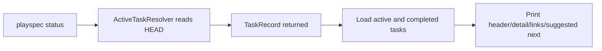
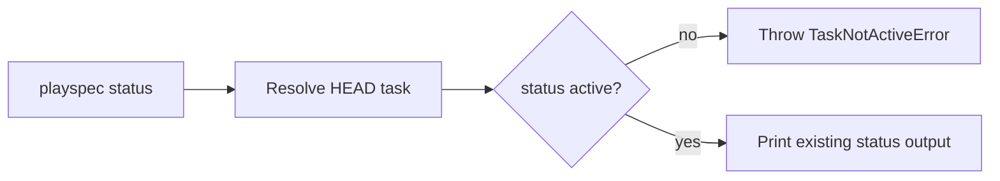

# Issue 257 Status Completed HEAD Guard

## Scope

Add lifecycle validation to the default HEAD-based `playspec status` path only. Bare `playspec status` and `playspec status --quiet` must reject a HEAD task whose status is not `active` before printing task detail, link sections, or suggested-next guidance.

Out of scope: redesigning `ActiveTaskResolver`, changing `current-task`, `prompt`, `next`, `phase`, archive behavior, link semantics, or broadening status output.

## Use Case Alignment

Operators use bare `playspec status` as active-work context. If `.playspec/HEAD` still points at a completed task, status should behave like other lifecycle-sensitive HEAD commands and report that the task is not active. Explicit inspection through `playspec status <taskId>` or `playspec status --task <id>` can remain an inspection path for completed records.

## Current Implementation Summary

Verified code behavior:

- `src/cli/commands/status.ts` resolves `taskIdOption` with `TaskIdResolver` and `store.getTask()`.
- When no task id is supplied, `runStatus()` calls `new ActiveTaskResolver(workspaceRoot, store).resolveTask()`.
- `ActiveTaskResolver.resolveTask()` reads `.playspec/HEAD` and returns the task record but does not enforce `status: active`.
- `runStatus()` then loads active and completed tasks and prints the compact header, detail lines, outgoing/incoming links, and suggested-next guidance.
- `TaskNotActiveError` already provides the standard non-active-task error and recovery hint.

Inferred behavior:

- A completed HEAD can currently reach `formatContextHeader()`, task detail printing, and `printSuggestedNext()`.

## Relevant Files Reviewed

- `src/cli/commands/status.ts`
- `src/core/active-task-resolver.ts`
- `src/core/errors.ts`
- `tests/cli.test.ts`
- `src/cli/index.ts`

## Active Entry Points And Bypasses

Active lifecycle entry point:

- `playspec status` with no positional `taskId` and no `--task` option. This resolves HEAD and should require an active task.

Inspection bypass:

- `playspec status <taskId>` and `playspec status --task <id>` are explicit lookups. They should not be changed unless tests reveal an existing contract conflict.

Old path:

- HEAD-based resolution currently goes through `ActiveTaskResolver.resolveTask()` without a status check.

## Current Architecture

`status` is a CLI-local command. Core remains decoupled from CLI and should not be changed for this issue. The command already owns the distinction between explicit task lookup and default HEAD lookup, making a local guard sufficient.

## Verified Behavior To Preserve

- Active HEAD tasks continue to show the compact header and full detail.
- `status --quiet` suppresses only the compact header and still shows detail for active tasks.
- Missing or empty HEAD should continue to surface `NoActiveTaskError` behavior from `ActiveTaskResolver`.
- Explicit completed-task inspection remains supported if existing behavior allows it.

## Problem

Bare status treats completed HEAD as active context. This can print stale task detail and link-derived guidance after a workflow has closed.

## Proposed Direction

Add a small helper or inline guard after default HEAD resolution:

- Track whether `taskIdOption` was supplied.
- If no explicit task was supplied and the resolved task is not active, throw `TaskNotActiveError(task.id, task.status)`.
- Run the guard before `loadActiveAndCompletedTasks()` and before any `console.log()`.

## File-By-File Plan

`src/cli/commands/status.ts`

- Import `TaskNotActiveError`.
- Add HEAD-only active validation in `runStatus()` immediately after task resolution.

`tests/cli.test.ts`

- Add regression coverage near existing status tests:
  - `playspec status` rejects completed HEAD before stdout output.
  - `playspec status --quiet` rejects completed HEAD before stdout output.
  - Explicit completed status inspection remains documented if supported.

## Risks And Open Questions

Risk: users who relied on bare `status` after task completion must switch HEAD to an active task or inspect the completed task explicitly.

Open question: whether explicit completed status inspection is an intended public contract. The issue allows preserving it, and keeping it unchanged limits blast radius.

## Reader Aids

Verified current flow:

Proposed HEAD flow:

