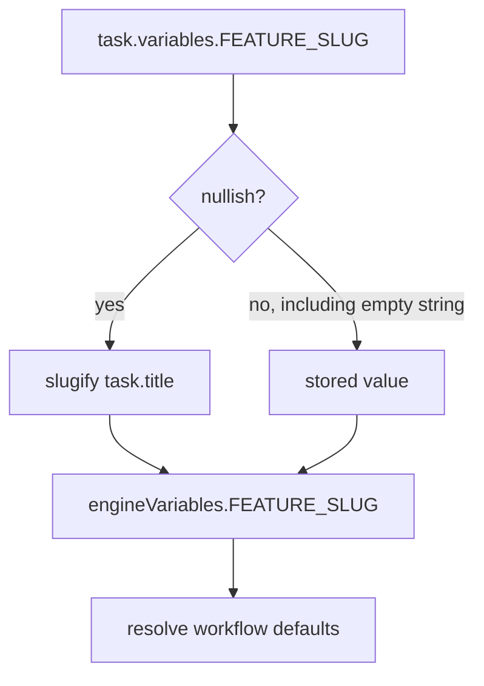
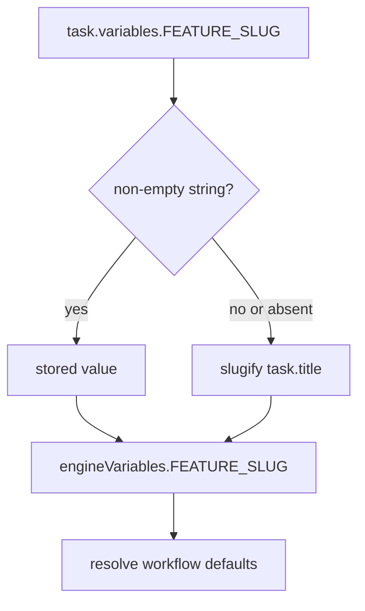

# Issue 259: Empty FEATURE_SLUG fallback before workflow defaults

## Scope

Fix `VariableResolver.resolve` so a stored `FEATURE_SLUG: ""` is treated the same as an absent `FEATURE_SLUG` before workflow variable defaults are resolved. Keep explicit non-empty `FEATURE_SLUG` task values and existing empty declared-variable default behavior.

Out of scope: MCP resolution, rollback, workflow installation, issue-scope report generation redesign, and broader variable-resolution semantics.

## Use Case Alignment

A task record can contain an empty `FEATURE_SLUG` value, usually from legacy or manually edited task YAML. Workflow defaults such as `PHASE_SPEC_FILE`, `PHASE_HANDOFF_FILE`, and mono-spec file paths render `{{FEATURE_SLUG}}`. Those defaults should receive the title-derived slug when the task value is empty, matching the absent-value behavior.

## High-Level Current Implementation Summary

Verified behavior:

- `src/template/variable-resolver.ts` derives `featureSlug` with `task.variables['FEATURE_SLUG'] ?? slugify(task.title)`.
- Because the nullish operator does not treat `""` as missing, an empty `FEATURE_SLUG` is placed into `engineVariables.FEATURE_SLUG`.
- `resolveDeclaredDefaults` resolves workflow defaults from `engineVariables` and task variables before the final returned variables are filtered.
- Empty task variables are filtered from the final returned object after defaults resolve, but that happens too late for `FEATURE_SLUG` defaults because the empty engine value was already used.

Inferred behavior:

- Any workflow default that references `FEATURE_SLUG` can render with blank path segments when a task stores `FEATURE_SLUG: ""`.

## Relevant Files Reviewed

- `src/template/variable-resolver.ts`: resolver implementation, default-resolution flow, reserved engine-variable filtering.
- `tests/unit/variable-resolver.test.ts`: existing coverage for absent `FEATURE_SLUG`, non-mono path defaults, mono-spec path defaults, issue-scope defaults, and empty task values falling back to declared defaults.
- `src/preset/assets/workflows/multi-spec/workflow.yaml`: built-in defaults for `PHASE_SPEC_FILE` and `PHASE_HANDOFF_FILE`.
- `src/preset/assets/workflows/mono-spec/workflow.yaml`: built-in defaults for `SPEC_FILE`, `PLAN_FILE`, `RESULT_FILE`, and `PR_FILE`.

## Active Entry Points And Bypasses

Active entry points:

- CLI prompt rendering and core prompt rendering call `VariableResolver.resolve`.
- Relevant-file discovery and viewer artifact resolution also call `VariableResolver.resolve`.
- Unit tests instantiate `VariableResolver` directly.

Bypasses:

- Task creation stores `FEATURE_SLUG` from task id by default in `YamlTaskStore`, so the bug primarily affects manually edited, legacy, migrated, or otherwise malformed task records.
- `filterReservedEngineVariables` does not reserve `FEATURE_SLUG`, so task variables still participate in default resolution and final output. The fix must keep explicit non-empty overrides working.

## Current Architecture

`VariableResolver.resolve` builds engine variables first, merges workflow and phase variable declarations, resolves declaration defaults, filters empty task overrides, then returns engine variables plus resolved defaults plus non-empty task variables. Empty declared task overrides already fall through to declaration defaults because `resolveDeclaredDefaults` checks `resolved[name] !== ''` before accepting an existing value.

## Verified Behavior

- No `FEATURE_SLUG` in task variables falls back to `slugify(task.title)`.
- Non-empty `FEATURE_SLUG` overrides remain effective.
- Empty declared non-engine task variables use workflow defaults.
- Empty `FEATURE_SLUG` currently does not fall back before defaults because it is handled in the early engine-variable construction path.

## Problems

- `FEATURE_SLUG` is inconsistent with adjacent empty task-variable handling.
- Defaults referencing `FEATURE_SLUG` can resolve to malformed paths like `docs//_phase3_handoff.md`.
- The final empty-task-variable filter cannot repair defaults that were already rendered with the empty slug.

## Proposed Direction

Change the resolver's `featureSlug` derivation to use the stored value only when it is non-empty. For the issue scope, an exact empty string check is enough because existing empty-variable behavior is specifically based on `value !== ''`; whitespace-only strings should remain explicit values unless a broader normalization change is requested.

## File-By-File Plan

- `src/template/variable-resolver.ts`: replace the nullish fallback with a helper or inline expression that treats `FEATURE_SLUG: ""` as unset before `engineVariables` and default resolution are built.
- `tests/unit/variable-resolver.test.ts`: add focused coverage proving empty `FEATURE_SLUG` derives from the title and that a default referencing `FEATURE_SLUG` receives the derived slug. Preserve existing tests for absent slug, explicit non-empty slug, and empty declared-variable defaults.

## Risks And Open Questions

- Compatibility risk: callers intentionally using an empty `FEATURE_SLUG` to force blank path segments will change behavior. That use is inconsistent with absent `FEATURE_SLUG` fallback and declared empty-variable semantics.
- Open question: whether whitespace-only `FEATURE_SLUG` should also fall back. This spec keeps the change to exact empty string to avoid broadening semantics.

## Reader Aids

Verified current flow:

Proposed flow:

