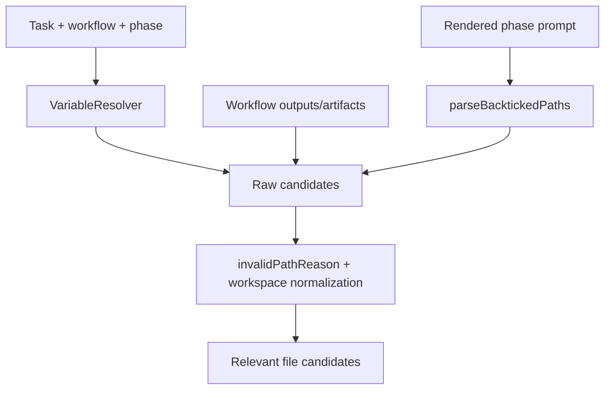

# Issue 266: Rendered Prompt Path Filtering

## Scope

Tighten rendered prompt backtick discovery in `src/core/relevant-files.ts` so prose-like issue-scope-create metadata is not normalized as a missing workspace file. Preserve existing discovery for explicit context refs, task sources, path variables, workflow outputs, workflow artifacts, existing project docs, and legitimate workspace-relative paths referenced from rendered prompts.

Out of scope: workflow semantic changes, issue-scope-create template redesign, GitHub issue creation behavior, viewer work, and broad relevant-file discovery redesign.

## Use Case Alignment

Operators run `playspec specs --show-missing --path-only` on an `issue-scope-create` task to see missing workflow report artifacts. The output must include missing report files such as `DISCOVERY_FILE`, `CANDIDATE_ISSUES_FILE`, and `CREATED_ISSUES_FILE`, but it must not include backticked prompt header metadata like `TARGET_REPOSITORY`, `TASK_TITLE`, or comma-separated `FOCUS_AREA` prose.

## High-Level Current Implementation Summary

Verified behavior:

- `discoverRelevantFiles()` resolves task/workflow variables, collects path-like variables, workflow outputs, workflow artifacts, rendered prompt backtick candidates, and existing project docs.
- Rendered prompt candidates are collected by `parseBacktickedPaths(rendered)`.
- `parseBacktickedPaths()` currently accepts a backticked token when `isPotentialPathValue()` sees `/`, `\`, or a trailing extension.
- `invalidPathReason()` rejects URLs, absolute paths, unresolved placeholders, shell-looking values, and placeholder sentinel values, but it does not reject spaces or commas.
- `issue-scope-create` templates backtick `{{TARGET_REPOSITORY}}`, `{{TASK_TITLE}}`, `{{FOCUS_AREA}}`, and report artifact paths.

Inferred behavior:

- A rendered repository identifier such as `cksdnr1/playspec` passes because it contains `/`.
- A focus area like `src/core, src/template, src/workflow, docs/features, tests/integration` passes because it contains `/` and commas are not invalid.
- A task title with spaces can pass if it also has path-looking punctuation; even when it does not, the filter is too permissive for rendered prompt metadata.

## Relevant Files Reviewed

- `src/core/relevant-files.ts`: relevant-file candidate collection, rendered prompt extraction, path validation, normalization, and deduplication.
- `tests/unit/relevant-files.test.ts`: focused unit coverage for discovery source priority, variable parsing, invalid path warnings, symlink safety, and legacy derived files.
- `tests/cli.test.ts`: CLI coverage for `specs --path-only`, `specs --show-missing`, and issue-scope-create task creation.
- `src/preset/assets/workflows/issue-scope-create/workflow.yaml`: declares required metadata variables, report path variables, artifacts, and phase outputs.
- `src/preset/assets/workflows/issue-scope-create/templates/scoped_issue_discovery.md`: backticks repository/focus metadata and report artifact paths.
- `src/preset/assets/workflows/issue-scope-create/templates/create_scoped_issues.md`: backticks repository/focus metadata and report artifact paths.

## Active Entry Points And Bypasses

Active entry point:

- CLI `specs --show-missing --path-only` resolves the active task, workflow, and effective phase, then calls `discoverRelevantFiles()`.

Discovery paths that must remain unchanged:

- Context refs from `task.contextRefs`.
- Existing source files under the task source directory.
- Variables whose names end in `_FILE`, `_PATH`, or `_DOC`.
- Backticked paths inside `CONTEXT_FILES` and `CONTEXT_REFS_DETAIL`.
- Required variables that are path-like.
- Workflow `outputs` and `artifacts`.
- Existing project doc files.

Rendered-prompt-specific bypass:

- Only candidates from rendered prompt backticks should get the stricter prose/metadata filter. Existing variable and workflow metadata paths should continue through current validation and normalization so explicitly declared workflow artifacts are not dropped.

## Current Architecture

## Verified Behavior

- Backticked `docs/features/feature_x/from_prompt.md` is discovered as a missing rendered-prompt candidate in unit tests.
- Workflow outputs and artifacts are discovered independently of rendered prompt parsing.
- Missing allowed workflow candidates are emitted when absent, which is the mechanism that should continue to report issue-scope-create report artifacts.
- Current invalid-path checks do not classify spaces or commas as invalid, so rendered prompt prose can be normalized as a workspace-relative missing path.

## Problems

- Rendered prompt parsing uses a broad "potential path" heuristic intended for all path-like strings.
- The rendered prompt source is noisier than structured workflow metadata because templates can backtick inline prose, identifiers, and command fragments.
- Treating every slash-containing backticked token as a path causes repository identifiers and comma-separated focus-area prose to appear as missing files.

## Proposed Direction

Add a rendered-prompt-specific filter before accepting backticked tokens. The filter should remain conservative:

- Reject values containing whitespace.
- Reject values containing commas.
- Reject values with characters that are not normal workspace path characters.
- Reject owner/repo-style identifiers by requiring either a path-like prefix such as `docs/`, `src/`, `tests/`, `.playspec/`, or at least a file extension on the final path segment.
- Keep common workspace-relative paths such as `docs/features/<slug>/spec.md`, `src/core/relevant-files.ts`, `tests/unit/relevant-files.test.ts`, and issue-scope-create report artifacts.

Apply this only to rendered prompt parsing or to an optional mode used by rendered prompt parsing, so context list variables and structured workflow declarations keep their current behavior.

## File-By-File Plan

- `src/core/relevant-files.ts`
  - Add a helper for rendered prompt backtick candidates, for example `isRenderedPromptPathCandidate()`.
  - Update `parseBacktickedPaths()` to use the stricter helper for rendered prompt discovery, or split it so rendered prompt parsing is strict while context list parsing retains existing behavior if needed.
  - Keep `invalidPathReason()` as the final safety layer for normalized candidates.

- `tests/unit/relevant-files.test.ts`
  - Add a focused issue-scope-create-like rendered template test with backticked repository, task title, comma-separated focus area, and report artifact paths.
  - Assert the three report artifact paths are candidates and the metadata values are not candidates.
  - Keep or add assertions that common valid rendered prompt paths still survive.

- `tests/cli.test.ts`
  - Add or update focused `specs --show-missing --path-only` coverage only if unit coverage does not prove the user-visible path. Prefer a narrow CLI test if the fixture setup is straightforward.

## Risks And Open Questions

- Risk: filtering too aggressively could drop legitimate rendered prompt paths without extensions. Mitigation: allow common workspace path roots and add unit coverage for common paths.
- Risk: changing shared `parseBacktickedPaths()` could affect `CONTEXT_FILES` parsing. Mitigation: either keep the legacy parser for context list variables or test both modes explicitly.
- Open question: whether to warn for rejected rendered prompt metadata. Prefer no warning for strict rendered-prompt filtering to avoid replacing missing-file noise with warning noise.

## Reader Aids

Acceptance indicators:

- Missing issue-scope-create report artifacts remain visible.
- `cksdnr1/playspec` is not visible as a missing path.
- `Hourly issue discovery: cksdnr1/playspec (...)` is not visible as a missing path.
- `src/core, src/template, src/workflow, docs/features, tests/integration` is not visible as a missing path.
- Existing rendered prompt path discovery for real workspace files remains covered.
