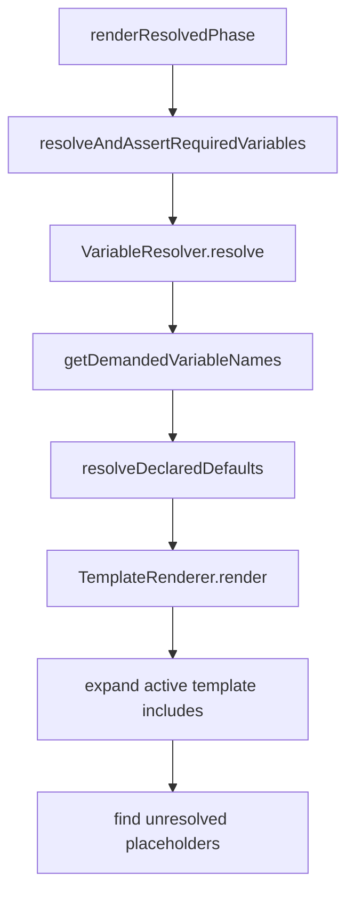
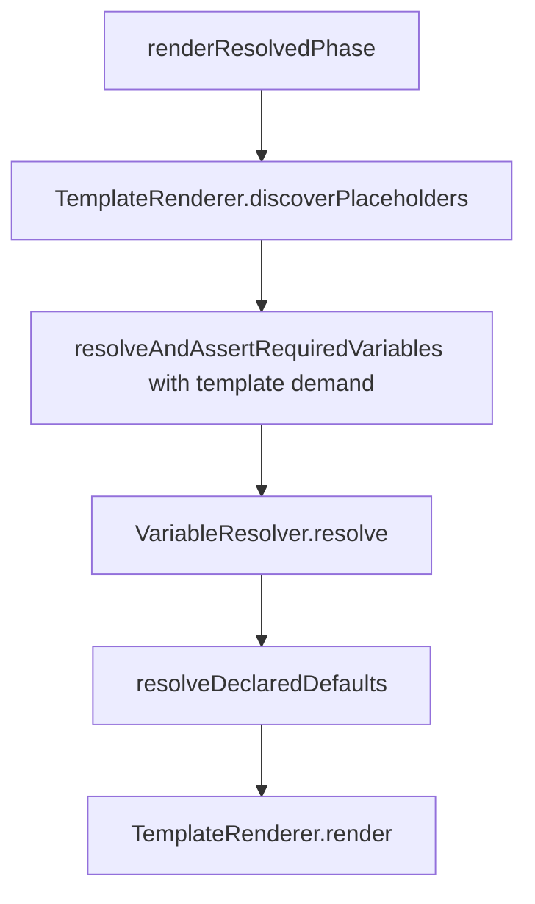

# Issue #270 Technical Spec

## Scope

Fix prompt rendering so a workflow variable default is resolved strictly when the active phase template renders that variable, even if the variable is not listed in `requiredVariables`, phase variables, or outputs.

Keep unused workflow defaults lazy/non-blocking when their unknown dependencies are not needed by the active phase. Do not change MCP, rollback, harness, routing, migration, viewer, or workflow editor behavior.

## Use Case Alignment

Workflow authors can declare a variable such as `REPORT_FILE` with default `docs/{{MISSING_KEY}}/report.md`. If the active phase template contains `{{REPORT_FILE}}`, rendering should report the broken default dependency `MISSING_KEY` via `UnknownVariableDefaultError`. The current behavior can suppress that error and later report only that `{{REPORT_FILE}}` is unresolved.

## High-Level Current Implementation Summary

Verified behavior:

- `PlaySpecCore.renderResolvedPhase()` calls `resolveAndAssertRequiredVariables()` before `TemplateRenderer.render()`.
- `VariableResolver.resolve()` merges workflow and phase variable declarations, then calls `resolveDeclaredDefaults()`.
- `resolveDeclaredDefaults()` suppresses `UnknownVariableDefaultError` and `CircularVariableDefaultError` only for top-level defaults that are not considered demanded.
- `getDemandedVariableNames()` currently demands required declarations, phase variable declarations unless explicitly `required: false`, `definition.requiredVariables`, `definition.outputs`, and placeholders inside output strings.
- `TemplateRenderer.render()` reads the selected template, recursively expands `{{include:...}}`, then checks unresolved placeholders before Handlebars rendering.

Inferred behavior:

- Since active-template placeholders are discovered only after variable resolution, a default used only by `{{REPORT_FILE}}` in the template is treated as unused during default resolution.

## Relevant Files Reviewed

- `src/core/playspec-core.ts`
- `src/template/variable-resolver.ts`
- `src/template/template-renderer.ts`
- `src/core/errors.ts`
- `tests/unit/variable-resolver.test.ts`
- `tests/unit/template-renderer.test.ts`

## Active Entry Points And Bypasses

Active entry points:

- `PlaySpecCore.renderNextPrompt()`
- `PlaySpecCore.renderExplicitPhasePrompt()`
- `PlaySpecCore.createSnapshot()`

Shared path:

- These paths reach `renderResolvedPhase()`, then `resolveAndAssertRequiredVariables()`, then `TemplateRenderer.render()`.

Bypasses:

- `assertNextPhaseRequiredVariables()` checks next-phase variables without rendering a prompt. It should keep using declaration-based demand only, because there is no active template render at that point.
- Direct `VariableResolver.resolve()` tests and callers should keep the current default behavior unless extra active-template demand is explicitly provided.

## Current Architecture

Verified flow:

Problem:

- Placeholder discovery happens at `F/G/H`, after demand-sensitive default suppression has already happened at `E`.

## Verified Behavior

- Non-demanded workflow defaults with unknown dependencies are intentionally ignored.
- Required variables, phase variables, requiredVariables, outputs, and output placeholders already make defaults demanded.
- `TemplateRenderer` has the correct active-template boundary because it resolves only the requested template and recursively expanded includes under the workflow template directory.

## Problems

- Active phase template placeholders are not included in default-demand calculation.
- The resolver can drop an unresolved default for a variable the active template actually renders.
- The final error points to the top-level placeholder instead of the missing dependency inside its default.

## Proposed Direction

Add a small active-template placeholder discovery path close to `TemplateRenderer`, reusing the same include expansion semantics and placeholder filtering as render. `PlaySpecCore.renderResolvedPhase()` should discover demanded placeholders from `definition.template` before resolving variables, then pass them into `VariableResolver.resolve()`.

Proposed flow:

## File-By-File Plan

`src/template/template-renderer.ts`

- Add a public method that reads the active template, expands includes with existing include safety/circular checks, and returns placeholder variable names.
- Keep filtering aligned with current unresolved-placeholder checks: ignore include directives, block/control tokens, comments, partials, and `else`.

`src/template/variable-resolver.ts`

- Add an optional resolve option such as `demandedVariables?: Iterable<string>`.
- Include those names in `getDemandedVariableNames()` before resolving declared defaults.
- Preserve existing behavior when no extra demanded variables are supplied.

`src/core/playspec-core.ts`

- In `renderResolvedPhase()`, discover active-template placeholder names before variable resolution and pass them into `resolveAndAssertRequiredVariables()`.
- Leave `assertNextPhaseRequiredVariables()` unchanged unless needed for type plumbing.

Tests:

- Add a focused core or integration test proving active-template-only placeholder demand raises `UnknownVariableDefaultError` for the default dependency.
- Keep/add resolver coverage proving an unused workflow default with an unknown dependency remains non-blocking.
- Add template placeholder discovery coverage if the helper is public.

## Risks And Open Questions

- Risk: demanding placeholders from inactive templates would revive unrelated defaults. Mitigation: discover only the active `definition.template` and its expanded includes.
- Risk: placeholder parsing may diverge between render and discovery. Mitigation: share the existing placeholder extraction/filter logic in `TemplateRenderer`.
- Open question: whether helper naming should be `discoverPlaceholderNames`, `getTemplatePlaceholderNames`, or similar. Prefer the name that reads cleanly at the call site.

## Reader Aids

Target behavior example:

- Workflow declares `REPORT_FILE.default = docs/{{MISSING_KEY}}/report.md`.
- Active phase template contains `{{REPORT_FILE}}`.
- No task variable supplies `REPORT_FILE`.
- Rendering fails with `UnknownVariableDefaultError` for `REPORT_FILE` depending on `MISSING_KEY`.
- If no active template or active include references `REPORT_FILE`, the same broken default remains non-blocking.
