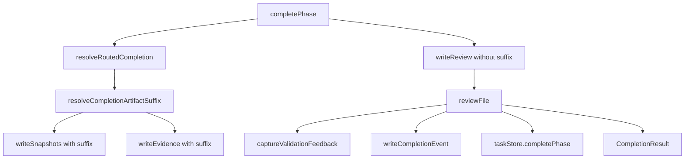
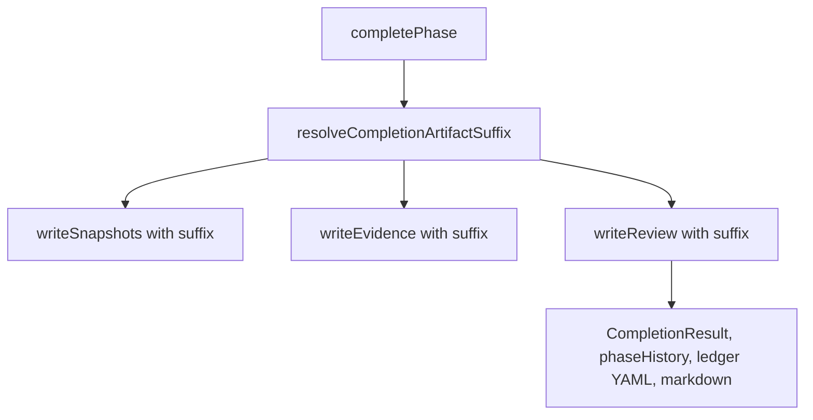

# Preserve Per-Visit Review Artifacts

## Scope

Fix review artifact naming for repeated routed phase completions so each visit records the review file written for that visit. Keep first-visit and non-routed review file names compatible.

Out of scope: routing redesign, review schema changes, validation template changes, feedback extraction redesign, completion ledger storage redesign, snapshot/evidence naming changes.

## Use Case Alignment

When a routed phase such as `validation` is completed, routed back, then completed again with `withReview: true`, users need both review artifacts to remain available. Completion result output, task `phaseHistory`, completion ledger YAML, and completion markdown should all point to the exact review artifact created during that completion.

## High-Level Current Implementation Summary

Verified code behavior:

- `PlaySpecCore.completePhase()` resolves routing before artifact writes and receives `visitCount` from `resolveRoutedCompletion()`.
- `resolveCompletionArtifactSuffix(visitCount)` returns an empty suffix for no visit count or visit 1, and `_visitN` for later routed visits.
- `writeSnapshots()` and `writeEvidence()` receive that suffix, so repeated routed completions produce distinct snapshot and evidence files.
- `writeReview()` currently receives only `task`, `phaseId`, and `validationTemplate`, then always writes `reviews/phase${phaseId}_review.yaml`.
- `reviewFile` returned from `writeReview()` flows into feedback capture, `writeCompletionEvent()`, `taskStore.completePhase()`, `CompletionResult`, and completion markdown rendering.

Inferred behavior:

- Because all downstream consumers use the single `reviewFile` string returned by `writeReview()`, fixing review path selection at the write point should update completion result, phase history, ledger YAML, and markdown consistently.

## Relevant Files Reviewed

- `src/core/playspec-core.ts`: completion routing, artifact writes, review write helper, completion ledger event creation, markdown rendering.
- `tests/integration/routing.test.ts`: routed workflow coverage, repeated visit snapshot/evidence assertions, completion ledger assertions.
- `tests/integration/completion-engine.test.ts`: non-routed review compatibility assertions for `reviews/phase1_review.yaml`.
- `src/storage/yaml-task-store.ts`: persists `reviewFile` from completion input into phase history.
- `src/storage/completion-ledger-store.ts`: appends completion events and markdown using the event payload from core.

## Active Entry Points And Bypasses

Active entry points:

- Core API: `PlaySpecCore.completePhase(taskId, { withReview: true, result })`.
- CLI: `playspec complete --review` routes through the core completion API.
- MCP completion tools are expected to route through core and should inherit this behavior without MCP-specific changes.

Bypasses:

- Manual artifact helpers for snapshots/evidence use manual suffixes and do not create review artifacts.
- Existing completion ledger display reads the stored event and does not recompute review paths.

## Current Architecture

Verified flow:

## Verified Behavior

- First routed visit currently uses unsuffixed snapshot/evidence paths.
- Second routed visit currently uses `_visit2` snapshot/evidence paths.
- First and second routed visits with review enabled would both write `reviews/phasevalidation_review.yaml`.
- Non-routed completion tests assert `reviews/phase1_review.yaml`; this path should stay unchanged.

## Problems

- Repeated routed review writes overwrite prior review files.
- Earlier phase history and completion ledger entries can point to review content created by a later visit.
- Feedback extraction inputs can become ambiguous because review paths are not visit-specific.

## Proposed Direction

Pass the existing `completionArtifactSuffix` into `writeReview()` and include it in the review filename:

- Visit 1 and non-routed: `reviews/phase${phaseId}_review.yaml`.
- Visit 2: `reviews/phase${phaseId}_visit2_review.yaml`.
- Visit N: `reviews/phase${phaseId}_visitN_review.yaml`.

Proposed flow:

## File-By-File Plan

- `src/core/playspec-core.ts`: add an optional suffix parameter to `writeReview()` and pass `completionArtifactSuffix` from `completePhase()`.
- `tests/integration/routing.test.ts`: add focused regression coverage for two routed validation completions with `withReview: true`; assert distinct review paths, file existence, first review content remains unchanged, phase history references, ledger event references, and completion markdown references.
- Existing non-routed tests in `tests/integration/completion-engine.test.ts` remain the compatibility guard for first-visit path behavior.

## Risks And Open Questions

- Risk: feedback extraction consumes `reviewFile`; this should be safe because it receives the same returned path, but regression coverage should exercise completion with review enabled.
- Risk: completion markdown path assertions need to inspect both routed events, not only ledger YAML.
- Open question: none requiring product decision; the compatible first-visit path is clear from existing tests.

## Reader Aids

Key invariant: the review artifact path must be computed once during completion and passed through all persisted and returned records, matching snapshots/evidence visit suffix compatibility.
