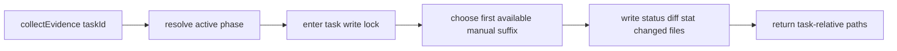
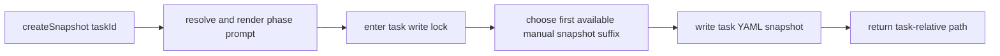

# Issue #276 Manual Artifact Uniqueness Spec

## Scope

Preserve distinct task-relative artifact files when `PlaySpecCore.collectEvidence(taskId)` or `PlaySpecCore.createSnapshot(taskId)` is called repeatedly for the same active task phase before phase completion or mutation.

In scope:

- Manual evidence filenames returned in `EvidenceResult.evidenceFiles`.
- Manual snapshot filenames returned in `SnapshotResult.snapshotFiles`.
- Focused integration coverage in `tests/integration/completion-engine.test.ts`.

Out of scope:

- Completion ledger semantics.
- Routed completion artifact visit-count behavior.
- Task artifact model redesign.
- MCP or CLI response shape changes beyond the returned filenames already exposed by core.

## Use Case Alignment

Operators and automation can manually collect evidence or snapshots during audit and recovery workflows. Two consecutive collections for the same phase must leave both collection results recoverable from the task directory. The file paths must remain relative to the task root so existing CLI/MCP consumers can continue to display and resolve them.

## High-Level Current Implementation Summary

Verified behavior:

- `collectEvidence()` resolves the active workflow phase and calls `writeEvidence(task, phaseId, '_manual')`.
- `writeEvidence()` writes three fixed files under `evidence/` using the supplied suffix.
- `createSnapshot()` resolves the active workflow phase and calls `writeSnapshots(task, phaseId, promptSnapshot, 'manual')`.
- `writeSnapshots()` writes a fixed manual file at `snapshots/phase${phaseId}_manual_task.yaml`.
- `completePhase()` computes a routed completion visit suffix and passes it to `writeSnapshots()` and `writeEvidence()`, preserving existing repeated completion artifact naming.

Inferred behavior:

- CLI and MCP manual collection commands delegate to core and should inherit filename uniqueness without interface changes.

## Relevant Files Reviewed

- `src/core/playspec-core.ts`
- `src/core/types.ts`
- `src/cli/commands/evidence.ts`
- `src/cli/commands/snapshot.ts`
- `src/mcp/server.ts`
- `tests/integration/completion-engine.test.ts`
- `package.json`

## Active Entry Points And Bypasses

Active entry points:

- Core: `PlaySpecCore.collectEvidence(taskId)`
- Core: `PlaySpecCore.createSnapshot(taskId)`
- CLI evidence command delegates to `collectEvidence()`.
- CLI snapshot command delegates to `createSnapshot()`.
- MCP evidence and snapshot tools delegate to the same core methods.

Bypasses:

- Routed completion uses `completePhase()` and must continue using `resolveCompletionArtifactSuffix()`.
- Existing evidence content generation through `GitState` should not change.
- Snapshot content should remain the YAML task record for manual snapshots.

## Current Architecture

Manual artifact path generation is embedded in the same private writers used by completion artifacts:

- `writeEvidence(task, phaseId, suffix)` accepts a suffix and writes status, diff stat, and changed-files artifacts.
- `writeSnapshots(task, phaseId, prompt, mode, contextMode, completionSuffix)` branches on `mode`; manual mode currently ignores suffixing and returns only the task YAML file.

The task root write lock wraps each manual operation, so deterministic collision detection can safely inspect existing files and choose the next available suffix inside the locked section.

## Verified Behavior

The current integration test `creates manual evidence and snapshot artifacts without phase mutation` asserts exact single-call manual paths:

- `evidence/phase1_manual_git_status.txt`
- `evidence/phase1_manual_git_diff_stat.txt`
- `evidence/phase1_manual_changed_files.txt`
- `snapshots/phase1_manual_task.yaml`

This proves the single-call shape but not repeat behavior. With the current fixed paths, a second manual call for the same phase rewrites the same files.

## Problems

- Manual evidence collection has no collision avoidance.
- Manual snapshot collection has no collision avoidance.
- Existing tests encode exact first-call paths and do not check whether first-call files survive after a second call.

## Proposed Direction

Add deterministic existing-file collision suffixing for manual artifacts only:

- First manual collection keeps the readable existing names.
- If the base manual files already exist, the next collection uses `_manual2`, then `_manual3`, and so on.
- Evidence suffixes should be selected as a set so all three files from one collection use the same suffix.
- Snapshot suffix selection should follow the same readable pattern, producing `snapshots/phase1_manual2_task.yaml` on the second collection.
- Completion mode continues using the existing routed visit suffix path unchanged.

This is deterministic, testable, task-relative, and avoids timestamp-only flakiness.

## File-By-File Plan

- `src/core/playspec-core.ts`
  - Add a small private helper to choose the first available manual suffix by checking for existing task-relative artifact files.
  - Update `collectEvidence()` to choose a manual evidence suffix inside the task write lock before calling `writeEvidence()`.
  - Update `createSnapshot()` or `writeSnapshots()` so manual snapshots choose a collision-free suffix inside the task write lock.
  - Preserve completion calls and existing visit suffix behavior.

- `tests/integration/completion-engine.test.ts`
  - Update the existing manual artifact test to assert first-call paths remain understandable and task-relative.
  - Add or extend coverage for two consecutive `collectEvidence()` calls, reading files from both returned path sets and proving first-call paths still exist after the second call.
  - Add or extend coverage for two consecutive `createSnapshot()` calls, reading both returned snapshot files and proving the first file still exists after the second call.
  - Keep repeated routed completion tests unchanged.

## Risks And Open Questions

Risks:

- Existing exact filename assertions must be updated intentionally.
- Suffix selection must happen while holding the task write lock to avoid same-process races.

Open questions:

- None blocking. The issue recommends deterministic suffixing, and existing first-call filenames can remain unchanged for compatibility.

## Reader Aids

Proposed manual evidence flow:

Proposed manual snapshot flow:

