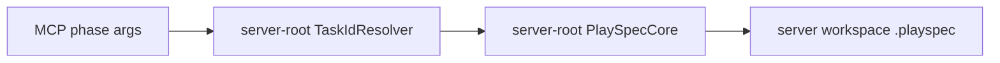
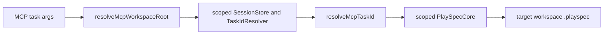

# Issue 278 MCP Workspace Root Spec

## Scope

Fix MCP task and phase tools so a caller can target a PlaySpec workspace outside the MCP server process working directory by passing `workspaceRoot`.

This change is limited to MCP request handling and tests. It does not change CLI HEAD behavior, Core task lookup semantics, workflow definitions, or storage layout.

## Use Case Alignment

An MCP server may run with a default root such as `/Users/chanwook.lee`, while the target task lives in a project workspace such as `/Users/chanwook.lee/PJ/AliveSolution`. `playspec_get_task` and `playspec_list_tasks` already support this by accepting `workspaceRoot`. Phase/progress tools should use the same root for task resolution, session lookup, prompt rendering, phase completion, evidence collection, and related task-scoped operations.

## High-Level Current Implementation Summary

Verified behavior:
- `src/mcp/server.ts` constructs one `YamlTaskStore`, `PlaySpecCore`, `McpSessionStore`, and `TaskIdResolver` from the server `workspaceRoot`.
- `playspec_get_task` and `playspec_list_tasks` accept `workspaceRoot`, call `resolveMcpWorkspaceRoot()`, and instantiate a scoped `YamlTaskStore`.
- `playspec_render_next_prompt`, `playspec_complete_phase`, `playspec_collect_evidence`, `playspec_use_session_task`, and other task-scoped tools use the server-root resolver/store/core.
- `src/mcp/context.ts` correctly centralizes MCP task-id resolution through `resolveMcpTaskId()` and does not read `.playspec/HEAD`.

Inferred behavior:
- When a task exists only in a project workspace, task-scoped MCP tools fail because prefix/canonical lookup happens against the wrong `.playspec` root.
- Session binding also lands in the server root because `McpSessionStore` is bound to the server root.

## Relevant Files Reviewed

- `src/mcp/server.ts`: MCP tool registration and handler dependencies.
- `src/mcp/context.ts`: task/session context resolution.
- `src/mcp/session-store.ts`: workspace-scoped session file persistence.
- `src/mcp/workspace-diagnostics.ts`: explicit workspace resolution and diagnostics formatting.
- `tests/integration/mcp-server.test.ts`: existing MCP lookup, session, render, and completion coverage.

## Active Entry Points And Bypasses

Active entry points:
- MCP tools registered in `buildMcpServer()`.
- `resolveMcpTaskId()` for all task/session task identity resolution.
- `TaskIdResolver` for canonical task id and prefix handling.
- `PlaySpecCore` for prompt, completion, evidence, snapshot, rollback, harness, and task link behavior.

Bypasses:
- `playspec_get_task` and `playspec_list_tasks` bypass the server-root store by constructing a scoped `YamlTaskStore`.
- No task-scoped phase tool currently has an equivalent scoped dependency path.

## Current Architecture

Verified flow for explicit lookup:

Verified flow for phase tools:

Proposed flow:

## Verified Behavior

- `resolveMcpTaskId()` is already the required MCP context boundary and should remain the only task-id/session-id resolver used by MCP task tools.
- `resolveMcpWorkspaceRoot()` already exists and is used by lookup tools.
- `McpSessionStore` stores sessions under the workspace `.playspec/sessions` directory, so it must be scoped to the effective workspace root for project-local session binding.

## Problems

1. Task-scoped MCP tools do not accept `workspaceRoot` through their shared input schema.
2. Handlers that operate on tasks use server-root dependencies even if a caller could supply a workspace.
3. Session binding and session lookup are server-root only, preventing a project-local MCP-only workflow from using `sessionId`.

## Proposed Direction

- Add optional `workspaceRoot` to the shared MCP task context schema.
- Add a small handler-local helper that resolves the effective workspace root and constructs scoped MCP dependencies.
- Use scoped `McpSessionStore`, `TaskIdResolver`, and `PlaySpecCore` for every task-scoped handler.
- Keep `resolveMcpTaskId()` in the task-id resolution path.
- Add regression coverage proving a server rooted elsewhere can use `workspaceRoot` to bind a session, render a prompt, complete a phase, and collect evidence for a project-local task.

## File-By-File Plan

- `src/mcp/server.ts`
  - Extend task-context schemas with `workspaceRoot`.
  - Create scoped dependency helper for task handlers.
  - Update task-scoped handlers to use scoped dependencies and effective workspace root.
  - Update session get/bind handlers to accept and use `workspaceRoot`.

- `tests/integration/mcp-server.test.ts`
  - Add explicit-workspace regression tests for phase/progress tools.
  - Assert that session binding with `workspaceRoot` writes/reads the project workspace session and can render through that session.

## Risks And Open Questions

- Re-instantiating scoped dependencies per MCP call is simple and consistent with the existing get/list pattern. If performance becomes a concern later, a scoped dependency cache can be added separately.
- Existing clients that omit `workspaceRoot` should continue using the server root unchanged.
- This implementation will not infer a workspace root from a bare `taskId`; callers still need to pass `workspaceRoot` when the task is outside the server root.

## Reader Aids

- `workspaceRoot` means the project root containing `.playspec`.
- Server root means the process cwd captured by `src/mcp/index.ts` and passed to `buildMcpServer()`.
- Task-scoped MCP tools are tools that accept `taskId` or `sessionId` and operate on task state.
