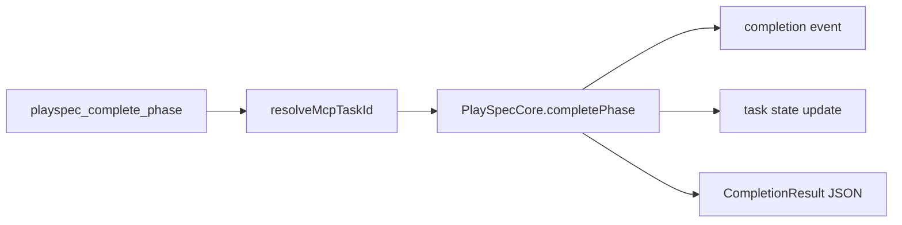
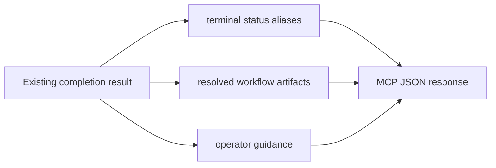

# Issue 282 MCP Terminal Workflow Status Spec

## Scope

Harden the `playspec_complete_phase` MCP response when a completion advances past the last workflow phase. The change must expose terminal workflow status and finalized workflow artifacts from the response alone. It must not add MCP task creation, evolution generation, archive behavior, or new routing semantics.

## Use Case Alignment

MCP-only automation repeatedly renders a prompt, produces phase artifacts, and calls `playspec_complete_phase`. On the final phase, the caller needs a structured signal that the workflow is complete, which artifacts are final, where the completion record is stored, and which MCP calls remain valid. This avoids follow-up CLI/status polling.

## High-Level Current Implementation

Verified current path:

- `src/mcp/server.ts` registers `playspec_complete_phase`, resolves task context with `resolveMcpTaskId()`, delegates to `PlaySpecCore.completePhase()`, and returns the result as JSON.
- `src/core/playspec-core.ts` owns phase completion: routing validation, prompt snapshots, evidence files, optional review file, feedback capture, completion ledger write, task state update, and optional evolution context snapshot.
- `src/core/types.ts` defines `CompletionResult` with `taskId`, `completedPhase`, `nextPhase`, `status`, phase artifact files, optional `completionEvent`, and optional feedback.
- `CompletionEvent` already records `previousPhase`, `nextPhase`, `statusAfterCompletion`, and `markdownFile`.
- Workflow artifact metadata exists on `WorkflowDefinition.artifacts`; `mono-spec` declares `spec`, `plan`, `result`, and `pr` paths via workflow variables.

## Relevant Files Reviewed

- `src/mcp/server.ts`: MCP tool registration and complete-phase delegation.
- `src/core/playspec-core.ts`: completion state transition, artifact writing, completion ledger event creation.
- `src/core/types.ts`: completion result, event, workflow, and artifact declaration types.
- `src/template/variable-resolver.ts`: workflow/task variable resolution for artifact path templates.
- `src/preset/assets/workflows/mono-spec/workflow.yaml`: declared final workflow artifact metadata.
- `tests/integration/mcp-server.test.ts`: MCP handler integration patterns.

## Active Entry Points And Bypasses

Active entry point:

`playspec_complete_phase` -> `resolveScopedTask()` -> `resolveMcpTaskId()` -> `PlaySpecCore.completePhase()` -> `YamlTaskStore.completePhase()`.

Bypasses to preserve:

- CLI completion uses `ActiveTaskResolver` and may print terminal text; this issue does not require CLI output changes.
- MCP task lookup/listing should continue to read state from storage after final completion.
- Non-final completion should keep returning next-phase data and should not be forced into a terminal-only payload shape.

## Current Architecture

Core computes the next phase before writing artifacts. When `nextPhase === null`, it sets task status to `completed`, writes a completion event, and persists task state through the task store. MCP currently returns the raw `CompletionResult`, which is useful but does not explicitly say the workflow is terminal or resolve declared workflow artifact paths.

## Verified Behavior

- `completionResult.nextPhase` is `null` on final completion.
- `completionResult.status` is `completed` on final completion.
- `completionResult.completionEvent.markdownFile` contains the completion record path.
- `completionResult.completionEvent.previousPhase` currently carries the phase completed by that event.
- Workflow artifact declarations can be resolved using `VariableResolver.resolve()` against the task, workflow, and completed phase.

## Problems

- MCP callers must infer workflow completion from `nextPhase === null` and `status === completed`.
- Final artifact metadata is not returned in the completion response.
- Operator guidance for valid next MCP calls is absent.
- The response contract does not clearly distinguish final completion from intermediate completion.

## Proposed Direction

Add terminal-aware fields to the core `CompletionResult`, populated from existing completion data and workflow metadata:

- `workflow`: workflow id.
- `completedPhaseId`: alias for the completed phase id.
- `previousPhaseId`: phase before the completion transition, sourced from the completion event.
- `nextPhaseId`: alias for the post-completion phase id or `null`.
- `taskStatus`: alias for task status after completion.
- `isWorkflowComplete`: `true` when `nextPhase === null` and status is `completed`.
- `finalArtifacts`: resolved workflow artifact declarations with role, path, kind, description, and an `exists` flag.
- `completionRecordPath`: completion event markdown file path.
- `operatorGuidance`: valid next MCP calls, with terminal guidance favoring `playspec_get_task`, `playspec_list_tasks`, and optional completion inspection via existing artifact paths.

Keep MCP simple by returning the enriched core result directly. This reuses existing completion logic and avoids duplicating terminal detection in the MCP server.

## File-By-File Plan

- `src/core/types.ts`: add explicit completion contract types and optional fields to `CompletionResult`.
- `src/core/playspec-core.ts`: resolve workflow artifacts using existing variable resolution after completion, set terminal fields, and include completion record path and guidance.
- `tests/integration/mcp-server.test.ts`: add a multi-phase MCP completion test that checks non-final next-phase behavior, final terminal status, final artifact metadata, and task/list consistency.
- Existing CLI should continue compiling because added fields are optional/additive.

## Risks And Open Questions

- `previousPhaseId` naming is ambiguous after completing a phase. To match existing ledger semantics, it should mirror `CompletionEvent.previousPhase`.
- Artifact paths may point to files that are expected outputs but not yet present. Include `exists` so automation can distinguish declared final artifacts from currently materialized files.
- `CompletionResult` currently uses `completedPhase` and `nextPhase`; adding aliases is backward-compatible but creates duplicate names. This is acceptable for MCP contract hardening.

## Reader Aids

Verified flow:

Proposed terminal response enrichment:

