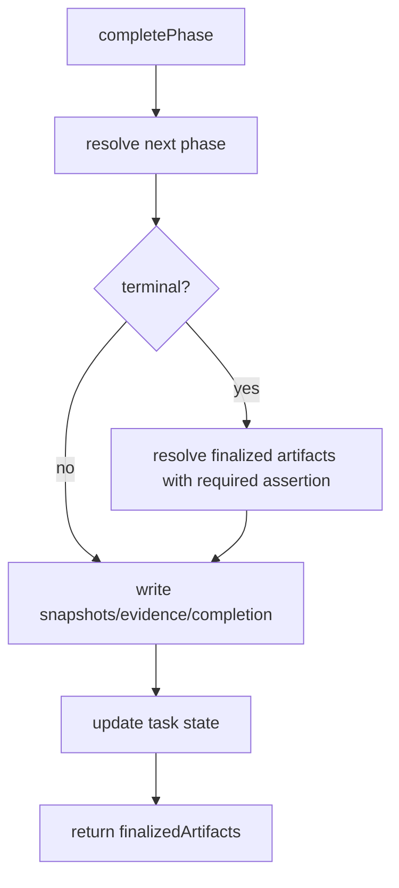

# Technical Spec: Validate Finalized Artifact Variables

## Scope

Fix terminal workflow completion so workflow-level `artifacts` paths receive the same required-variable validation as prompt rendering before finalized artifact metadata is produced.

In scope:

- `src/core/playspec-core.ts` finalized artifact variable resolution.
- Integration tests in `tests/integration/mcp-server.test.ts`.
- Existing variable resolver behavior and required-variable error shape.

Out of scope:

- Redesigning workflow artifacts or completion records.
- Changing evidence, snapshot, review, rollback, MCP task resolution, or migration behavior.
- Adding viewer behavior or broader workflow semantics.

## Use Case Alignment

Operators completing a terminal phase should get an actionable missing-variable error when a required workflow variable is needed to locate final artifacts. Completion should not report paths containing raw placeholders like `{{PROJECT_KEY}}`.

## High-Level Current Implementation Summary

Verified behavior:

- Prompt rendering calls `resolveAndAssertRequiredVariables()`, which resolves defaults and then calls `assertRequiredVariables()`.
- Completion computes `nextPhase`, writes completion artifacts, updates task state, then calls `resolveFinalizedArtifacts()`.
- `resolveFinalizedArtifacts()` currently calls `this.variableResolver.resolve()` directly with artifact path placeholders as `additionalDemandedVariables`, then calls `renderInlineTemplate()` for each artifact path.
- `renderInlineTemplate()` preserves unresolved placeholder tokens when a variable is unavailable.

Inferred behavior:

- A terminal completion with a missing required variable used only by `workflow.artifacts.*.path` can produce finalized artifact metadata with unresolved placeholders, or fail only after downstream path inspection.
- If validation is performed only after `taskStore.completePhase()`, an error can still leave task state completed.

## Relevant Files Reviewed

- `src/core/playspec-core.ts`
- `src/core/required-variables.ts`
- `tests/integration/mcp-server.test.ts`
- `tests/unit/variable-resolver.test.ts`
- `package.json`

## Active Entry Points and Bypasses

Active entry point:

- MCP `playspec_complete_phase` delegates to `PlaySpecCore.completePhase()`.

Important path:

- `completePhase()` -> `resolveRoutedCompletion()` -> `assertNextPhaseRequiredVariables()` -> snapshot/evidence writes -> `taskStore.completePhase()` -> `resolveFinalizedArtifacts()`.

Bypass:

- `resolveFinalizedArtifacts()` bypasses `resolveAndAssertRequiredVariables()`, so declarations with `required: true` are not asserted for variables demanded only by workflow artifact paths.

## Current Architecture

`VariableResolver.resolve()` determines variables from task values, workflow/phase declarations, defaults, and demanded placeholders. It intentionally does not enforce required declarations by itself. Required checks live in `assertRequiredVariables()` and are invoked by higher-level flows.

## Verified Behavior

The existing terminal MCP integration test verifies that workflow artifacts using defaults such as `RESULT_FILE: "{{OUTPUT_DIR}}/result.md"` are rendered into `finalizedArtifacts`.

The variable resolver unit tests verify that optional defaults with unavailable dependencies remain undefined unless demanded, and that missing required default dependencies are represented as undefined values for required-variable assertion to catch.

## Problems

`resolveFinalizedArtifacts()` requests artifact path placeholders from the resolver but does not assert required declarations. A missing required variable can therefore reach `renderInlineTemplate()`.

Also, finalized artifact resolution currently runs after task completion persistence, so a terminal validation failure should be preflighted before completion writes/state mutation.

## Proposed Direction

1. Route finalized artifact variable resolution through `resolveAndAssertRequiredVariables()` using artifact path placeholders as `additionalDemandedVariables`.
2. Preflight finalized artifact resolution before terminal completion writes when `nextPhase === null`.
3. Keep the post-completion finalized artifact response shape unchanged for valid workflows.
4. Add MCP integration coverage for missing required artifact path variables and declaration defaults.

## File-by-File Plan

`src/core/playspec-core.ts`

- In `completePhase()`, after routing and next-phase validation, preflight finalized artifact resolution when `nextPhase === null`.
- Update `resolveFinalizedArtifacts()` to use `resolveAndAssertRequiredVariables()` with artifact path placeholders.

`tests/integration/mcp-server.test.ts`

- Add a negative terminal completion test with `artifacts.result.path: docs/{{PROJECT_KEY}}/result.md`, `PROJECT_KEY.required: true`, and no task variable.
- Assert MCP returns the public error wrapper containing `Missing required variables` and `PROJECT_KEY`.
- Add or extend a positive test where an artifact path variable is resolved from declaration defaults and appears resolved in `finalizedArtifacts`.

## Risks and Open Questions

Risk:

- Workflows that previously completed with unresolved required placeholders will now fail at terminal completion. This matches prompt rendering behavior and the issue acceptance criteria.

Open questions:

- None for implementation scope.

## Reader Aids

Proposed terminal flow:

