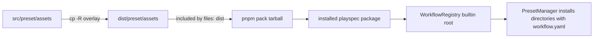

# Issue #293 Clean Preset Assets Spec

## Scope

Ensure package builds make `dist/preset/assets` a clean copy of `src/preset/assets` before packaging. The change is limited to preset asset packaging and regression coverage around stale copied workflow/template assets.

Out of scope: workflow precedence, preset install semantics, CLI UX, release process redesign, and broader `dist` cleanup.

## Use Case Alignment

Maintainers need `pnpm build` and `pnpm pack` to produce package assets that match the current source tree. If a bundled workflow or template was removed or renamed in `src/preset/assets`, a previous build must not leave the old asset in `dist/preset/assets` where installed packages can expose it.

## High-Level Current Implementation Summary

Verified behavior:

- `package.json` defines `build` as `tsc && tsc-alias && mkdir -p dist/preset/assets && cp -R src/preset/assets/. dist/preset/assets`.
- `prepack` runs `pnpm build`, so package artifacts inherit the build asset copy behavior.
- `WorkflowRegistry` resolves the built-in workflow root from compiled runtime location: `dist/preset/assets/workflows`.
- `PresetManager.installPresetWorkflows()` enumerates every directory in the built-in root and copies entries containing `workflow.yaml`.
- `tests/integration/package-artifact.test.ts` packs the repository, installs the tarball into a temp consumer, and asserts compiled bins plus selected `mono-spec` assets are present.

Inferred behavior:

- Because `cp -R` overlays into an existing directory, removed source workflow directories or template files can remain in `dist/preset/assets` after a later build.
- Those stale workflow directories are observable because runtime code enumerates the built-in root rather than using a generated manifest.

## Relevant Files Reviewed

- `package.json`: build and prepack scripts.
- `tests/integration/package-artifact.test.ts`: package artifact/install regression coverage.
- `src/preset/assets/**`: source assets that should be mirrored.
- `src/workflow/workflow-registry.ts`: built-in workflow root resolution and listing.
- `src/preset/preset-manager.ts`: preset init copies built-in workflows discovered in the compiled root.

## Active Entry Points And Bypasses

Active entry points:

- `pnpm build` is the direct package build path.
- `pnpm pack` invokes `prepack`, which invokes `pnpm build`.
- Installed CLI `playspec init --preset default` can install built-in workflows from the package asset tree.

Bypasses/alternate paths:

- Runtime source execution with `tsx src/cli/index.ts` may use the repository's compiled asset root when available; this issue only targets package build output.
- Project/user workflow directories are separate roots and must not be cleaned.
- The fix should not remove all of `dist`, because compiled output and TypeScript build behavior are unrelated to this issue.

## Current Architecture

Verified flow:

Problem: the overlay step does not remove files that exist only in `dist/preset/assets`.

## Verified Behavior

- Current source assets include built-in workflows such as `mono-spec`, `issue-scope-create`, `issue-validate`, `multi-spec`, `phase-execution`, `simple-bug`, and `total-plan`.
- Package artifact coverage asserts two `mono-spec` asset paths are installed but does not seed stale `dist/preset/assets` content before packing.

## Problems

- A stale workflow directory under `dist/preset/assets/workflows/<old-id>/workflow.yaml` survives the current build script.
- A stale template file under an existing workflow survives the current build script.
- `prepack` can include those stale files in the tarball.
- Installed package behavior can expose or install stale built-in workflow assets.

## Proposed Direction

Replace the overlay-only asset copy command with a clean-copy step that removes only `dist/preset/assets`, recreates it, and copies `src/preset/assets` into it. Keep this path in `package.json` so `pnpm build` and `pnpm pack` share the same behavior.

Add package artifact regression coverage that:

- Seeds a stale workflow directory and a stale template file into `dist/preset/assets`.
- Runs the same package build path used by `prepack` through `pnpm build` or `pnpm pack`.
- Asserts stale files are absent after the build/package operation.
- Keeps assertions that current source assets are present in the installed package artifact.

## File-By-File Plan

- `package.json`: update `build` to clean `dist/preset/assets` before copying source assets.
- `tests/integration/package-artifact.test.ts`: extend the package artifact test, or add a focused test in the same file, to seed stale preset assets and assert cleanup.
- Optional only if needed: add small local test helper functions for stale path seeding and absence assertions.

## Risks And Open Questions

- Risk: using `rm -rf dist/preset/assets` is intentionally scoped but still shell-dependent. This package already uses POSIX shell commands in `build`; using a POSIX cleanup command is consistent with the current script.
- Risk: the package artifact test invokes packaging/build and may be slower; keep new assertions focused to avoid broad fixture churn.
- Open question: none blocking.

## Reader Aids

- The desired invariant is `dist/preset/assets` equals the source asset tree after `pnpm build`.
- Do not clean `.playspec/workflows`, user workflow roots, or all of `dist`.
