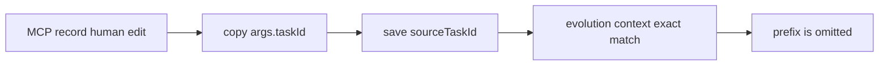
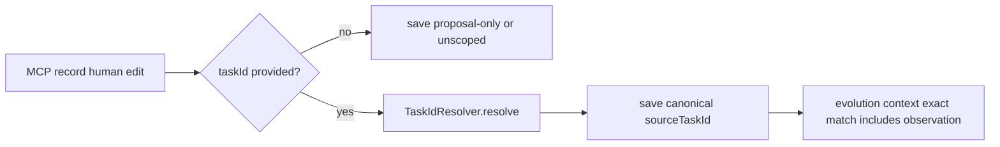

# Issue #295: Canonicalize MCP Human Edit Observation Task IDs

## Scope

Fix `playspec_record_human_edit_observation` so an optional MCP `taskId` is resolved to a canonical task ID before it is stored as `sourceTaskId` on a human edit observation.

In scope:

- Resolve provided MCP `taskId` values through the scoped `TaskIdResolver`.
- Preserve exact task ID behavior.
- Preserve MCP no-HEAD semantics.
- Preserve proposal-only and unscoped observations when `taskId` is omitted.
- Reject ambiguous or missing task ID prefixes before writing an observation.
- Add focused MCP integration coverage and evolution-context coverage for the canonicalized write path.

Out of scope:

- CLI evolution command behavior.
- Human edit observation schema or storage layout.
- Evolution context filtering behavior.
- `playspec_get_task` prefix semantics.
- Any `.playspec/HEAD` fallback in MCP tools.

## Use Case Alignment

MCP clients can use exact task IDs or unique task ID prefixes in task-context tools. A client should be able to record a human edit observation with the same task reference style and later see that observation included when rendering or completing the canonical task with evolution context.

## High-Level Current Implementation Summary

Verified:

- `src/mcp/server.ts` constructs scoped task context with `YamlTaskStore`, `McpSessionStore`, and `TaskIdResolver`.
- Shared MCP task routing calls `resolveMcpTaskId()`, which validates `taskId`, resolves exact IDs or unique prefixes through `TaskIdResolver`, and does not read `.playspec/HEAD`.
- `playspec_record_human_edit_observation` currently accepts `taskId: z.string().optional()` but writes `args.taskId` directly to `sourceTaskId`.
- `EvolutionContextReader.collect()` includes human edit observations only when `observation.sourceTaskId === task.id` or when an observation references a relevant proposal.

Inferred:

- A stored prefix will be persisted successfully but later omitted for the intended task because evolution context filtering requires the canonical task ID.

## Relevant Files Reviewed

- `src/mcp/server.ts`
- `src/mcp/context.ts`
- `src/core/task-id-resolver.ts`
- `src/evolution/context-reader.ts`
- `tests/integration/mcp-server.test.ts`
- `tests/integration/init-create-next.test.ts`
- `README.md`
- `package.json`

## Active Entry Points And Bypasses

Active path:

1. MCP client calls `playspec_record_human_edit_observation`.
2. Handler builds a `HumanEditObservation`.
3. Handler saves through `EvolutionHumanEditStore.saveObservation()`.
4. Later prompt rendering or phase completion may request evolution context.
5. `EvolutionContextReader.collect()` filters observations by exact canonical task ID.

Bypass:

- The record-human-edit handler does not currently call `resolveMcpTaskId()` or `TaskIdResolver` for `args.taskId`.

Old or alternate paths:

- CLI `playspec evolution human-edit` has separate behavior and is out of scope.
- Proposal-only observations can still be included by proposal relevance and must continue to work without task resolution.

## Current Architecture

`TaskIdResolver.resolve()` loads active and completed task IDs, returns exact matches as exact, returns a unique prefix match as prefix, throws `AmbiguousTaskIdError` for multiple matches, and throws `TaskIdResolutionError` for no matches.

MCP task-context tools use resolver-backed canonical IDs and avoid HEAD fallback. Evolution context consumes persisted records and does not attempt late canonicalization.

## Verified Behavior

- `resolveMcpTaskId()` canonicalizes explicit task IDs and prefixes.
- `playspec_render_next_prompt` already has MCP prefix coverage showing canonical task ID output.
- Human edit observation persistence accepts optional `sourceTaskId` without checking that it maps to an existing task.
- Evolution context is exact-match on `sourceTaskId`.

## Problems

- `playspec_record_human_edit_observation` can persist a stale prefix in `sourceTaskId`.
- Ambiguous and nonexistent task references can be stored as observations instead of failing.
- The user-visible MCP behavior is inconsistent with documented MCP task-context resolution.

## Proposed Direction

In the MCP human-edit handler:

1. If `args.taskId` is present, create scoped task context for the request workspace.
2. Resolve `args.taskId` with the scoped `TaskIdResolver`.
3. Store `resolved.taskId` as `sourceTaskId`.
4. If resolution fails, return the existing MCP error response and do not call `saveObservation()`.
5. If `args.taskId` is absent, keep the current proposal-only or unscoped observation behavior.

Also ensure the handler uses workspace-scoped evolution storage when `workspaceRoot` is provided, so task resolution and observation writes target the same workspace.

## File-By-File Plan

`src/mcp/server.ts`

- Add optional `workspaceRoot` to the tool schema if required to support scoped writes consistently.
- Resolve provided `taskId` through the scoped `TaskIdResolver` before observation construction.
- Build `sourceTaskId` only from the canonical resolved task ID.
- Save through an `EvolutionHumanEditStore` bound to the effective workspace root.

`tests/integration/mcp-server.test.ts`

- Add a test where `taskId` is a unique prefix and persisted `sourceTaskId` is the canonical task ID.
- Add ambiguous-prefix and nonexistent-task tests that assert an MCP error response and no human edit observation file is written.
- Add evolution-context coverage through the MCP record handler and `playspec_render_next_prompt` or `playspec_complete_phase` with `withEvolutionContext`.

## Risks And Open Questions

Risks:

- Behavior becomes stricter for callers that previously used arbitrary `taskId` strings. This matches existing MCP task routing and issue requirements.
- The existing top-level `humanEditStore` in `buildMcpServer()` may be workspace-root fixed; the fix should avoid introducing workspace mismatch for calls with `workspaceRoot`.

Open questions:

- None blocking.

## Reader Aids

Verified current flow:

Proposed flow:

