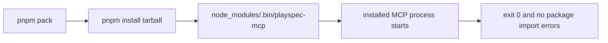

# Issue #297 - Exercise Installed playspec-mcp Bin In Package Artifact Coverage

## Scope

Update package artifact test coverage so a packed PlaySpec tarball installed into a temporary consumer workspace verifies both public package bins:

- `node_modules/.bin/playspec`
- `node_modules/.bin/playspec-mcp`

The runtime implementation, MCP startup behavior, package `bin` metadata, workflow loading, and unrelated CLI UX are out of scope.

## Use Case Alignment

Consumers configure MCP through the published `playspec-mcp` command from `package.json#bin`. The package artifact smoke test should therefore prove the installed command shim exists and starts without package import resolution failures after `pnpm pack` and install.

## High-Level Current Implementation Summary

Verified in `tests/integration/package-artifact.test.ts`:

- The test packs the repository with `pnpm pack`.
- It installs the tarball into a temporary consumer workspace.
- It verifies expected compiled files and preset workflow assets are present.
- It verifies stale preset assets are absent.
- It invokes installed `.bin/playspec` for `init --preset default`.
- It starts MCP by running `node node_modules/playspec/dist/mcp/index.js`, which bypasses the installed `.bin/playspec-mcp` shim.

Verified in `tests/integration/runtime-bin.test.ts`:

- Runtime-bin coverage starts compiled repository entry points directly with `node dist/...`.
- This is separate from packed-artifact consumer shim coverage.

## Relevant Files Reviewed

- `package.json`: publishes `playspec` and `playspec-mcp` under `bin`.
- `tests/integration/package-artifact.test.ts`: package tarball install smoke test and target for this change.
- `tests/integration/runtime-bin.test.ts`: related direct compiled-bin runtime coverage, not expected to change.

## Active Entry Points And Bypasses

Verified active consumer CLI path:

- `node_modules/.bin/playspec` is built with `path.join(consumerWorkspace.dir, 'node_modules', '.bin', 'playspec')`.
- `execa(binPath, ['init', '--preset', 'default'], ...)` exercises the installed shim.

Verified MCP bypass path:

- `mcpBinPath` is currently `path.join(installedPackageRoot, 'dist/mcp/index.js')`.
- `execa('node', [mcpBinPath], ...)` proves the compiled file can start, but not that package-manager bin metadata produced a working consumer command.

## Current Architecture

The package artifact test creates a consumer-style installation boundary:

1. Pack this repository.
2. Install the tarball into a separate temp workspace.
3. Inspect files under `node_modules/playspec`.
4. Invoke package-manager-created shims under `node_modules/.bin`.

The existing CLI assertion follows that boundary. The MCP assertion currently crosses around it by invoking the installed file directly.

## Verified Behavior

- `package.json#bin` contains both `playspec` and `playspec-mcp`.
- Package artifact coverage asserts installed `dist/mcp/index.js` exists.
- Package artifact coverage does not assert `node_modules/.bin/playspec-mcp` exists.
- Package artifact coverage does not invoke the installed `playspec-mcp` command.
- Existing MCP assertion checks exit code `0` and absence of `ERR_PACKAGE_IMPORT_NOT_DEFINED` and `Package import specifier`.

## Problems

- A broken or missing `playspec-mcp` bin shim can pass the current packed artifact test.
- The current MCP startup assertion does not cover the consumer-facing command path named in `package.json#bin`.

## Proposed Direction

Keep the change local to `tests/integration/package-artifact.test.ts`:

- Add an installed MCP bin shim path with the same `node_modules/.bin/<name>` style used for `playspec`.
- Assert the shim exists after install.
- Start MCP through that shim with the same `cwd`, empty `input`, `reject: false`, and `timeout: 5000` behavior currently used for the direct file startup.
- Retain existing installed file assertions, preset asset assertions, and installed `playspec` command assertion.

## File-By-File Plan

`tests/integration/package-artifact.test.ts`

- Keep `installedPackageRoot` and expected installed file assertions unchanged.
- Add `const mcpBinPath = path.join(consumerWorkspace.dir, 'node_modules', '.bin', 'playspec-mcp');`.
- Assert `binPath` and `mcpBinPath` exist with `expectFileExists`.
- Replace `execa('node', [mcpBinPath], ...)` with `execa(mcpBinPath, [], ...)`.
- Keep MCP stderr assertions for `ERR_PACKAGE_IMPORT_NOT_DEFINED` and `Package import specifier`.

## Risks And Open Questions

- Package-manager bin shims differ by platform, so the test should continue to use explicit `.bin` paths and direct `execa` invocation rather than shell command lookup.
- No runtime-bin shared assertion changes are planned, so `pnpm test -- --run tests/integration/runtime-bin.test.ts` is not required unless implementation expands beyond package artifact coverage.

## Reader Aids

Verified package bin metadata:

```json
{
  "playspec": "dist/cli/index.js",
  "playspec-mcp": "dist/mcp/index.js"
}
```

Proposed package artifact MCP flow:


