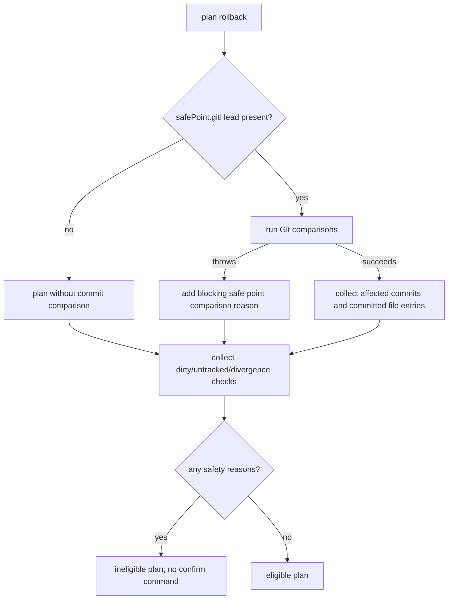

# Issue #299: Block unresolved rollback safe-point Git head

## Scope

Fix rollback safety validation so a task rollback safe point with a non-null `gitHead` must be comparable by Git before PlaySpec reports git rollback as eligible or executes confirmed git rollback.

In scope:
- `src/core/rollback-manager.ts` planning and confirmed execution guard behavior.
- Focused regression tests for invalid or unreachable `rollback.lastSafePoint.gitHead`.
- Existing rollback behavior for valid safe points, dirty tracked files, later commits, branch divergence, untracked conflicts, quoted paths, and clean rollback.

Out of scope:
- Migration, workflow registry, completion ledger storage, viewer, archive, or broad repository health checks.
- State-only rollback semantics, except shared messaging that recommends state-only recovery when Git rollback is unsafe.

## Use Case Alignment

Operators use `playspec rollback` to preview whether Git rollback is safe before running `playspec rollback --git-only --confirm`. If the stored rollback safe-point commit is stale, malformed, pruned, or otherwise unreachable, PlaySpec must not imply a trustworthy baseline. Preview should show Git rollback as ineligible, and confirmed Git rollback should fail non-zero with an actionable blocking reason.

## Current Implementation Summary

Verified from `src/core/rollback-manager.ts`:
- `RollbackManager.plan()` loads the task safe point, workspace state, committed changes since the safe point, dirty tracked files, untracked files, target rollback files, and safety reasons.
- `listCommitsAfter(safePoint.gitHead)` and `listNameStatusSince(safePoint.gitHead)` are each followed by `.catch(() => [])`.
- If Git cannot resolve the safe-point head, those comparison calls can become empty arrays, leaving no affected commits or target files.
- `executeGitRollback()` calls `plan()`, throws only when `plan.canExecuteGitRollback` is false or `safePoint.gitHead` is absent, and skips `git restore` when target files are empty. That can return a successful Git rollback message without validating or restoring against the safe point.

Verified from `src/core/git-state.ts`:
- `listCommitsAfter()` runs `git rev-list --oneline <base>..HEAD`.
- `listNameStatusSince()` runs `git diff --name-status -z <base>..HEAD`.
- Both require Git to resolve `<base>`.

Verified from `src/core/state-desync-detector.ts`:
- The adjacent desync path does not suppress `listNameStatusSince()` failures; it translates them through `DesyncCheckFailedError`.

Verified from `src/cli/commands/rollback.ts`:
- Preview prints `Git rollback eligible: yes|no`, safety reasons, recommended action, and confirm command only when eligible.
- Confirmed `--git-only --confirm` goes through `PlaySpecCore.executeGitRollback()`.

## Relevant Files Reviewed

- `src/core/rollback-manager.ts`
- `src/core/git-state.ts`
- `src/core/state-desync-detector.ts`
- `src/core/errors.ts`
- `src/cli/commands/rollback.ts`
- `tests/cli.test.ts`
- `tests/unit/rollback-manager.test.ts`
- `package.json`

## Active Entry Points and Bypasses

Active CLI preview path:
`playspec rollback` or `playspec rollback --git-only` -> `runRollback()` -> `PlaySpecCore.planRollback()` -> `RollbackManager.plan()` -> printed plan.

Active CLI confirmed path:
`playspec rollback --git-only --confirm` -> `runRollback()` -> `PlaySpecCore.executeGitRollback()` -> `RollbackManager.executeGitRollback()`.

MCP path:
`playspec_plan_rollback` and `playspec_execute_git_rollback` use the same core manager through `PlaySpecCore`, so the core fix should cover MCP without MCP-specific changes.

Bypass risk:
The current `.catch(() => [])` is the bypass. It turns safe-point comparison failure into "no commits/no files", which can make the plan eligible and confirmed execution successful.

## Current Architecture

Rollback planning is the safety boundary. It builds a typed `RollbackPlanResult` with safety reasons and `canExecuteGitRollback`. Confirmed rollback reuses the plan, so invalid safe-point handling should live in planning and be represented as a safety reason. This keeps preview and confirmed execution consistent.

## Verified Behavior

- Valid safe point with no dirty state remains eligible.
- Dirty tracked source files block confirmed rollback.
- New commits after the safe point block rollback.
- Untracked files that conflict with target files block rollback.
- Quoted path handling is covered by both CLI and unit tests.
- Invalid safe-point comparison failures are currently swallowed.

## Problems

1. `RollbackManager.plan()` loses Git comparison failure information.
2. An unreachable safe-point `gitHead` can produce an eligible rollback plan.
3. Confirmed Git rollback can return success without attempting `git restore` when the computed target file set is empty.
4. The operator-facing message does not state that the rollback baseline cannot be resolved or compared.

## Proposed Direction

- Replace swallowed comparison failures in `RollbackManager.plan()` with explicit safety reasons.
- When a non-null safe-point Git head cannot be compared, mark `canExecuteGitRollback` false.
- Use wording that clearly mentions the rollback safe-point Git head cannot be resolved or compared.
- Preserve the no-Git-head behavior: a safe point without `gitHead` remains blocked during confirmed Git rollback through the existing guard.
- Keep `executeGitRollback()` dependent on the plan so preview and confirmed behavior stay aligned.

## File-by-File Plan

`src/core/rollback-manager.ts`
- Introduce a local helper or structured try/catch around safe-point comparisons.
- If `listCommitsAfter()` or `listNameStatusSince()` throws, collect a blocking safety reason and use empty comparison arrays only as display fallback.
- Keep dirty/untracked/branch divergence logic unchanged.

`tests/unit/rollback-manager.test.ts`
- Add regression coverage where `safePoint.gitHead` is present but comparison throws.
- Assert preview plan is ineligible and contains the safe-point resolution/comparison reason.
- Assert confirmed rollback rejects and no `git restore` call is attempted.
- Keep the existing quoted-path restore test passing.

Optional `tests/cli.test.ts`
- Add CLI-level coverage if unit coverage does not sufficiently assert preview output and non-zero confirmed behavior. Unit tests are preferred to keep the regression focused and fast.

## Risks and Open Questions

- Risk: malformed historical safe-point metadata will newly block Git rollback. This is intended safer behavior.
- Risk: adding raw Git stderr to safety reasons could make tests brittle. Prefer stable wording with a short reason suffix only if useful.
- Open question: whether to preflight with `git rev-parse --verify <head>^{commit}`. Not required if both comparison calls are converted into blocking errors, but a preflight could provide a single clearer reason.

## Reader Aids

Proposed rollback safety flow:

