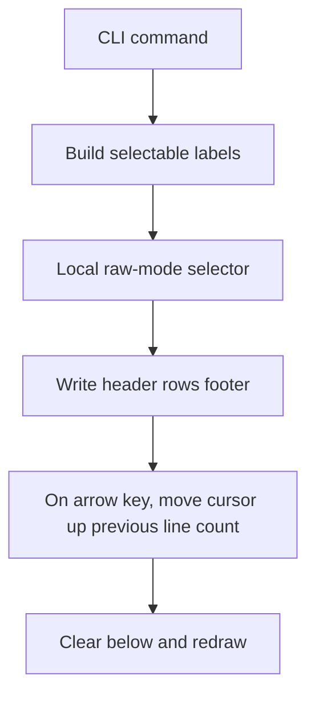
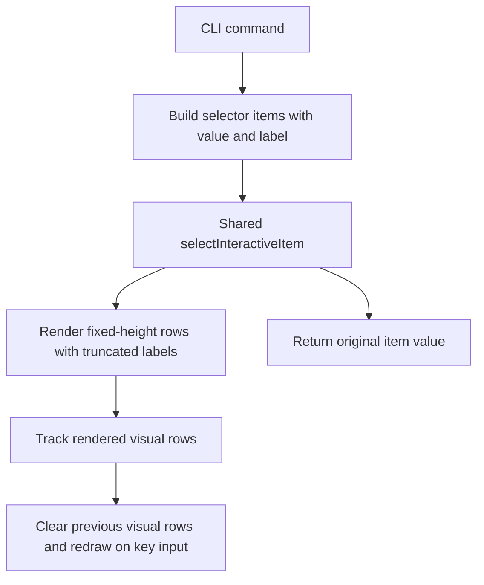

# Issue 29 Selection Prompt Redraw Wrap Bug - Technical Spec

## Scope

Fix the interactive selection prompt redraw behavior when option labels are longer than the terminal width. The fix must cover the shared selector behavior used by relevant-file selection and task/phase selection without changing command semantics.

In scope:
- Centralized interactive selector rendering and key handling.
- Clean redraw when labels wrap or are truncated.
- `playspec specs` relevant-file picker, `playspec use` task picker, and `playspec phase --select` phase picker.
- Preservation of full selected values even if visible labels are shortened.
- Tests for redraw accounting, cancellation, and selection.

Out of scope:
- Viewer work.
- Workflow changes outside the active mono-spec task.
- Clipboard behavior changes.
- Core relevant-file discovery changes.

## Use Case Alignment

An operator runs an interactive PlaySpec command in a narrow terminal. The picker contains long paths and metadata suffixes. Repeated Up/Down redraws must not leave stale text such as `PLAN_FSelect a relevant file:` or duplicate prompt headers. Enter must still return the complete selected item value, and Esc/Ctrl+C must still cancel.

## High-Level Current Implementation Summary

Verified current code has three raw-mode selector implementations:
- `src/cli/commands/specs.ts` selects relevant files.
- `src/cli/commands/use.ts` selects active tasks.
- `src/cli/commands/phase.ts` selects phases.

Each implementation writes a header, rows, and footer, then moves the cursor up and clears down on the next render. The implementations differ in how they track previous output height:
- `specs.ts` estimates visual rows with `line.length / stdout.columns`.
- `use.ts` and `phase.ts` count only logical lines.

This is fragile for wrapped labels and repeated redraws. It also makes a centralized fix impossible without extracting shared selector code.

## Relevant Files Reviewed

- `src/cli/commands/specs.ts`: active relevant-file picker and command behavior.
- `src/cli/commands/use.ts`: active task picker with duplicated raw-mode selector.
- `src/cli/commands/phase.ts`: phase picker with duplicated raw-mode selector.
- `src/cli/index.ts`: confirms `specs`, `use`, and `phase --select` entry points.
- `tests/cli.test.ts`: existing CLI integration coverage for relevant-file selection.
- `tests/integration/routing.test.ts`: likely home for phase routing behavior if selector coverage is needed.

## Active Entry Points And Bypasses

Active interactive entry points:
- `playspec specs` without `--path-only` and in an interactive terminal.
- `playspec use` without a task id and in an interactive terminal.
- `playspec phase --select`.

Bypasses:
- `playspec specs --path-only`, `--print` in non-interactive mode, and explicit `--task` paths do not render the selector.
- `playspec use <taskId>` does not render the selector.
- `playspec phase --set <phaseId>` and `playspec phase <phaseId>` do not render the selector.

The issue mentions `playspec spec`; this checkout exposes `specs` but no singular `spec` command in `src/cli/index.ts`.

## Current Architecture

Verified flow:

The problem is that previous line count is not reliable for terminal visual rows once a row wraps.

## Verified Behavior

- `specs.ts` returns `items[selectedIndex].candidate`, so the selected value can remain full even if a display label is changed.
- `use.ts` returns `items[selectedIndex].task`.
- `phase.ts` returns the selected phase id or `null` on cancellation.
- All three selectors currently handle Up, Down, Enter, Esc, and Ctrl+C.

## Problems

1. Selector logic is duplicated across commands, so the relevant-file redraw bug is not fixed centrally.
2. Previous render height is under-counted in `use.ts` and `phase.ts` for wrapped rows.
3. `specs.ts` uses raw string length, which does not account for ANSI/control width and still allows visible labels to occupy many rows.
4. No focused unit tests exercise the renderer/key handling independent of a real terminal.

## Proposed Direction

Add a shared CLI selector module that owns:
- Raw-mode setup/restore.
- Key handling for Up/Down/Enter/Esc/Ctrl+C.
- Rendering and clearing.
- Display label truncation to fit the current terminal width where practical.
- Previous render visual row accounting based on the actual rendered labels.

Recommended renderer behavior:
- Use a conservative terminal width from `stdout.columns`, minimum 1.
- Truncate visible option labels to a single visual row when the terminal is wide enough for a marker and ellipsis.
- Preserve full original values in each item payload.
- Track visual rows for header, option rows, and footer using a width-aware helper.
- Clear previous output with cursor-up plus clear-screen-down.

This approach prevents option rows from wrapping in normal terminals and keeps row accounting correct for fixed text that could wrap in extremely narrow terminals.

## File-by-File Plan

- `src/cli/interactive-selector.ts`: new shared selector implementation and exported pure helpers for tests.
- `src/cli/commands/specs.ts`: replace local selector with shared selector and keep relevant-file command semantics.
- `src/cli/commands/use.ts`: replace local selector with shared selector and keep task selection semantics.
- `src/cli/commands/phase.ts`: replace local selector with shared selector and keep `null` cancellation behavior.
- `tests/unit/interactive-selector.test.ts`: cover label truncation, row accounting, full payload selection, arrow redraw clearing, Enter, Esc, and Ctrl+C.
- `tests/cli.test.ts`: adjust/add command-level coverage if needed for `specs`.

## Risks And Open Questions

- ANSI display width can be deeper than needed here. The current selector labels are plain text; a conservative ANSI-stripping helper is enough unless future labels add styling.
- Very narrow terminals may force header/footer wrapping. The shared renderer should count those rows even if labels are truncated.
- Existing interactive tests may depend on exact prompt text. Keep headers and footers unchanged.

## Reader Aids

Proposed flow:

