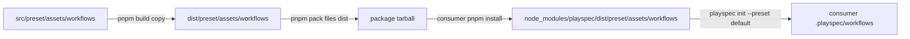

# Issue #301: Package Artifact Bundled Workflow Coverage Spec

## Scope

Update package artifact regression coverage so the packed and installed package proves every current bundled workflow directory with a `workflow.yaml` is present under `dist/preset/assets/workflows` and is installed into a consumer workspace by `playspec init --preset default`.

This change is limited to test coverage. It must not change workflow precedence, preset install behavior, package publishing behavior, CLI UX, or workflow loading semantics.

## Use Case Alignment

Users installing the published package should receive the same bundled workflow set that exists in `src/preset/assets/workflows`. A release should fail package artifact validation if any workflow directory containing `workflow.yaml` is missing from the tarball or if init does not copy it into `.playspec/workflows`.

## High-Level Current Implementation Summary

Verified behavior:

- `package.json` runs `pnpm build` during `prepack`.
- `pnpm build` compiles TypeScript, rewrites aliases, removes `dist/preset/assets`, recreates it, and copies `src/preset/assets/.` into `dist/preset/assets`.
- `tests/integration/package-artifact.test.ts` packs the repository, installs the tarball into a temporary consumer workspace, verifies selected installed package files, runs installed `playspec init --preset default`, and checks runtime import smoke tests.
- `PresetManager.installPresetWorkflows()` enumerates directories under `WorkflowRegistry.getBuiltinRoot()`, filters to directories that contain `workflow.yaml`, and copies each missing workflow into the project or user workflow root.
- `WorkflowRegistry.getBuiltinRoot()` resolves to `dist/preset/assets/workflows` at runtime.

Current coverage gap:

- The package artifact test verifies only `mono-spec` workflow assets and only `.playspec/workflows/mono-spec/workflow.yaml` after init.
- Other bundled workflows can be absent from the package or init-installed workflow set without failing the smoke test.

## Relevant Files Reviewed

- `tests/integration/package-artifact.test.ts`: current package artifact smoke test and stale asset cleanup assertions.
- `package.json`: build, prepack, and `test:package-artifact` scripts.
- `src/preset/preset-manager.ts`: preset init and workflow installation behavior.
- `src/workflow/workflow-registry.ts`: built-in workflow root resolution and workflow-directory filtering.
- `src/preset/assets/workflows/*/workflow.yaml`: current source workflow directories.

## Active Entry Points And Bypasses

Active entry point:

- `pnpm test:package-artifact` executes `tests/integration/package-artifact.test.ts`.

Relevant runtime path:

- Consumer installed `node_modules/.bin/playspec init --preset default` calls preset initialization and copies bundled workflow directories from the installed package's `dist/preset/assets/workflows`.

Bypass paths:

- Direct source-tree workflow loading is not exercised by this package artifact test.
- User and project workflow precedence are outside scope.
- MCP package import smoke assertions should remain unchanged.

## Current Architecture

Verified flow:

## Verified Behavior

The source workflow directories containing `workflow.yaml` are:

- `issue-scope-create`
- `issue-validate`
- `mono-spec`
- `multi-spec`
- `phase-execution`
- `simple-bug`
- `total-plan`

The existing package artifact test already preserves important assertions for:

- stale asset cleanup before packing
- compiled CLI/MCP/core/runtime files
- `mono-spec` template presence
- stale asset absence in the installed package
- installed CLI init exit code
- MCP runtime package import behavior

## Problems

- `expectedInstalledFiles` hardcodes only one workflow YAML path.
- The post-init workspace assertion checks only the `mono-spec` workflow YAML.
- The test does not derive expected workflow IDs from source workflow directories, so future workflow additions require manual updates unless the implementation lists them explicitly.

## Proposed Direction

Add a small helper in `tests/integration/package-artifact.test.ts` that reads `src/preset/assets/workflows`, filters to directories containing `workflow.yaml`, and returns sorted workflow IDs. Use those IDs to assert:

- `node_modules/playspec/dist/preset/assets/workflows/<workflow-id>/workflow.yaml` exists for every bundled workflow.
- `.playspec/workflows/<workflow-id>/workflow.yaml` exists after installed `playspec init --preset default`.

Keep the existing compiled runtime, stale cleanup, stale installed file absence, and template assertions intact.

## File-By-File Plan

- `tests/integration/package-artifact.test.ts`
  - Add a helper to discover bundled workflow IDs from `src/preset/assets/workflows`.
  - Keep filtering tied to `workflow.yaml`.
  - Use discovered IDs for installed package workflow YAML assertions.
  - Use discovered IDs for post-init `.playspec/workflows` assertions.
  - Leave existing stale asset cleanup and compiled runtime checks in place.

## Risks And Open Questions

Risks:

- Reading source workflow IDs at test runtime ties the expected set to the checkout under test, which is intended for this regression.
- The package artifact test already performs filesystem-heavy pack/install work; the new directory scan is negligible.

Open questions:

- None. The requested scope is test-only and does not touch workflow loading expectations.

## Reader Aids

Implementation should prefer structured filesystem APIs (`readdir` with `withFileTypes`, `access`) over ad hoc shelling out from the test. Keep assertions sorted or deterministic to simplify failure output.
