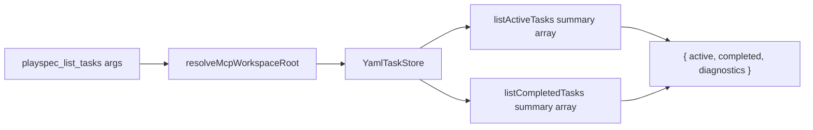
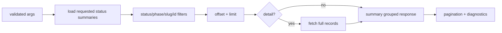

# Issue 306 List Tasks Filters Technical Spec

## Scope

Add server-side filtering, bounded default output, and optional full-detail projection to the MCP `playspec_list_tasks` tool. This is limited to MCP behavior and related integration tests.

Out of scope:

- Changing the human CLI `playspec list-tasks` output.
- Changing `playspec_get_task` or `playspec_get_status` semantics.
- Adding new storage backends or changing task file layout.

## Use Case Alignment

The caller needs to discover a task id in a workspace with many PlaySpec tasks without receiving an MCP response large enough to exceed token limits. Common discovery paths are:

- Find active tasks in a specific phase.
- Find a task whose id/title contains a slug fragment.
- Page through a large active/completed/archived set.
- Opt in to full task records only when a caller explicitly needs detail.

## High-Level Current Implementation Summary

Verified behavior:

- `src/mcp/server.ts` registers `playspec_list_tasks`.
- The tool currently accepts only `workspaceRoot`.
- It resolves the effective workspace root, creates a scoped `YamlTaskStore`, reads active and completed tasks, collects diagnostics, and returns `{ active, completed, diagnostics }`.
- `YamlTaskStore.listActiveTasks()` and `listCompletedTasks()` already return `TaskSummary[]`, not full `TaskRecord[]`.
- `TaskSummary` is `{ id, title, status, currentPhase, workflow }`.
- `YamlTaskStore.listArchivedTasks()` exists and returns archived summaries, but `playspec_list_tasks` does not expose it.

Inferred behavior:

- The observed token overflow is likely caused by unbounded arrays across many tasks, not by full task records in the current codebase.
- Some external callers may already assume `active` and `completed` are arrays, so compatibility is best preserved by keeping those top-level keys.

## Relevant Files Reviewed

- `src/mcp/server.ts`: MCP tool registration and `playspec_list_tasks` handler.
- `src/storage/yaml-task-store.ts`: summary listing and archived task listing behavior.
- `src/storage/task-store.ts`: task store interface.
- `src/core/types.ts`: `TaskStatus`, `TaskRecord`, and `TaskSummary`.
- `src/core/schemas.ts`: `TaskRecordSchema` and `TaskSummarySchema`.
- `tests/integration/mcp-server.test.ts`: existing MCP list/get/create/completion tests.

## Active Entry Points And Bypasses

Active entry point:

- MCP clients call `playspec_list_tasks` through `buildMcpServer()` in `src/mcp/server.ts`.

Bypass paths:

- MCP callers that already know a task id can use `playspec_get_task` for full records or `playspec_get_status` for compact status.
- CLI callers use `playspec list-tasks`, which is separate and should not be changed for this issue.
- Core logic does not depend on `playspec_list_tasks`; this change should remain MCP-local.

## Current Architecture

Current verified flow:

## Verified Behavior

- The tool does not use `ActiveTaskResolver` or `.playspec/HEAD`, satisfying MCP context rules for this handler.
- The handler scopes storage to the requested `workspaceRoot`.
- Existing list output contains summary fields only.
- Existing tests assert that listed tasks can be found under `active` or `completed`.

## Problems

- Output is unbounded by default.
- There are no server-side filters for `status`, `phase`, or slug/id substring matching.
- Archived summaries are not available from the MCP list tool despite storage support.
- There is no explicit detail opt-in path for callers that want full records from list results.
- There is no response metadata that tells callers whether results were truncated.

## Proposed Direction

Add a typed MCP args schema for `playspec_list_tasks`:

- `status?: "active" | "completed" | "archived" | "all"`; default should preserve active/completed categories.
- `phase?: string`; match `currentPhase`.
- `slug?: string`; case-insensitive substring match against `id` and `title`.
- `idContains?: string`; case-insensitive substring match against `id`.
- `summary?: boolean`; default `true`.
- `detail?: boolean`; default `false`. When true, return full `TaskRecord` objects for matched tasks.
- `limit?: number`; default a bounded value such as 50, max a bounded value such as 500.
- `offset?: number`; default 0.

Default output should remain compact and bounded:

- Keep top-level `active`, `completed`, and `diagnostics` keys for compatibility.
- Add `archived` only when `status` is `archived` or `all`.
- Add `pagination` metadata containing `limit`, `offset`, `total`, `returned`, and `hasMore`.
- Apply filters before pagination.
- Apply pagination across the combined filtered result set, then regroup by status for the response.

Full detail mode:

- Use summaries for discovery by default.
- When `detail: true`, fetch full task records only for the already filtered/paginated summaries.
- For archived tasks, use `getArchivedTask`; for active/completed tasks, use `getTask`.
- `summary: false` should be treated as equivalent to `detail: true` for callers following the issue wording.

Proposed flow:

## File-By-File Plan

- `src/mcp/server.ts`
  - Add constants for default and maximum list limits.
  - Add a Zod schema object for `playspec_list_tasks` args.
  - Add small local helpers for summary filtering, pagination, grouping, and detail expansion.
  - Update the handler to use requested statuses, filters, bounded pagination, and optional detail.

- `tests/integration/mcp-server.test.ts`
  - Add tests for default bounded summary output and pagination metadata.
  - Add tests for `status + phase` filtering.
  - Add tests for `slug` and `idContains` matching.
  - Add a test proving `detail: true` returns full record fields while default output remains summary-shaped.
  - Keep existing list tests compatible.

## Risks And Open Questions

- Compatibility risk: callers expecting all tasks by default may now need to page. Mitigation: include `pagination.hasMore` and allow larger explicit limits up to the max.
- Compatibility risk: adding `archived` only when requested avoids changing default response size and shape too much.
- Open question: the issue mentions full records from list, but current code returns summaries. The implementation should still support detail opt-in because acceptance explicitly asks for it.
- Open question: exact default limit. Use 50 unless implementation evidence suggests another local convention.

## Reader Aids

- `playspec_get_status` remains the cheap path after a task id is known.
- `playspec_get_task` remains the explicit single-task full-record path.
- This feature makes `playspec_list_tasks` the cheap discovery path before the task id is known.
