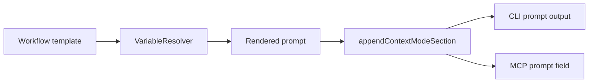

# Issue 307: Render Phase Prompt Context Formatting

## Scope

Fix prompt rendering for tasks with context refs so:

- Compact mode emits each context file once with path, role, source, and snippet.
- Full mode emits context file bodies in a newline-delimited, line-chunkable form.
- MCP `playspec_render_phase_prompt` receives the same behavior through the existing core renderer.

Out of scope:

- Workflow changes beyond prompt output formatting.
- MCP task resolution changes.
- Clipboard, prompt snapshot metadata, viewer, archive, migration, or evolution behavior.

## Use Case Alignment

An automation user calls `playspec_render_phase_prompt` or the CLI prompt renderer with many context files. Compact prompts should avoid repeated file lists, while full prompts should remain readable and usable with line-based offset/limit tooling.

## High-Level Current Implementation Summary

Prompt rendering flows through `PlaySpecCore.renderResolvedPhase()`. It renders the workflow template with variables from `VariableResolver`, then calls `appendContextModeSection()` to append compact or full context material.

The current mono-spec templates include both `CONTEXT_FILES` and `CONTEXT_REFS_DETAIL`. Compact mode then appends `## Compact Context Summary`, so every context ref appears in three places. Strict/full mode currently append fenced context sections with embedded file contents.

## Relevant Files Reviewed

- `src/core/playspec-core.ts`: appends context-mode sections and summarizes context content.
- `src/template/variable-resolver.ts`: resolves `CONTEXT_FILES` and `CONTEXT_REFS_DETAIL` template variables.
- `src/mcp/server.ts`: `playspec_render_phase_prompt` delegates to core `renderExplicitPhasePrompt()`.
- `src/preset/assets/workflows/mono-spec/templates/tech_spec_draft.md`: representative template with repeated context variables.
- `tests/integration/init-create-next.test.ts`: existing context-mode rendering coverage.
- `tests/integration/mcp-server.test.ts`: existing MCP rendering parity coverage.

## Active Entry Points And Bypasses

Verified entry points:

- CLI `prompt` and `phase` commands call core prompt rendering with a normalized `contextMode`.
- MCP `playspec_render_phase_prompt` calls `PlaySpecCore.renderExplicitPhasePrompt()`.
- MCP `playspec_render_next_prompt` calls `PlaySpecCore.renderNextPrompt()`.

Bypasses and alternate paths:

- Prompt templates can directly reference `CONTEXT_FILES` and `CONTEXT_REFS_DETAIL`.
- Existing workflows other than mono-spec may also include those variables.
- No MCP-specific prompt formatter exists; MCP receives the core-rendered prompt string inside JSON.

## Current Architecture

Verified behavior:

- `resolveContextVariables()` always resolves `CONTEXT_FILES` to a path-only bullet list and `CONTEXT_REFS_DETAIL` to a path/role/source bullet list when refs exist.
- `appendContextModeSection()` appends one compact summary row per ref in compact mode, including path, role, source, and a first-paragraph snippet.
- `appendContextModeSection()` appends fenced context body sections for non-compact modes.
- MCP tools return the same prompt string produced by core rendering.

Inferred behavior:

- The single-line full-mode symptom is likely caused by context file contents that contain very long physical lines, combined with a prompt returned as a single JSON string field.
- Making context body output line-delimited at context-file boundaries and wrapping very long physical lines improves chunkability without changing context content semantics.

Open questions:

- Whether strict and full should diverge in truncation behavior is not currently specified by code or issue acceptance. This fix should preserve both modes unless a future issue defines different semantics.

## Structured Evidence

| Artifact | Field/key path | Literal values | Use |
| --- | --- | --- | --- |
| `src/core/schemas.ts` / MCP schemas | `contextMode` enum | `compact`, `strict`, `full` | Reuse as-is |
| `src/template/variable-resolver.ts` | context variables | `SOURCE_PROBLEM_FILE`, `CONTEXT_FILES`, `CONTEXT_REFS_DETAIL` | Preserve compatibility, but suppress redundant rendered blocks only for compact output |
| `src/mcp/server.ts` | tool name | `playspec_render_phase_prompt` | Existing tool delegates to core renderer; no MCP fork |

## Problems

1. Compact mode repeats the same context ref path list via `CONTEXT_FILES`, `CONTEXT_REFS_DETAIL`, and `## Compact Context Summary`.
2. The compact summary already contains all required acceptance data, but it is appended after redundant template blocks.
3. Full/strict context sections preserve file contents verbatim, so a context file with one very long line can make rendered prompt output hard to chunk by line.

## Proposed Direction

- Keep variable resolution backwards-compatible for workflows and callers that use `CONTEXT_FILES` / `CONTEXT_REFS_DETAIL`.
- In core compact rendering, remove rendered template blocks for `CONTEXT_FILES` and `CONTEXT_REFS_DETAIL` before appending the compact summary.
- Keep the compact summary as the single authoritative context list row per ref:
  - ``- `path` (role: role, source: source): snippet``
- For non-compact context body sections, normalize embedded context content so very long physical lines are split into bounded lines. Preserve readable fenced blocks and add context-file boundaries with headings, role, and source.
- Do not change MCP code except tests if needed, because it already delegates to core.

## File-By-File Plan

- `src/core/playspec-core.ts`
  - Add a focused helper that removes the rendered `CONTEXT_FILES` and `CONTEXT_REFS_DETAIL` variable blocks from compact prompts.
  - Add a helper for formatting context file content for non-compact modes with bounded physical line length.
  - Keep context summaries based on existing `summarizeContextContent()`.
- `tests/integration/init-create-next.test.ts`
  - Add or update tests proving compact prompt has exactly one row per context ref containing path, role, source, and snippet.
  - Add a full-mode test with a long single-line context file and assert the rendered prompt contains multiple chunkable lines.
- `tests/integration/mcp-server.test.ts`
  - Add or update MCP phase prompt coverage if core-only coverage does not exercise `playspec_render_phase_prompt` directly.

## Risks And Open Questions

- Removing rendered context variable blocks is text-shape-sensitive. The helper should target the exact bullet-label block format emitted by current workflow templates and leave unrelated content untouched.
- Wrapping long content lines changes physical formatting inside code fences. This improves chunkability but may not be byte-for-byte identical to source files. The prompt still exposes the same textual content in order.
- Existing tests may assert the presence of `CONTEXT_FILES` or `CONTEXT_REFS_DETAIL`; update only tests that describe rendered compact output, not variable resolver compatibility tests.

## Reader Aids

Verified flow:

Proposed compact flow:

