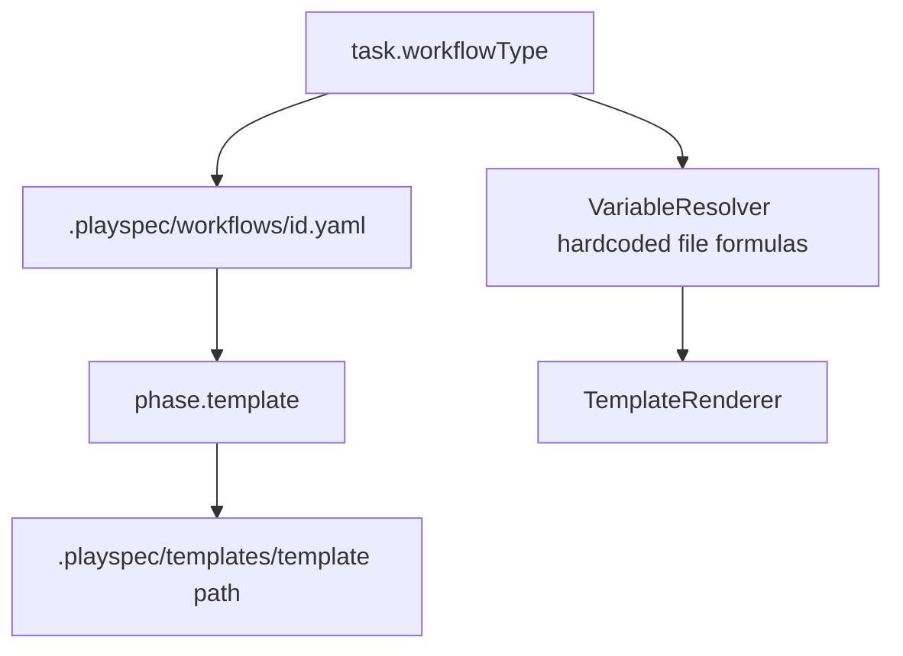
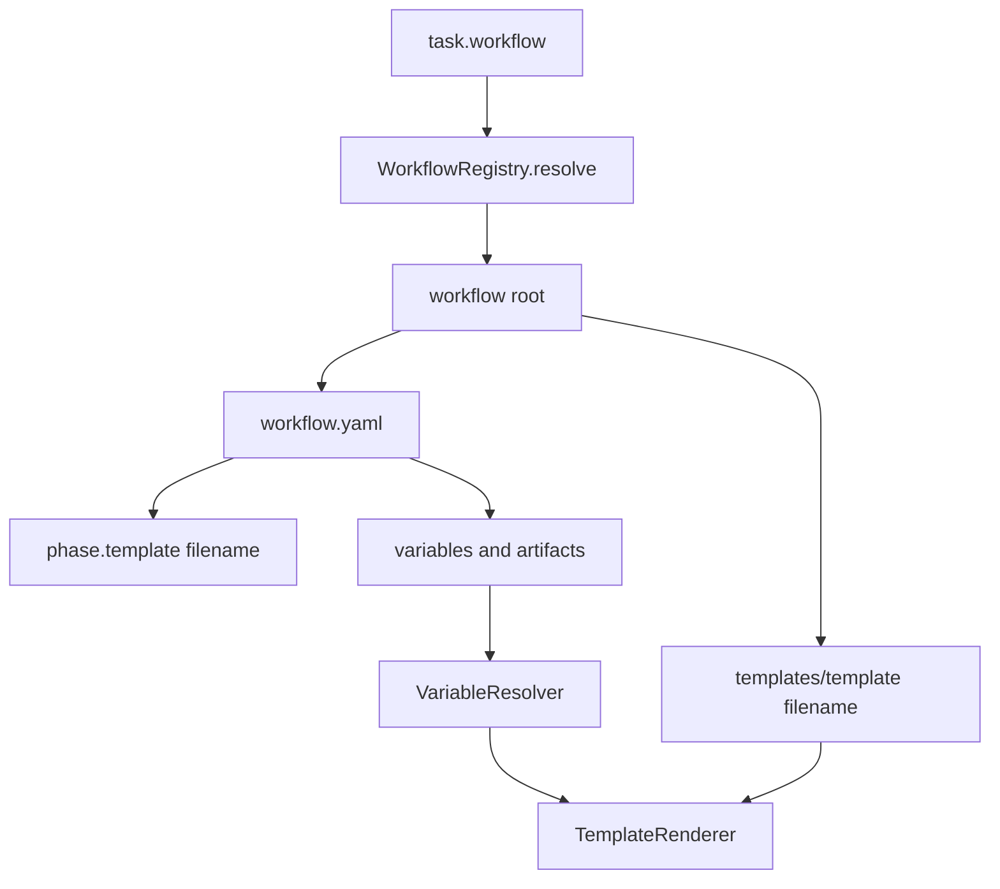

# Declarative Workflow Assets Technical Spec

## Scope

Implement workflows as first-class runtime assets. A task stores `workflow`, not `workflowType` or pack metadata. A workflow directory owns its `workflow.yaml`, local `templates/`, variable defaults, artifact declarations, phases, gates, and routing.

In scope:

- `task.yaml` uses `workflow`.
- Built-in workflow assets live under `src/preset/assets/workflows/<workflow-id>/`.
- User-installed workflow assets live under `~/.playspec/workflows/<workflow-id>/`.
- `workflow.yaml` declares metadata, variables, artifacts, phases, and local template filenames.
- Prompt rendering resolves templates only inside the selected workflow's `templates/` directory.
- Variable resolution order is engine built-ins, workflow defaults, current phase defaults, task variables.
- Unknown default references, circular defaults, unresolved required variables, and unsafe template paths fail with clear errors.
- CLI supports workflow-centered `list`, `show`, `validate`, `install`, `remove`, and `export` commands.
- `playspec create "Title" --workflow mono-spec` is supported and persists `workflow: mono-spec`.
- Planning context and relevant-file paths derive from resolved workflow artifacts instead of TypeScript filename formulas.

Out of scope:

- Workflow packs.
- `workflowType`/`workflowPack` for new task state.
- Cross-workflow templates, project template fallback, shared template roots, or pack includes.
- Git URL workflow install.
- Viewer behavior or auto-apply evolution behavior.

## Use Case Alignment

Issue #34 asks to restart the issue #30 direction around one simpler concept: the workflow itself is the executable runtime asset. Users should only choose a workflow id, such as `mono-spec`, and PlaySpec should load that workflow's schema, templates, defaults, and declared artifacts without exposing pack/source/version concepts.

## High-Level Current Implementation Summary

Verified current behavior:

- `TaskRecord` stores `workflowType`.
- `YamlTaskStore.createTask()` writes `workflowType` and hardcodes `paths.projectDocRoot`.
- `WorkflowLoader` loads `.playspec/workflows/<workflowType>.yaml`.
- `PresetManager.initWorkspace()` copies `src/preset/assets/default` into `.playspec`, including workflows and templates.
- `TemplateRenderer` renders from `.playspec/templates/<template>`.
- `VariableResolver` hardcodes many path defaults, including mono-spec files and total-plan files.
- Phase definitions contain `requiredVariables` and `outputs`, but workflow-level variables and artifacts do not exist.
- `discoverRelevantFiles()` inspects path-like variables, required variables, and phase `outputs`, not workflow artifacts.
- CLI create syntax is `playspec create <workflowType> "<title>"`; workflow management commands do not exist.

Inferred behavior:

- Existing tests expect `.playspec/workflows` and `.playspec/templates` to exist after init, so migration to task-state-only `.playspec` requires test updates.
- Current `outputs` can be retained for phase-level compatibility, but declarative artifacts should become the primary path source.

## Relevant Files Reviewed

- `src/core/types.ts`
- `src/core/schemas.ts`
- `src/storage/yaml-task-store.ts`
- `src/workflow/workflow-loader.ts`
- `src/workflow/workflow-schema.ts`
- `src/template/variable-resolver.ts`
- `src/template/template-renderer.ts`
- `src/core/playspec-core.ts`
- `src/core/relevant-files.ts`
- `src/cli/commands/create.ts`
- `src/cli/index.ts`
- `src/preset/preset-manager.ts`
- `src/preset/assets/default/workflows/mono-spec.yaml`
- `src/preset/assets/default/workflows/total-plan.yaml`
- `tests/unit/variable-resolver.test.ts`
- `tests/integration/workflow-loader.test.ts`
- `tests/integration/init-create-next.test.ts`

## Active Entry Points And Bypasses

Active entry points:

- `playspec init --preset default` copies preset assets into `.playspec`.
- `playspec create <workflowType> "<title>"` creates task state.
- `playspec prompt`, `playspec phase`, and `playspec next` load the task workflow and render a phase template.
- `playspec complete`, `rewind`, `status`, `current-task`, `list-tasks`, and `specs` read the task workflow value.

Bypass and old paths to update:

- Direct `WorkflowLoader.load(task.workflowType)` calls across CLI/Core.
- Direct template rendering from `.playspec/templates`.
- Phase-execution task creation computes total-spec and phase-plan context paths in `create.ts`.
- Tests and docs that assert `workflowType` or `.playspec/workflows`.

## Current Architecture

## Proposed Architecture

## Verified Behavior

- The active PlaySpec task for this issue is `issue_34_declarative_workflow_assets` using `mono-spec`.
- The current first phase prompt resolves hardcoded `SPEC_FILE`, `PLAN_FILE`, `RESULT_FILE`, and `PR_FILE` from TypeScript defaults.
- `pnpm exec tsx src/cli/index.ts prompt --no-copy --write` successfully rendered the first phase and wrote a prompt snapshot.

## Problems

- Runtime assets are copied into `.playspec`, conflicting with the issue requirement that `.playspec` stores task state only.
- `workflowType` naming makes workflow look like a type enum instead of a runtime asset id.
- Template paths are project-level paths and can reference any template under `.playspec/templates`.
- Required file variables are encoded in TypeScript, so workflow behavior is split between YAML and code.
- There is no schema for workflow variables or artifacts.
- There is no registry that resolves built-in and user workflow roots.
- CLI surface is centered on positional workflow type creation, with no workflow asset commands.

## Proposed Direction

1. Extend Core types and schemas with `workflow`, workflow metadata, variable declarations, artifact declarations, and phase variable declarations.
2. Replace `WorkflowLoader` internals with a registry-backed resolver that finds built-ins in `src/preset/assets/workflows` and user workflows in `~/.playspec/workflows`.
3. Move built-in assets from `src/preset/assets/default/workflows/*.yaml` and `src/preset/assets/default/templates/<workflow>/` into workflow-local directories.
4. Update `TemplateRenderer` to accept a workflow template root and reject absolute paths, `..`, nested traversal, and resolved paths outside `templates/`.
5. Update `VariableResolver` to merge engine built-ins, workflow defaults, phase defaults, and task variables, resolving defaults with dependency checks.
6. Update task creation and display commands to use `workflow`, while allowing old positional CLI creation only as a compatibility shim if tests or existing UX require it.
7. Add `src/cli/commands/workflow.ts` for list/show/validate/install/remove/export.
8. Update phase-execution context lookup and relevant file discovery to use resolved workflow artifacts.
9. Update tests around task schema, workflow loading, template safety, variable resolution, CLI create, workflow commands, and relevant files.

## File-By-File Plan

- `src/core/types.ts`: rename task workflow field, add workflow variable/artifact types, allow phase variables.
- `src/core/schemas.ts`: validate new task and workflow fields; optionally accept legacy `workflowType` only for migration/read compatibility if needed.
- `src/workflow/workflow-schema.ts`: export workflow schema from workflow module, not only Core schema aliases.
- `src/workflow/workflow-registry.ts`: add built-in/user workflow resolution and listing.
- `src/workflow/workflow-installer.ts`: add filesystem install/remove/export helpers.
- `src/workflow/workflow-loader.ts`: load from registry, parse `workflow.yaml`, verify id/root/template safety.
- `src/template/variable-resolver.ts`: implement ordered defaults, dependency resolution, and required variable checks.
- `src/template/template-renderer.ts`: render from resolved workflow `templates/` root only.
- `src/core/playspec-core.ts`: resolve `task.workflow`, phase definition, variables, artifacts, and template root in one flow.
- `src/core/relevant-files.ts`: include resolved workflow artifacts.
- `src/cli/commands/create.ts`: support `--workflow`, persist `workflow`, remove hidden planning filename formulas.
- `src/cli/commands/workflow.ts`: implement workflow commands.
- `src/cli/index.ts`: register workflow command and update create usage/help.
- `src/preset/preset-manager.ts`: initialize task-state directories only; stop copying workflow/template runtime assets into `.playspec`.
- `src/preset/assets/workflows/*`: add built-in workflow-local assets.
- `tests/**`: update schema expectations and add regression coverage for task.workflow, registry resolution, template traversal rejection, variable default errors, artifacts, and workflow CLI commands.

## Risks And Open Questions

- Existing active tasks with `workflowType` may fail unless the read schema supports legacy compatibility. The issue asks for new schema removal, but a read-only fallback is low risk and prevents breaking historical task state.
- `completion.validationTemplate` currently records `.playspec/templates/...`; it should become workflow-local metadata or a display path without project template assumptions.
- `simple-bug`, `multi-spec`, and `phase-execution` are existing built-ins. The issue centers on `mono-spec` and `total-plan`, but tests currently cover all workflows.
- User workflow installation needs deterministic overwrite behavior. MVP should reject existing ids unless an explicit overwrite option is added later.

## Reader Aids

- Treat `workflow` as a runtime asset id, not a type.
- Treat `workflow.yaml` as the source of workflow-specific files.
- Treat `.playspec` as task state, prompt snapshots, evidence, and completion history only.
