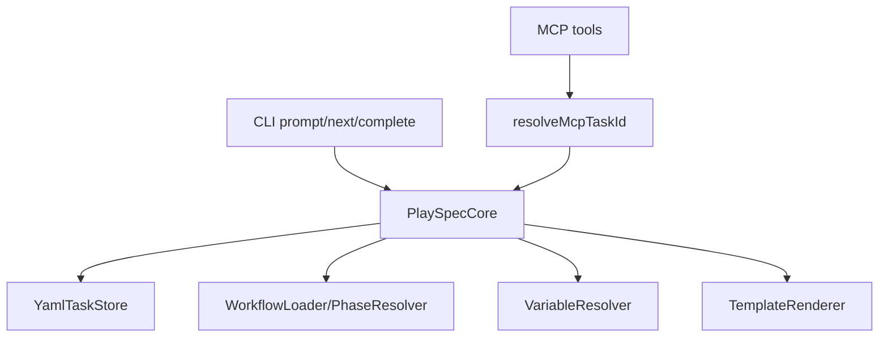
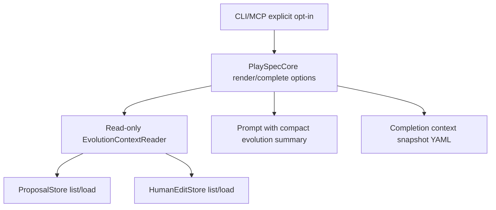

# PlaySpec Update 6.5 Technical Spec

## Scope

Implement only Phase 6.5, "Evolution Prompt Surfacing", from `docs/features/playspec_evolution/playspec_evolution_phase_plan.md`.

Phase 6.5 adds explicit opt-in, read-only evolution context surfacing for prompt rendering and completion. It must not generate proposals, apply proposals, mutate proposal or human edit records, mutate workflows/templates/rules/task records for evolution purposes, add harness behavior, or implement Phase 8 context modes.

## Use Case Alignment

Users preparing the next prompt need a compact view of relevant pending/refining evolution proposals and recorded human edit observations without changing those records. Users completing a phase may opt in to persist a context snapshot showing which evolution records were considered for the next phase.

## High-Level Current Implementation Summary

Verified:

- `PlaySpecCore.renderNextPrompt(taskId)` validates context refs, resolves the workflow/current phase, resolves variables, and renders the phase template.
- `PlaySpecCore.completePhase(taskId, options)` validates routing, writes completion snapshots/evidence/review, persists phase completion, and returns `CompletionResult`.
- `playspec prompt`, deprecated `playspec next`, and post-completion prompt rendering call the same core prompt rendering path.
- MCP prompt and complete tools call `resolveMcpTaskId()` before core methods and do not read `.playspec/HEAD`.
- `src/evolution/` already stores and validates proposals and human edit observations. Proposal listing currently returns all valid proposal records; malformed records throw while listing.

Not implemented yet:

- No render/complete option carries evolution context intent.
- No compact evolution summary is appended to prompt variables.
- No completion-time evolution context snapshot schema/path/writer exists.
- No CLI/MCP flags or arguments expose this phase.

## Relevant Files Reviewed

Must-read files:

- `docs/features/playspec_evolution/playspec_evolution_phase_plan.md`
- `docs/features/playspec_evolution/playspec_evolution_total_spec.md`
- `src/core/playspec-core.ts`
- `src/core/types.ts`
- `src/evolution/types.ts`
- `src/evolution/schemas.ts`
- `src/evolution/proposal-store.ts`
- `src/evolution/human-edit-store.ts`
- `src/utils/paths.ts`
- `src/cli/index.ts`
- `src/cli/commands/prompt.ts`
- `src/cli/commands/next.ts`
- `src/cli/commands/complete.ts`
- `src/mcp/server.ts`
- `src/mcp/context.ts`
- `tests/cli.test.ts`
- `tests/integration/init-create-next.test.ts`
- `tests/integration/mcp-server.test.ts`

## Active Entry Points And Bypasses

Active entry points:

- CLI: `playspec prompt`, `playspec next`, `playspec complete`.
- MCP: `playspec_render_next_prompt`, `playspec_complete_phase`.
- Core: `renderNextPrompt()`, `completePhase()`.

Bypass paths to preserve:

- `playspec phase` renders explicit phase prompts and is not named in Phase 6.5 entry points.
- Normal prompt, next, completion, and MCP calls without evolution context must not load proposal or human edit records.
- MCP must keep using `resolveMcpTaskId()` and must not fall back to HEAD.

## Current Architecture

Verified flow:

Proposed Phase 6.5 flow:

## Verified Behavior

- Proposal records support `pending`, `refining`, `skipped`, `applied`, and `failed`.
- Human edit records support `recorded`, `ignored`, and `superseded`.
- Proposal summaries can be derived from existing fields: ID, status, revision, updatedAt, source refs, evidence ref count, target files, and risk level.
- Snapshot storage should be added under `.playspec/evolution/context/{taskId}/{phaseId}-{timestamp}.yaml`.

## Problems

- Core render APIs accept no options, so every caller has identical default behavior.
- Completion options do not carry evolution opt-in.
- There is no schema for validating context snapshots.
- Tests do not yet prove default-off behavior avoids loading malformed evolution records.

## Proposed Direction

Add a small read-only evolution context component under `src/evolution/` that:

- Loads pending/refining proposals and recorded human edit observations only when requested.
- Produces compact prompt lines for render paths.
- Produces validated snapshot records for completion paths.
- Does not write except for explicit completion context snapshots.
- Filters proposals to records whose `source.taskId` matches the active task ID, whose `source.archivedTaskId` or `source.artifactRefs[].archivedTaskId` matches an archived task explicitly referenced by the task context refs, or whose `source.artifactRefs[].path` matches an explicit archived-artifact context ref path.
- Filters human edit observations to `status: recorded` records whose `sourceTaskId` matches the active task ID or whose `proposalId` is one of the included proposal IDs. Records without `sourceTaskId` and without an included `proposalId` are omitted and counted.

Extend core render/complete options with `withEvolutionContext?: boolean`. When enabled, core appends a compact evolution section to rendered prompts. On completion, core writes a validated snapshot after phase result persistence and before rendering the next prompt.

Snapshot records must validate before write and include:

- `taskId`
- `phaseId`
- `proposalIds`
- `humanEditObservationIds`
- `omittedProposalCount`
- `omittedHumanEditObservationCount`
- `generatedAt`
- `generationSource`: `prompt`, `next`, `complete`, or `mcp`

Expose `--with-evolution-context` on `prompt`, `next`, and `complete`. Add optional MCP booleans to prompt and complete tools using existing explicit task/session resolution.

## File-By-File Plan

- `src/evolution/types.ts`: add `EvolutionContextSnapshot`, prompt summary types, and generation source type.
- `src/evolution/schemas.ts`: add zod schema for snapshot records.
- `src/evolution/context-reader.ts`: add read-only context collection, summary formatting, filtering, omitted counts, and snapshot writing.
- `src/utils/paths.ts`: add evolution context snapshot directory/path helpers.
- `src/core/types.ts`: add render and completion option/result fields as needed.
- `src/core/playspec-core.ts`: thread render/complete options, append summaries, and write completion snapshots only on opt-in.
- `src/cli/index.ts`: register `--with-evolution-context` for prompt/next/complete.
- `src/cli/commands/prompt.ts`, `src/cli/commands/next.ts`, `src/cli/commands/complete.ts`: propagate the option.
- `src/mcp/server.ts`: add optional `withEvolutionContext` args to prompt and complete tools.
- Tests: cover CLI default-off/opt-in, completion snapshot write/no-write, malformed record failures only with opt-in, and MCP explicit-context behavior.

## Risks And Open Questions

- Proposal and human edit listing currently throw on malformed records. This is acceptable only when opt-in is enabled; default paths must not call either store.
- Prompt summary placement should avoid template changes where possible. Appending a generated section after the rendered prompt is the least invasive Phase 6.5 approach.

## Validation Patch Ledger

- Latest Step 2 score: 92/100, inferred from unresolved human edit filtering and snapshot contract ambiguity.
- Resolved: human edit filtering is now explicit.
- Resolved: proposal filtering for active task and explicit archived references is now explicit.
- Resolved: snapshot field contract is now explicit.
- Remaining blockers: none identified for Phase 6.5 implementation.

## Reader Aids

- Verified means read directly from code in this branch.
- Inferred means derived from existing types plus Phase 6.5 wording.
- Out of scope means belongs to a later phase or is explicitly forbidden by Phase 6.5.
