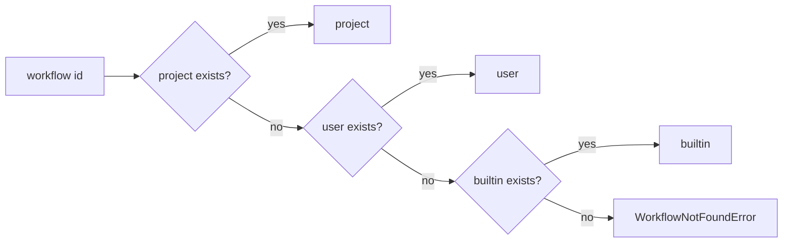

# Issue 73 Workflow Dedup Technical Spec

## Scope

Implement workflow source priority and deduplication for `playspec workflow list`, `playspec workflow show <id>`, and runtime workflow resolution. Update `playspec init` so default workflow assets can be installed into project scope, user scope, or skipped. Update ignore policy so project workflows under `.playspec/workflows/**` are committable while runtime state stays ignored.

Out of scope: changing workflow schema contents, MCP behavior, evolution proposal policy, archive/migration behavior, and destructive cleanup of existing workflow directories.

## Use Case Alignment

Users may have the same workflow ID available from bundled assets, user overrides, and a project-local workflow. The CLI should present one effective workflow per ID, make the source clear without exposing filesystem paths, and use the same effective source when showing or running that workflow.

## Current Implementation Summary

Verified behavior:
- `WorkflowRegistry` only knows `user` and `builtin` sources.
- `WorkflowRegistry.resolve()` checks user before builtin.
- `WorkflowRegistry.list()` concatenates builtin and user entries, then sorts only by ID, so duplicate IDs can appear.
- `WorkflowLoader.resolve()` delegates to `WorkflowRegistry.resolve()`, so `workflow show` follows current user-over-builtin resolution.
- `PresetManager.initWorkspace()` installs bundled workflows into the user workflow root automatically.
- Root `.gitignore` currently ignores all of `.playspec/`, so project workflow assets cannot be committed without force-add.

Inferred behavior:
- Tests commonly set `PLAY_SPEC_USER_WORKFLOWS` to isolate user workflow assets.
- `workflow install/remove` are user-scope commands and can remain user-scoped for this issue.

## Relevant Files Reviewed

- `src/workflow/workflow-registry.ts`
- `src/workflow/workflow-loader.ts`
- `src/core/types.ts`
- `src/cli/commands/workflow.ts`
- `src/cli/commands/init.ts`
- `src/preset/preset-manager.ts`
- `src/utils/paths.ts`
- `src/cli/index.ts`
- `.gitignore`
- `tests/integration/init-create-next.test.ts`
- `tests/integration/workflow-loader.test.ts`
- `tests/cli.test.ts`

## Active Entry Points And Bypasses

Active entry points:
- `playspec workflow list` -> `runWorkflowList()` -> `WorkflowRegistry.list()`.
- `playspec workflow show <id>` -> `runWorkflowShow()` -> `WorkflowLoader.resolve()` -> `WorkflowRegistry.resolve()`.
- Runtime prompt/render flows -> `WorkflowLoader.load()/resolve()` -> `WorkflowRegistry.resolve()`.
- `playspec init` -> `runInit()` -> `PresetManager.initWorkspace()`.

Bypass paths:
- `WorkflowLoader.resolveFromDirectory()` validates explicit directories and should not participate in source priority.
- `WorkflowInstaller.install/remove()` manages user workflows and can keep its existing user-scope behavior.

## Proposed Direction

Add `project` to `WorkflowSource` and add a project workflow root at `<workspace>/.playspec/workflows`. Update `WorkflowRegistry` to resolve sources in priority order `project`, `user`, `builtin`. `list()` should deduplicate by ID by iterating in priority order and retaining the first seen ID, then return stable groups sorted by source priority and ID.

Update `PresetManager.initWorkspace()` to accept a workflow install destination of `project | user | skip`, defaulting to `project` for direct API callers and CLI default. Copy bundled workflows into the selected target only if missing.

`playspec init` contract:
- Add `--workflow-install <project|user|skip>` for automation.
- In interactive terminals, ask: `Install default workflows? [project/user/skip] (project):`.
- Empty interactive input selects `project`.
- Non-interactive init without `--workflow-install` selects `project`.
- Invalid values fail with an explicit error before mutating workflow assets.
- The final success message includes the selected workflow install destination.

Update `.gitignore` exactly enough to keep project workflows committable while runtime state stays ignored:
- Ignore non-workflow `.playspec` content by default.
- Explicitly unignore `.playspec/workflows/` and `.playspec/workflows/**`.
- Ignore `.playspec/tasks/`.
- Ignore `.playspec/cache/`.
- Ignore `.playspec/tmp/`.
- Ignore `.playspec/logs/`.
- Do not ignore `.playspec/workflows/`.
- Keep existing `node_modules/`, `dist/`, `.serena/`, `*.log`, and `.mcp.json` ignores.

This issue does not require committing existing `.playspec/HEAD`, `.playspec/config.yaml`, `.playspec/sessions/`, or `.playspec/rules/`; init must not add them to git.

## File-by-File Plan

- `src/core/types.ts`: extend `WorkflowSource` to include `project`; add an install-scope type if useful.
- `src/utils/paths.ts`: add `getProjectWorkflowsRoot()`.
- `src/workflow/workflow-registry.ts`: add project root, source order, deduplicated list, and source-priority sorting.
- `src/workflow/workflow-loader.ts`: ensure `resolveFromDirectory()` remains explicit and source typing is valid.
- `src/preset/preset-manager.ts`: add configurable workflow install scope and copy bundled workflows to project or user root.
- `src/cli/commands/init.ts` and `src/cli/index.ts`: add `--workflow-install <project|user|skip>`, interactive prompt, non-interactive project default, and invalid-value rejection.
- `.gitignore`: replace blanket `.playspec/` ignore with the exact runtime directory ignores listed above.
- Tests: add registry/list/show priority tests and init install-scope/gitignore tests.

## Risks And Open Questions

- Existing tests expect init to install workflows into the user workflow root; update them to the new project default and add explicit user-scope tests.
- Non-interactive `playspec init` cannot prompt. It must default to project install unless `--workflow-install user` or `--workflow-install skip` is passed.
- Existing user workflows should still work when no project workflow overrides them.

## Step 2 Validation Ledger

Latest Step 2 score: 82/100.

Resolved:
- Defined the exact CLI/API contract for init destination selection, including the non-interactive flag and default.
- Defined exact `.gitignore` patterns instead of a broad runtime-state statement.

Remaining blocker: none after this patch.

Medium/low risks:
- Tests must be updated for new project default because older tests expected init to copy workflows into the user root.

## Reader Aids

Effective resolution flow:

