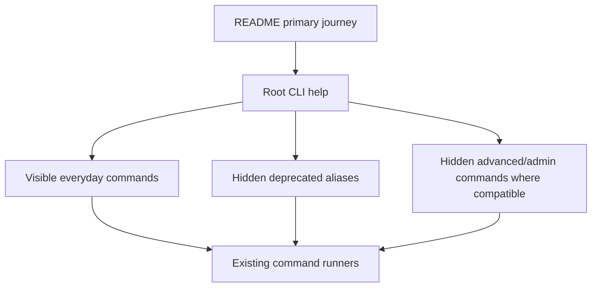

# Issue 74 CLI Optimize Technical Spec

## Scope

Optimize the human-facing PlaySpec CLI for issue #74 by first documenting a simpler README user journey, then compacting the default CLI surface around that journey. The implementation must stay focused on CLI/documentation shape, preserve core workflows, and avoid future-phase work such as adding a viewer.

In scope:
- Rewrite the README around the normal CLI journey: init, create/select a task, render prompt, complete phases, inspect state, and close/archive only when appropriate.
- Make `playspec --help` less noisy by hiding deprecated compatibility aliases and advanced/admin surfaces from default help.
- Keep compatibility for existing commands that scripts may still call, with deprecation warnings where behavior is intentionally legacy.
- Deprecate migration from the CLI surface by hiding `migrate` from root help and printing a warning when invoked.
- Keep migration implementation files in this issue because `src/cli/commands/migrate.ts`, `src/migration/*`, and `tests/integration/migration.test.ts` still depend on them. Deleting them is not safe in this scope.

Out of scope:
- New workflow phases, MCP behavior changes, markdown viewer work, destructive git behavior, or Core coupling to CLI.
- Breaking existing active task, prompt, completion, and mono-spec behavior.

## Use Case Alignment

The intended user journey is compact:

1. `playspec init --preset default`
2. `playspec create "Feature title"` or `playspec create --workflow mono-spec "Feature title"`
3. `playspec prompt --no-copy` or `playspec prompt --write`
4. Do the phase deliverable.
5. `playspec complete --result approved --no-copy` at approval gates, or plain `playspec complete --no-copy` for linear steps.
6. `playspec status`, `playspec list-tasks`, or `playspec use <taskId>` when switching context.

The README should teach this first. Advanced workflows (`workflow`, `harness`, `evolution`, `archive`, rollback/desync tools) remain callable and can be documented in a compact advanced section, but must not dominate the first CLI experience or root help.

## High-Level Current Implementation Summary

Verified behavior:
- The CLI is registered in `src/cli/index.ts` using Commander.
- `playspec --help` currently lists many top-level commands, including deprecated aliases and advanced surfaces.
- `playspec list`, `playspec current`, and `playspec next` are compatibility aliases implemented by separate command files that print deprecation warnings.
- `playspec migrate` is a full visible top-level command implemented by `src/cli/commands/migrate.ts` and backed by `src/migration/*`.
- README still presents migration as current functionality and includes a long command reference before a strong compact journey.

Inferred behavior:
- Hiding commands from Commander help is lower risk than deleting command implementations, because existing tests and scripts can continue calling hidden commands.
- Full migration module deletion is risky unless migration tests are intentionally removed or rewritten and imports are proven unused.

Resolved decision:
- Migration is not deleted in this issue. It is hidden and deprecated at the CLI boundary because integration tests and imports prove the files are still active code.

## Relevant Files Reviewed

Must-read files reviewed:
- `README.md`
- `src/cli/index.ts`
- `src/cli/commands/prompt.ts`
- `src/cli/commands/next.ts`
- `src/cli/commands/current-task.ts`
- `src/cli/commands/current.ts`
- `src/cli/commands/list-tasks.ts`
- `src/cli/commands/list.ts`
- `src/cli/commands/migrate.ts`
- `tests/cli.test.ts`
- `package.json`

Maybe-read during implementation:
- `tests/integration/migration.test.ts`
- `tests/integration/runtime-bin.test.ts`
- `src/migration/types.ts`
- `src/migration/schemas.ts`
- `src/migration/migration-runner.ts`
- `src/migration/migration-store.ts`

## Active Entry Points And Bypasses

Active user entry point:
- `src/cli/index.ts` registers all public commands and controls what appears in `playspec --help`.

Compatibility bypasses:
- `list`, `current`, and `next` remain callable aliases even though newer commands exist.
- `migrate` can be kept callable while hidden from help, with a stronger deprecation warning.

Advanced surfaces:
- `workflow`, `harness`, `archive`, `evolution`, `rollback`, `desync-check`, `evidence`, and `snapshot` are valid features but add noise to the root help for the simple journey.
- These commands must remain callable by direct invocation, including explicit command help, but must be hidden from `playspec --help`.

## Current Architecture

The CLI layer imports command runners from `src/cli/commands/*` and delegates to storage/core/workflow modules. Root command registration is the best place to compact help without altering core behavior.

Proposed flow:

## Verified Behavior

- Running `pnpm exec tsx src/cli/index.ts --help` currently shows duplicate/overlapping commands: `list` and `list-tasks`, `current` and `current-task`, `prompt` and `next`.
- The same help also shows migration and advanced surfaces, making the first CLI view long.
- Running `playspec list` already emits `Warning: playspec list is deprecated...` before delegating to `list-tasks`.
- Running `playspec current` already emits a deprecation warning before showing current task details.
- `README.md` says migration is included and gives a dedicated migration section.

## Problems

- Root help is too verbose for the normal user path.
- Deprecated aliases appear with canonical commands, making deprecated paths look equally important.
- Migration is still presented as a current user feature even though issue #74 asks to deprecate it.
- README starts as a capability inventory more than a use-case-led guide.

## Proposed Direction

1. README first:
   - Reframe the top of the README around the compact mono-spec CLI journey.
   - Keep installation/build instructions.
   - Move command reference into concise sections.
   - Mark deprecated aliases and migration as legacy/hidden instead of current path.

2. CLI help compaction:
   - Keep visible root commands focused on the primary journey: `init`, `create`, `prompt`, `complete`, `status`, `list-tasks`, `current-task`, `get-task`, `use`, `add-context`, `specs`, and `phase`.
   - Hide deprecated aliases from root help with Commander `.hideHelp()`: `list`, `current`, `next`.
   - Hide migration from root help and print a deprecation warning when called.
   - Hide advanced/admin groups from root help with Commander `.hideHelp()`: `workflow`, `rewind`, `evidence`, `snapshot`, `desync-check`, `rollback`, `harness`, `close`, `archive`, and `evolution`.
   - Preserve direct command execution and explicit command help, for example `playspec harness --help` and `playspec evolution --help`.

3. Migration:
   - Do not delete `src/migration/*` in this implementation pass.
   - Remove migration from the primary README journey.
   - Add an explicit CLI deprecation warning in `runMigrate` or command action.
   - Keep `tests/integration/migration.test.ts` passing unless the maintainer explicitly requests migration removal in a later issue.

## Root Help Acceptance Contract

After implementation, `playspec --help` must show these top-level commands:
- `init`
- `create`
- `list-tasks`
- `current-task`
- `get-task`
- `add-context`
- `use`
- `prompt`
- `specs`
- `phase`
- `complete`
- `status`
- `help`

After implementation, `playspec --help` must not show these top-level commands:
- Deprecated aliases: `list`, `current`, `next`
- Advanced/admin commands: `workflow`, `rewind`, `evidence`, `snapshot`, `desync-check`, `rollback`, `harness`, `close`, `archive`, `evolution`
- Deprecated migration command: `migrate`

Callable compatibility contract:
- `playspec list`, `playspec current`, and `playspec next` remain callable and keep existing deprecation warnings.
- `playspec migrate` remains callable but starts by writing a warning to stderr: `Warning: \`playspec migrate\` is deprecated. Migration is hidden from the primary CLI workflow.`
- `playspec harness --help`, `playspec evolution --help`, `playspec archive --help`, and `playspec workflow --help` remain callable.
- No command registration change may alter Core behavior, task storage, MCP context resolution, migration validation, or workflow phase routing.

## File-By-File Plan

- `README.md`: Rewrite top-level user journey and compact command model. Remove migration from current status/quick path and mark legacy if mentioned.
- `src/cli/index.ts`: Add `.hideHelp()` to the exact hidden command set listed in the Root Help Acceptance Contract. Update descriptions for visible commands to be shorter and journey-oriented.
- `src/cli/commands/migrate.ts`: Add a deprecation warning when invoked if `migrate` remains callable.
- `tests/cli.test.ts`: Adjust root help expectations to assert compact help hides deprecated aliases, migration, and advanced/admin groups while keeping core journey commands visible. Keep explicit subcommand help tests for advanced groups. Add migrate deprecation coverage.

## Risks And Open Questions

- Hiding advanced commands will break tests that assert `harness` or `evolution` appear in root help; update those tests to assert the commands are hidden from root help and still available through explicit command help.
- Removing migration files is not part of this issue because migration integration tests and package imports exist. Hidden/deprecated migration is the issue-aligned step.
- Deprecated aliases should remain callable to avoid unnecessary breakage.

## Step 2 Validation Ledger

Latest Step 2 readiness score: 42/100.

Resolved by this patch:
- README migration/current-status ambiguity: implementation must remove migration from current status and primary journey, with only legacy/deprecated mention if needed.
- Root help ambiguity: exact visible and hidden command sets are now specified.
- Migration deletion ambiguity: migration files must not be deleted in this issue.
- Advanced command ambiguity: advanced commands are hidden from root help but remain directly callable.
- Test ambiguity: root help and explicit subcommand help assertions are specified.

Remaining blockers:
- None in the spec after this patch. Implementation still needs to make the code/doc/test changes.

Downgraded risks:
- Migration file removal is downgraded to no active work because keeping files is explicitly required for safety.

## Reader Aids

Definitions:
- Canonical command: the preferred command documented in the README and visible in root help.
- Deprecated alias: an older command kept callable with a warning but hidden from root help.
- Advanced command: a valid feature command that is not part of the everyday first-run journey.
