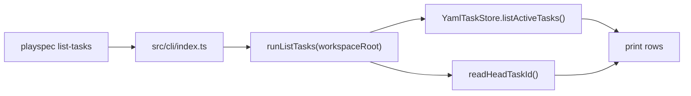

# Issue 86: Show HEAD Task First In `list-tasks`

## Scope

Implement a CLI UX improvement for `playspec list-tasks`: when `.playspec/HEAD` names an existing active task, print that task first and mark it visibly as current using the existing `[HEAD]` marker. Keep all other active tasks in their existing relative order. Do not change storage ordering, task schemas, MCP behavior, or add new JSON fields.

Out of scope:

- Adding a viewer or future workflow phase behavior.
- Changing Core task resolution rules.
- Adding JSON output to `list-tasks`.
- Changing task creation, `use`, `current-task`, archive, migration, or MCP behavior.

## Use Case Alignment

Users return to a workspace and run `playspec list-tasks` to orient themselves. The selected task should be the first item they see, so they can continue without scanning a longer list. If HEAD is empty or stale, the command should remain a non-mutating list command and keep the current helpful behavior.

## High-Level Current Implementation Summary

Verified from code:

- `src/cli/index.ts` wires the real `list-tasks` command directly to `runListTasks(process.cwd())`.
- `src/cli/commands/list-tasks.ts`:
  - checks that `.playspec` exists;
  - reads active task summaries through `YamlTaskStore.listActiveTasks()`;
  - reads `.playspec/HEAD` through `readHeadTaskId()`;
  - prints `No active tasks.` when the active list is empty;
  - prints each active task in store order;
  - appends ` [HEAD]` to the matching row.
- `readHeadTaskId()` catches missing or unreadable HEAD and returns `null`.
- `YamlTaskStore.listActiveTasks()` skips unreadable task entries and returns active summaries in directory iteration order.

Inferred behavior:

- A stale HEAD pointing to a missing task does not currently crash `list-tasks` because `runListTasks()` compares the raw string to listed task IDs and does not call `getTask(headTaskId)`.
- The deprecated hidden `playspec list` delegates to the same `runListTasks()` path, so it will inherit the display improvement.

## Relevant Files Reviewed

- `src/cli/index.ts` - real Commander entry point for `list-tasks`.
- `src/cli/commands/list-tasks.ts` - display loop and HEAD marker logic.
- `src/cli/cli-utils.ts` - `readHeadTaskId()` and effective phase display helpers.
- `src/storage/task-store.ts` - task store contract.
- `src/storage/yaml-task-store.ts` - active task listing behavior and ordering source.
- `tests/cli.test.ts` - real CLI integration tests using `tsx src/cli/index.ts`.

## Active Entry Points And Bypasses

Active path:



Bypass and adjacent paths:

- `playspec list` is hidden/deprecated but delegates to `runListTasks()`.
- `playspec current-task` resolves and displays only HEAD, but it is not the list ordering path.
- MCP tools must not read `.playspec/HEAD`; this feature is CLI-only.
- `YamlTaskStore.listActiveTasks()` must not be changed to privilege HEAD because storage should not know about the human CLI current-task pointer.

## Current Architecture

`list-tasks` is a presentation command over `TaskSummary[]`. The command already has all required inputs: active task summaries and the optional HEAD task ID. Therefore the safest architecture is a command-local pure ordering step:

1. Read `tasks`.
2. Read `headTaskId`.
3. If `headTaskId` matches an active task in `tasks`, produce `[headTask, ...remainingTasks]`.
4. If no match, use `tasks` unchanged.
5. Reuse the existing row formatter and `[HEAD]` marker.

## Verified Behavior

- Missing `.playspec` returns `WorkspaceNotInitializedError` with the existing init hint.
- Empty active list after init prints `No active tasks.`.
- HEAD marker already appears as ` [HEAD]` in `list-tasks`.
- `list-tasks` does not mutate `task.yaml`.
- Effective phase display is calculated per row and is independent of row ordering.

## Problems

- The HEAD row is marked but not elevated. If `YamlTaskStore.listActiveTasks()` returns another task before HEAD, the user must scan.
- Existing tests cover marker presence but not ordering when HEAD is not naturally first.
- Existing tests cover no active tasks but not a stale HEAD with active tasks.

## Proposed Direction

Add a small helper in `src/cli/commands/list-tasks.ts` to derive display order without mutating `tasks`:

```ts
function orderTasksForDisplay(tasks: TaskSummary[], headTaskId: string | null): TaskSummary[]
```

The helper should:

- Return `tasks` unchanged when `headTaskId` is `null`.
- Return `tasks` unchanged when no task ID matches HEAD.
- Return the matching task first when found.
- Preserve the relative order of every non-HEAD task.

No JSON output exists on `list-tasks` today, so backward compatibility is preserved by not adding any new output mode or data field.

## Validation Patch Ledger

Latest Step 2 validation score: 94/100. The validation concerns are resolved at spec level as follows:

- Implementation missing in `runListTasks()` remains an expected implementation task, not an unresolved architecture decision. The required patch is command-local display ordering over already-loaded `TaskSummary[]`.
- Missing tests are resolved at spec level by requiring real CLI tests that exercise `tsx src/cli/index.ts`, not helper-only tests.
- Filesystem listing order risk is resolved by making tests derive observed task rows from CLI output and then assert the transformation: matching HEAD row moves to index 0, while every other observed row keeps its previous relative order.
- Stale/no HEAD behavior is resolved by requiring direct CLI regression tests that write empty or stale `.playspec/HEAD` values and assert non-crashing output without false `[HEAD]` markers.

## File-By-File Plan

- `src/cli/commands/list-tasks.ts`
  - Import `TaskSummary` type if needed.
  - Add a local display-order helper.
  - Iterate over ordered tasks while keeping the existing header, effective phase display, and `[HEAD]` marker.
- `tests/cli.test.ts`
  - Add a real CLI test where HEAD is set to a task that is not first in the natural active listing. The test should:
    - initialize a workspace;
    - create at least three active tasks through `YamlTaskStore`;
    - run `playspec list-tasks` once with no HEAD to capture natural task row order;
    - choose a non-first observed task ID as HEAD by writing `.playspec/HEAD`;
    - run `playspec list-tasks` again through the real CLI path;
    - assert the first task row is the chosen HEAD row and contains `[HEAD]`;
    - assert the remaining rows equal the original observed rows with only the chosen HEAD row removed.
  - Add a stale HEAD regression test with active tasks. The test should write `.playspec/HEAD` to a missing task ID, run `playspec list-tasks`, assert exit code `0`, assert task rows still appear, and assert no row contains `[HEAD]`.
  - Add or preserve a no-HEAD active-list regression test. The test should remove or empty `.playspec/HEAD`, run `playspec list-tasks`, assert exit code `0`, assert task rows still appear in the observed natural order, and assert no row contains `[HEAD]`.
  - Keep existing no-active and read-only coverage.

## Risks And Open Questions

- Directory iteration ordering is filesystem-dependent. Tests should create slugs with predictable lexical names, but the behavior under test is relative movement: the HEAD task is first, and other observed rows keep their relative order.
- If a future `list-tasks --json` option is added, this feature should not introduce new fields unless documented. Current code has no JSON option for this command.
- Existing hidden `playspec list` will inherit the same output; this is acceptable because it already delegates to `runListTasks()`.

## Reader Aids

- `HEAD`: `.playspec/HEAD`, the human CLI current-task pointer.
- `TaskSummary`: compact task metadata returned by `TaskStore.listActiveTasks()`.
- "Natural order": the order returned by `YamlTaskStore.listActiveTasks()` before the CLI display helper moves the matching HEAD task.
