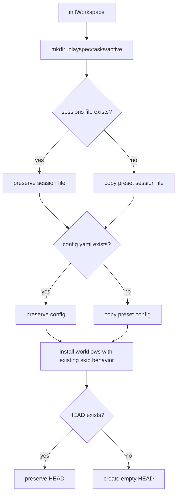

# Make preset init preserve existing config and HEAD state on rerun

## Scope

Implement a focused idempotency fix for `PresetManager.initWorkspace()` so rerunning preset init in an existing workspace preserves local runtime state and user-modified preset files. Keep first-time init behavior unchanged.

In scope:
- Preserve an existing `.playspec/config.yaml`.
- Preserve an existing `.playspec/HEAD`.
- Preserve existing preset session files under `.playspec/sessions`.
- Keep workflow installation skip-if-present behavior intact.
- Add focused regression coverage in `tests/integration/init-create-next.test.ts`.

Out of scope:
- Preset migration/versioning behavior.
- Workflow registry priority changes.
- Workflow execution behavior.
- CLI behavior unrelated to `initWorkspace()`.

## Use Case Alignment

Users and automation may call `playspec init` repeatedly in an already-initialized repository. The method comment says this is safe, and workflow installation already avoids replacing installed workflow definitions. The rest of preset initialization should follow the same non-destructive rule so local config, session state, and the active task pointer are not lost.

## High-Level Current Implementation Summary

Verified in `src/preset/preset-manager.ts`:
- `initWorkspace()` creates `.playspec/tasks/active`.
- It copies bundled preset sessions into `.playspec/sessions` using recursive `cp`.
- It copies bundled preset `config.yaml` into `.playspec/config.yaml`.
- It installs bundled workflows unless `workflowInstall` is `skip`.
- It writes an empty `.playspec/HEAD`.

Verified in `installPresetWorkflows()`:
- Workflow directories are copied from the built-in registry to project or user scope.
- A workflow with an existing `workflow.yaml` is skipped.
- A partial workflow directory without `workflow.yaml` is repaired by copying the built-in workflow directory.

## Relevant Files Reviewed

- `src/preset/preset-manager.ts`
- `src/utils/paths.ts`
- `tests/integration/init-create-next.test.ts`
- `package.json`

## Active Entry Points and Bypasses

Active entry point:
- CLI `playspec init` calls `PresetManager.initWorkspace()` through `src/cli/commands/init.ts`.

Direct test entry point:
- Existing integration tests instantiate `PresetManager` and call `initWorkspace()` directly.

Bypasses and alternate paths:
- `playspec create` and `playspec use` intentionally update `.playspec/HEAD`.
- Core and MCP code read task state through explicit task ids or resolver paths and are not part of this init behavior.
- No migration or rollback path is involved.

## Current Architecture

Preset initialization owns workspace scaffolding:
- Runtime directories: `.playspec/tasks/active`, `.playspec/sessions`.
- Preset config file: `.playspec/config.yaml`.
- Active task pointer: `.playspec/HEAD`.
- Installed workflows: `.playspec/workflows` or `user-workflows`, depending on `workflowInstall`.

Workflow installation already treats existing complete workflow directories as user-owned state. Config, HEAD, and sessions currently do not receive that protection.

## Verified Behavior

Verified current first-init behavior:
- `.playspec/HEAD` is created empty.
- `.playspec/config.yaml` exists.
- `.playspec/sessions/cli.default.yaml` exists.
- `.playspec/tasks/active` exists.
- Project or user workflow install destinations are created according to options.

Verified current rerun behavior from code:
- `.playspec/config.yaml` is overwritten from preset assets.
- `.playspec/HEAD` is cleared by writing `''`.
- Preset session files may be overwritten by recursive copy.
- Existing workflow files are preserved when their workflow directory contains `workflow.yaml`.

## Problems

- `initWorkspace()` is only partially idempotent.
- Rerunning init can erase local config customizations.
- Rerunning init can clear the active task pointer in `HEAD`.
- Existing session files are runtime/user state and should follow the same non-destructive rule as config and HEAD.

## Proposed Direction

Make preset init create default files only when missing:
- Keep `mkdir(..., { recursive: true })` for required directories.
- Copy preset sessions into `.playspec/sessions` without overwriting existing files.
- Copy preset `config.yaml` only when missing.
- Create `.playspec/HEAD` as an empty file only when missing.
- Keep `installPresetWorkflows()` unchanged so existing workflow skip and partial repair behavior remain intact.

Implementation detail:
- Add a small private helper in `PresetManager` for copy-if-missing or write-if-missing behavior, or use `access()` checks inline where the code remains readable.
- Document the preservation rule with a short implementation comment near the guarded preset state writes.

## File-by-File Plan

`src/preset/preset-manager.ts`
- Guard preset session copy, config copy, and HEAD creation against existing destination files.
- Use non-destructive behavior for reruns.
- Keep first-time scaffolding exactly as today.

`tests/integration/init-create-next.test.ts`
- Extend first-init assertions to verify required default files/directories are created.
- Add a regression test that initializes once, writes custom `.playspec/config.yaml`, non-empty `.playspec/HEAD`, an existing session file, and an existing workflow file, reruns init, and verifies all are preserved.

## Risks and Open Questions

Risk:
- Automation that expected `playspec init` to refresh bundled config will stop receiving that implicit reset. This aligns with the documented safe-to-rerun contract and should be visible in the regression test name.

Decision:
- Existing session files should be preserved. They live under `.playspec` runtime state and are more similar to HEAD/config user state than to versioned bundled defaults on rerun.

Open questions:
- None for the scoped issue.

## Reader Aids

Proposed rerun flow:

