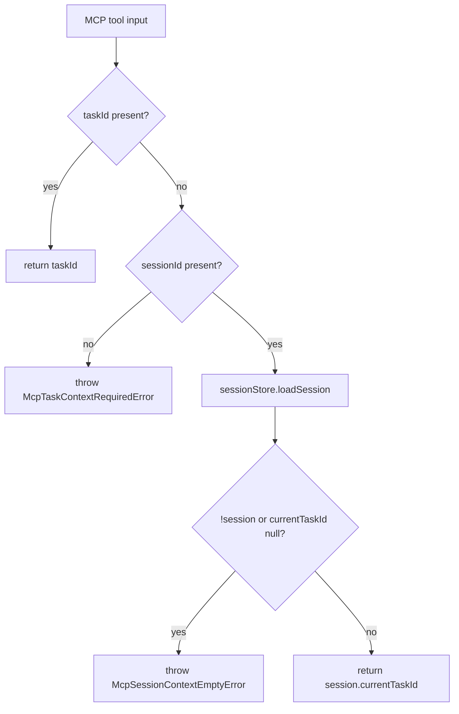
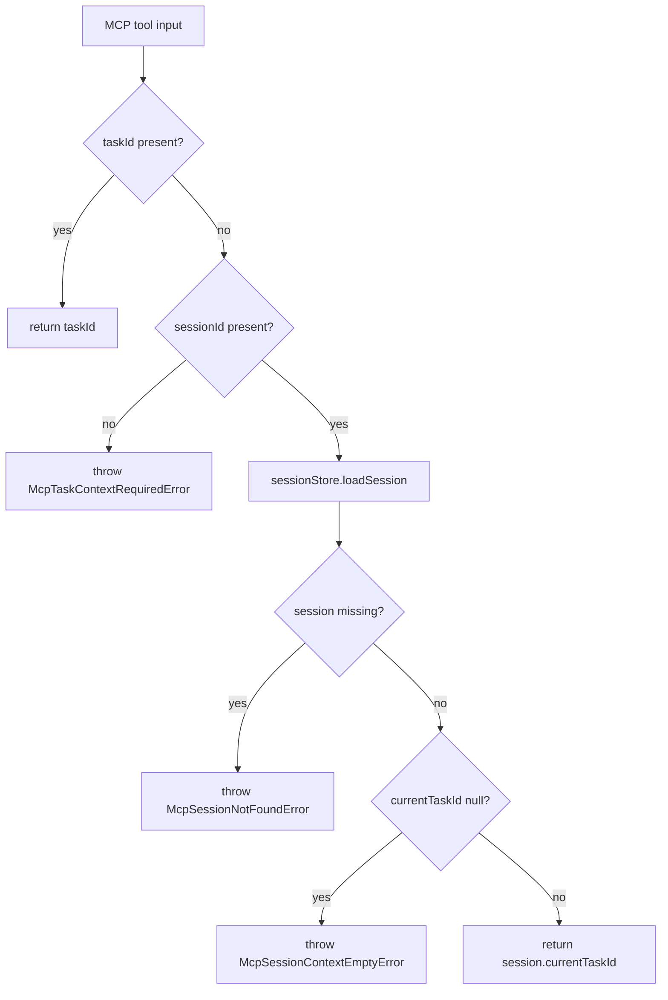

# MCP Session Not Found Error Differentiation Spec

## Scope

Implement issue #105 only: differentiate MCP session lookup failure from an existing MCP session with no bound task. The change is limited to MCP context resolution errors and the focused integration coverage for `resolveMcpTaskId()`.

Out of scope:

- Changing `McpSessionStore.loadSession()` return type or API.
- Changing MCP tool signatures.
- Changing CLI or non-MCP context resolution.
- Adding new workflow phases or viewer behavior.

## Use Case Alignment

Automation agents call MCP tools with either an explicit `taskId` or a `sessionId`. When a `sessionId` is provided, the resolver must produce actionable errors:

- Missing session file: tell the caller to create or bind a session.
- Existing session with `currentTaskId: null`: tell the caller to bind a task to the existing session.

The issue acceptance criteria require a new `McpSessionNotFoundError` for the missing-session path and preserved `McpSessionContextEmptyError` behavior for the null-task path.

## High-Level Current Implementation Summary

Verified behavior:

- `src/mcp/context.ts` resolves an explicit `taskId` immediately.
- With `sessionId`, it calls `McpSessionStore.loadSession(sessionId)`.
- `src/mcp/session-store.ts` returns `null` from `loadSession()` for any read or parse error.
- `resolveMcpTaskId()` currently checks `if (!session || session.currentTaskId === null)` and throws `McpSessionContextEmptyError` for both cases.
- `tests/integration/mcp-server.test.ts` currently includes one test for `currentTaskId: null` and one test that expects the same empty-context error for a missing session.

Inferred behavior:

- MCP server tool handlers rely on `resolveMcpTaskId()` for task-context-bearing tools, so the new error can surface through existing MCP error serialization without tool signature changes.

Open questions:

- `loadSession()` also returns `null` for unreadable or corrupt YAML, not only missing files. Because the issue explicitly says not to change `loadSession()` API surface, all `null` results will map to `McpSessionNotFoundError` in this implementation.

## Relevant Files Reviewed

- `src/mcp/context.ts`: active MCP task context resolver.
- `src/mcp/errors.ts`: MCP-specific `PlaySpecError` subclasses.
- `src/mcp/session-store.ts`: YAML-backed MCP session loader/saver.
- `tests/integration/mcp-server.test.ts`: existing integration coverage for session store and resolver behavior.
- `src/mcp/server.ts`: MCP tool handlers call the resolver through existing context wiring.

## Active Entry Points And Bypasses

Active entry points:

- Direct tests call `resolveMcpTaskId(input, sessionStore)`.
- MCP server tool handlers in `src/mcp/server.ts` call `resolveMcpTaskId()` for task-scoped operations.
- `resolveMcpTaskContext()` delegates to `resolveMcpTaskId()`.

Bypasses and alternate paths:

- Explicit `taskId` bypasses session lookup.
- Missing both `taskId` and `sessionId` bypasses session lookup and throws `McpTaskContextRequiredError`.
- CLI HEAD resolution is intentionally separate and must not be introduced into MCP context resolution.

## Current Architecture

Verified flow:

Proposed flow:

## Verified Behavior

- Existing sessions with `currentTaskId: null` can be created with `McpSessionStore.saveSession()`.
- Missing sessions are currently represented as `null` by `loadSession()`.
- Existing tests cover both paths but currently expect the same error class.
- The project uses path aliases for cross-module imports; MCP files currently use sibling imports within `src/mcp/`, which is allowed by `AGENTS.md`.

## Problems

- Missing-session and null-task states are conflated under `McpSessionContextEmptyError`.
- The current hint, "Call playspec_use_session_task to bind a task to this session first.", is not accurate when no session record exists.
- Integration coverage locks in the ambiguous missing-session behavior.

## Proposed Direction

Add `McpSessionNotFoundError` in `src/mcp/errors.ts`, update `resolveMcpTaskId()` to split the guard into two checks, and update integration tests to assert each error class independently.

## File-By-File Plan

`src/mcp/errors.ts`

- Add exported `McpSessionNotFoundError extends PlaySpecError`.
- Message should identify the missing session ID.
- Hint should instruct creating or binding a new session, using existing MCP tool naming where appropriate.
- Leave `McpSessionContextEmptyError` unchanged.

`src/mcp/context.ts`

- Import `McpSessionNotFoundError`.
- After `loadSession()`, check `if (!session)` and throw the new error.
- Then check `if (session.currentTaskId === null)` and throw `McpSessionContextEmptyError`.
- Keep explicit `taskId` precedence and no-HEAD behavior unchanged.

`tests/integration/mcp-server.test.ts`

- Import the new error class.
- Keep the null-task test expecting `McpSessionContextEmptyError`.
- Replace the missing-session expectation with `McpSessionNotFoundError`, or add a new explicitly named test matching the issue acceptance criteria.
- Optionally assert the new hint text if supported by the existing `PlaySpecError` shape.

## Risks And Open Questions

- Callers that only catch `McpSessionContextEmptyError` for missing sessions will need to also handle `McpSessionNotFoundError`. This is an intentional issue-scoped behavior change.
- Because `loadSession()` returns `null` for all load failures, corrupt sessions and permission errors will also become `McpSessionNotFoundError` until the store API is refined in a future issue.
- No schema or session file format changes are planned.

## Reader Aids

- `McpSessionContextEmptyError`: session exists but has no `currentTaskId`.
- `McpSessionNotFoundError`: resolver received a `sessionId`, but `loadSession()` returned `null`.
- MCP context must continue to avoid `.playspec/HEAD` and must use explicit `taskId` or session-bound task context only.
