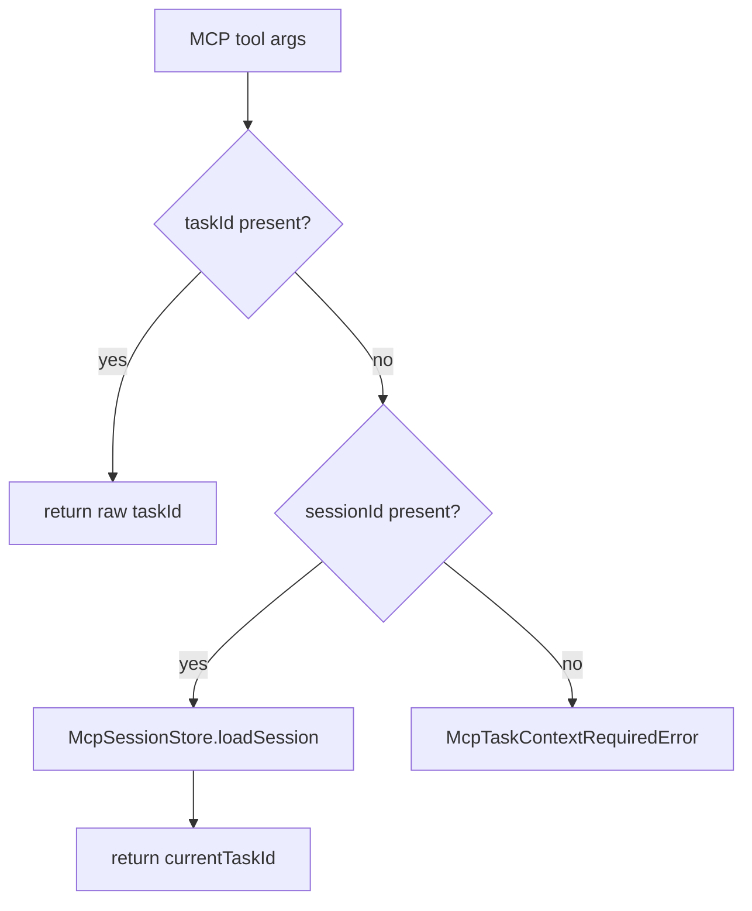
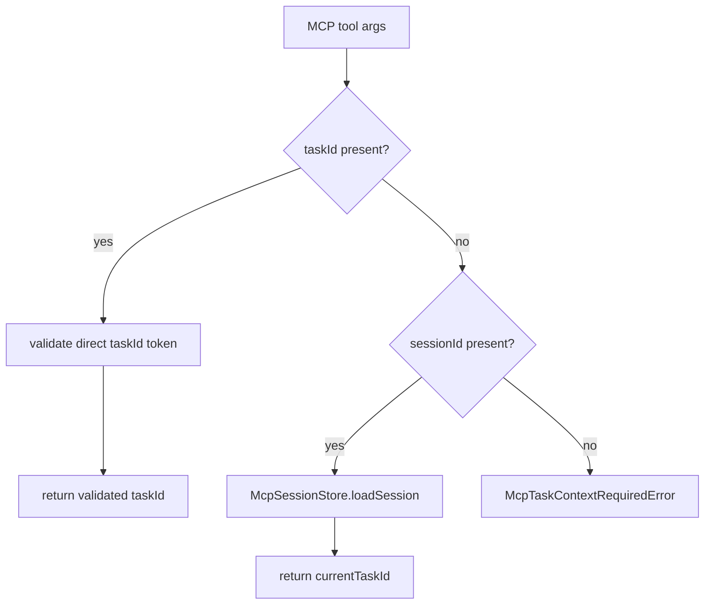

# MCP taskId Resolver Boundary Validation Spec

## Scope

Add direct `taskId` input validation at the MCP context resolver boundary. The change is limited to `src/mcp/context.ts`, MCP-specific error reporting in `src/mcp/errors.ts`, and focused tests in `tests/integration/mcp-server.test.ts`.

Out of scope: MCP tool parameter schema changes, CLI task ID validation, `TaskIdResolver` matching behavior, session ID validation, HEAD fallback behavior, and any migration or viewer work.

## Use Case Alignment

MCP tools accept task context from automated callers through either `taskId` or `sessionId`. A caller that supplies `taskId` should only be able to pass a single task identifier token, not a filesystem path-like value or string containing control characters. Invalid input should fail before reaching task store or core operations.

## High-Level Current Implementation Summary

Verified behavior: `resolveMcpTaskId()` in `src/mcp/context.ts` currently returns `input.taskId` directly when present. If `taskId` is absent and `sessionId` is present, it loads the session from `McpSessionStore`, rejects missing sessions, rejects sessions with no current task, and returns `session.currentTaskId`. If neither value is present, it throws `McpTaskContextRequiredError`.

Verified behavior: MCP lifecycle tools call `resolveMcpTaskId()` before invoking core operations such as prompt rendering, completion, evidence collection, rollback, context edits, phase setting, snapshots, harness operations, and evolution proposal generation.

## Relevant Files Reviewed

- `src/mcp/context.ts`: direct MCP task context resolution.
- `src/mcp/errors.ts`: MCP-specific `PlaySpecError` subclasses and user-facing hints.
- `src/mcp/server.ts`: active MCP entry points that call `resolveMcpTaskId()`.
- `src/core/task-id-resolver.ts`: prefix/exact task ID resolver used elsewhere, intentionally unchanged.
- `tests/integration/mcp-server.test.ts`: existing MCP session store, resolver, and server integration tests.

## Active Entry Points and Bypasses

Active entry point: tools that use `resolveMcpTaskId(args, sessionStore)` receive untrusted MCP arguments and pass the resulting task ID into core APIs.

Bypass path: explicit `taskId` currently bypasses session lookup and `TaskIdResolver.resolve()`. That precedence should remain, but the explicit ID must be validated first.

Alternate path: `resolveMcpSourceTaskId()` in `src/mcp/server.ts` resolves `sourceTaskId` through `TaskIdResolver.resolve()` before falling back to `resolveMcpTaskId()` for `taskId`/`sessionId`. This issue targets direct `taskId` through `resolveMcpTaskId()` only.

## Current Architecture

Verified flow:

Proposed flow:

## Verified Behavior

- Direct task ID takes precedence over session ID.
- No context does not fall back to `.playspec/HEAD`.
- Missing session and empty-session errors already have MCP-specific hints.
- No MCP-specific invalid task ID error exists today.

## Problems

Direct `taskId` input can contain path separators, null bytes, control characters, or very long strings. Downstream task storage uses task IDs in `.playspec` task paths, so the MCP boundary should reject malformed direct IDs before storage or core calls.

## Proposed Direction

Add a small validation helper in `src/mcp/context.ts` or adjacent MCP error code and call it before returning explicit `taskId`.

Validation rules:

- Reject `/` and `\`.
- Reject `\0`.
- Reject ASCII control characters.
- Reject strings longer than 256 characters.
- Preserve current behavior for normal generated slug IDs.

Add an MCP-specific `McpInvalidTaskIdError` with a hint that documents the rules: use a task ID without path separators, null bytes, or control characters, with maximum length 256 characters.

## File-By-File Plan

- `src/mcp/errors.ts`: add `McpInvalidTaskIdError`.
- `src/mcp/context.ts`: validate explicit `taskId` before returning it.
- `tests/integration/mcp-server.test.ts`: add resolver tests for valid IDs, slash, backslash, null byte, control character, and over-length direct `taskId` inputs. Keep session behavior tests unchanged.

## Risks and Open Questions

Risk: Over-restricting could reject unusual but previously accepted task IDs. The requested rules are intentionally narrow and still allow normal PlaySpec slugs.

Open question: Whether session-stored `currentTaskId` should also be validated on read is not part of this issue. The current scope is direct untrusted `taskId` input at `resolveMcpTaskId()`.

## Reader Aids

The implementation should not use `ActiveTaskResolver`, should not read `.playspec/HEAD`, and should not alter MCP schemas. The resolver remains the boundary where untrusted direct `taskId` becomes trusted internal context.
