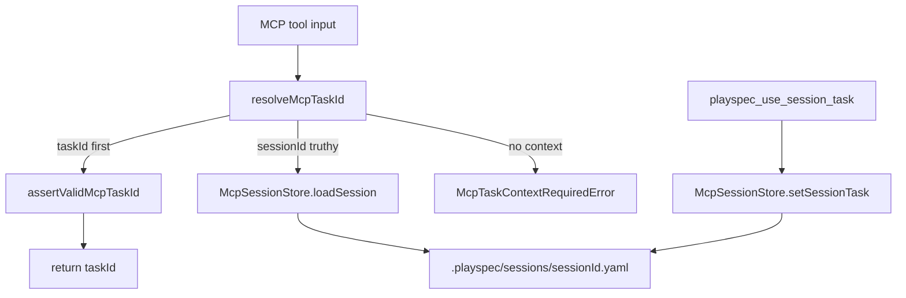
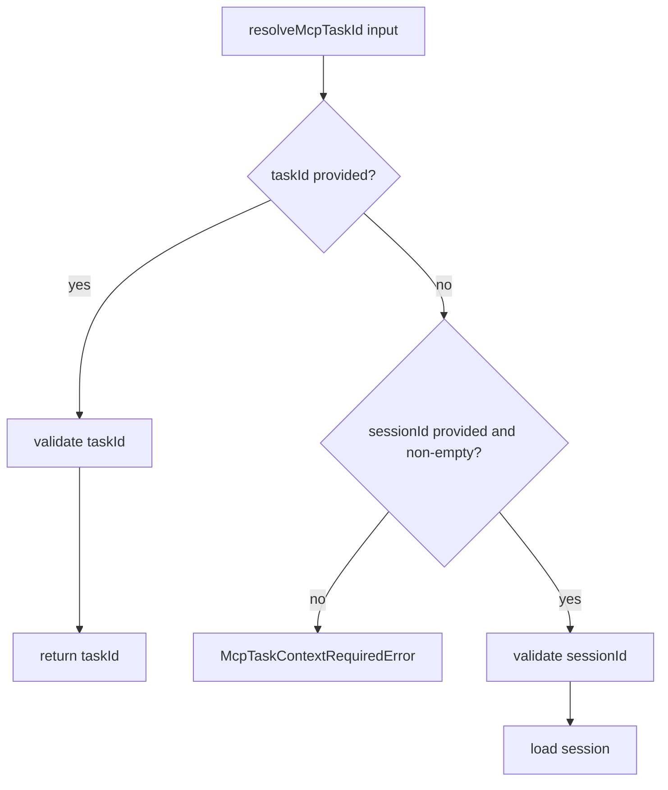

# MCP Resolver Boundary Input Validation

## Scope

Add defense-in-depth validation at the MCP task context boundary for task and session identifiers. The change is limited to MCP resolver/session behavior and tests. It does not change MCP tool schemas, session file format, CLI task ID validation, HEAD fallback behavior, or non-MCP core flows.

## Use Case Alignment

Automation callers can invoke MCP tools with `taskId` or `sessionId`. Those values cross from external tool input into PlaySpec file paths and task lookup. The resolver should reject missing or malformed context early with clear PlaySpec errors, so accidental empty strings or unsafe filename characters do not produce confusing downstream session lookup behavior.

## High-Level Current Implementation Summary

Verified code behavior:

- `resolveMcpTaskId()` in `src/mcp/context.ts` first returns a provided truthy `taskId` after direct validation.
- Direct task IDs are currently rejected when over 256 characters, when containing `/` or `\`, or when containing null/control characters.
- `resolveMcpTaskId()` then checks `if (input.sessionId)` and loads the session by ID only when the value is truthy.
- Empty string `sessionId` is treated the same as an absent session ID when no `taskId` is present, causing `McpTaskContextRequiredError`.
- Empty string `sessionId` is ignored when a valid `taskId` is present because task ID precedence is already first.
- `McpSessionStore.sessionPath()` directly interpolates `${sessionId}.yaml` under `.playspec/sessions`.
- `McpSessionStore.setSessionTask()` accepts `sessionId` and `taskId` parameters and relies on `saveSession()` plus schema parsing, but does not apply MCP filename-safety validation before loading or saving.

Inferred behavior:

- MCP server tool schemas still use `z.string()` for relevant IDs, so normal MCP calls should provide strings. Resolver-level runtime checks still protect direct function calls and future schema drift.
- Session IDs with path separators can escape the intended session filename shape because `path.join(..., `${sessionId}.yaml`)` is used directly.

## Relevant Files Reviewed

- `src/mcp/context.ts`: MCP task context resolver and direct task ID validation.
- `src/mcp/session-store.ts`: YAML-backed MCP session load/save/set helpers.
- `src/mcp/errors.ts`: MCP-specific PlaySpec error classes and hints.
- `src/mcp/server.ts`: MCP tool schemas and resolver call sites.
- `tests/integration/mcp-server.test.ts`: integration coverage for MCP session store, resolver, and server behavior.

## Active Entry Points And Bypasses

Active entry points:

- MCP tools in `src/mcp/server.ts` call `resolveMcpTaskId(args, sessionStore)` for task-context operations.
- `playspec_use_session_task` calls `McpSessionStore.setSessionTask()` directly to bind a session to a task.
- Tests import `resolveMcpTaskId()` and `McpSessionStore` directly.

Bypass paths:

- `McpSessionStore.loadSession()` and `saveSession()` are public methods and can still be called directly. The implementation should validate the write/bind boundary in `setSessionTask()` and resolver read path, without broad API or schema changes.
- Core and CLI flows are separate from MCP and should not be coupled to these validations.

## Current Architecture

## Verified Behavior

- Missing context already throws `McpTaskContextRequiredError`.
- Valid direct `taskId` is preferred over `sessionId`.
- Invalid direct task IDs with `/`, `\`, null/control characters, or excessive length throw `McpInvalidTaskIdError`.
- Nonexistent-looking session IDs throw `McpSessionNotFoundError`.
- Session IDs bound through `setSessionTask()` can contain any string accepted by `SessionRecordSchema`.

## Problems

- The `McpTaskContextRequiredError` hint does not document accepted identifier formats.
- Direct `taskId` validation does not reject `:`, even though the issue calls out colons as unsafe for YAML filenames on all platforms.
- There is no session ID validation helper, so resolver session lookup and `setSessionTask()` can diverge.
- `setSessionTask()` accepts unsafe session IDs before constructing YAML paths.

## Proposed Direction

Add small MCP-local validation helpers in a sibling MCP utility file, for example `src/mcp/validation.ts`. Reuse them from `resolveMcpTaskId()` and `McpSessionStore.setSessionTask()` so the resolver and session binding boundary enforce the same filename-safe rules.

Proposed rules:

- `taskId`: non-empty string, 256 characters or fewer, no `/`, `\`, `:`, null bytes, or control characters.
- `sessionId`: non-empty string, 256 characters or fewer, no `/`, `\`, `:`, null bytes, or control characters.
- `resolveMcpTaskId()` keeps direct `taskId` precedence. If `taskId` is valid, an empty or malformed `sessionId` does not mask task resolution.
- If only `sessionId` is present and it is `""`, throw `McpTaskContextRequiredError` to preserve missing-context semantics.
- If only `sessionId` is present and it is malformed but non-empty, throw a dedicated `McpInvalidSessionIdError`.
- `McpSessionStore.setSessionTask()` must validate both `sessionId` and `taskId` before calling `loadSession()` or `saveSession()` so invalid values do not reach filename construction.

Proposed flow:

## File-By-File Plan

- `src/mcp/errors.ts`: update `McpTaskContextRequiredError` hint with expected `taskId`/`sessionId` format; add `McpInvalidSessionIdError` if malformed non-empty session IDs need a specific error.
- `src/mcp/errors.ts`: add `McpInvalidSessionIdError` with a hint matching the session ID rules.
- `src/mcp/validation.ts`: add shared MCP identifier validation helpers for task IDs and session IDs; reject `:` for both identifiers.
- `src/mcp/context.ts`: use the shared helpers; validate session IDs before loading; keep direct task ID precedence; treat empty `sessionId` as missing context when no valid `taskId` is provided.
- `src/mcp/session-store.ts`: validate `sessionId` and `taskId` inside `setSessionTask()` before load/save path construction.
- `tests/integration/mcp-server.test.ts`: add the two required empty-string resolver tests; add focused coverage for colon rejection on direct `taskId`, malformed non-empty `sessionId`, and `setSessionTask()` validation.

## Validation Ledger

- Step 2 score: 92/100.
- Resolved: chose a dedicated `McpInvalidSessionIdError` for malformed non-empty session IDs.
- Resolved: fixed helper ownership to `src/mcp/validation.ts` rather than leaving placement open.
- Resolved: made `setSessionTask()` validation order explicit before any load/save path construction.
- Remaining blockers: none.
- Remaining medium risks: ensure tests cover both resolver and session binding paths so the shared helper cannot regress silently.

## Risks And Open Questions

- Risk: `loadSession()` remains a permissive low-level read helper. This is acceptable if resolver and bind paths are treated as MCP boundaries.
- Risk: adding colon rejection for direct `taskId` is a stricter behavior than today, but it matches the issue scope and filename-safety requirement.

## Reader Aids

- Resolver boundary means the first function that translates MCP tool input into a task ID for core operations.
- Session boundary means the MCP helper that creates or updates `.playspec/sessions/*.yaml` files.
- HEAD fallback is intentionally absent from MCP resolution and should remain absent.
