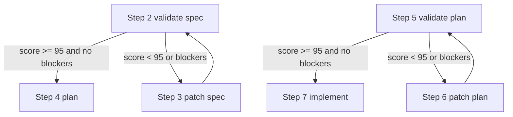

# mono-spec update issue 37 Technical Spec

## Scope

Update only the built-in `mono-spec` workflow preset prompts so validation gates in Step 2 and Step 5 require a validation score of at least 95/100, produce markdown score/risk output, and feed that output into the following patch steps. Do not change runtime routing semantics or other workflows.

## Use Case Alignment

The workflow user wants mono-spec validation to be stricter and more actionable. A code agent should be able to render Step 2 or Step 5, perform the validation directly, record a markdown score/risk ledger, and only approve the gate when the score is `>= 95` with no unresolved blockers. Step 3 and Step 6 should explicitly consume those markdown validation outputs when a revision loop is needed.

## High-Level Current Implementation Summary

Verified code behavior:
- `src/preset/assets/workflows/mono-spec/workflow.yaml` defines the linear mono-spec phase order and gated routing for Step 2 and Step 5.
- Step 2 currently renders `tech_spec_validate.md`, which asks the operator to prepare and paste an external GPT prompt.
- Step 3 currently renders `tech_spec_patch.md`, which says to use the latest technical validation output but does not name a markdown score/risk output.
- Step 5 currently renders `implementation_plan_validate.md`, which asks for validation and a risk ledger in `PLAN_FILE` but does not require a 0-100 score or a `>= 95` approval threshold.
- Step 6 currently renders `implementation_plan_patch.md`, which says to use the latest validation output but does not name a markdown score/risk output.

Inferred behavior:
- The CLI renders prompt templates directly from preset assets; prompt-only updates should be covered by rendering tests rather than runtime code changes.

Open questions:
- Whether validation/risk markdown outputs should be separate files. Current mono-spec artifacts only expose `SPEC_FILE`, `PLAN_FILE`, `RESULT_FILE`, and `PR_FILE`; the narrowest change is to store Step 2 output in `SPEC_FILE` and Step 5 output in `PLAN_FILE` rather than adding new artifacts.

## Relevant Files Reviewed

- `src/preset/assets/workflows/mono-spec/workflow.yaml`
- `src/preset/assets/workflows/mono-spec/templates/tech_spec_validate.md`
- `src/preset/assets/workflows/mono-spec/templates/tech_spec_patch.md`
- `src/preset/assets/workflows/mono-spec/templates/implementation_plan_validate.md`
- `src/preset/assets/workflows/mono-spec/templates/implementation_plan_patch.md`
- `src/preset/assets/workflows/total-plan/templates/total_spec_validate.md`
- `src/preset/assets/workflows/total-plan/templates/phase_plan_validate.md`
- `tests/integration/init-create-next.test.ts`

## Active Entry Points And Bypasses

Active entry point:
- `PlaySpecCore.renderExplicitPhasePrompt()` and `playspec prompt/phase` render mono-spec templates through the workflow loader.

State/data update:
- Template files under `src/preset/assets/workflows/mono-spec/templates/` are copied into `.playspec/workflows` during init and are included in `dist` by the build script.

Propagation:
- Rendering tests initialize the default preset and render templates from installed workflow assets.

Reset/clear:
- No persistent runtime state migration is needed because this is a preset prompt update.

User-visible behavior:
- Rendered Step 2 and Step 5 prompts should show direct Codex/code-agent validation instructions, markdown score output requirements, and `>= 95` approval rules.
- Rendered Step 3 and Step 6 prompts should instruct the agent to use the prior markdown validation/risk score output when patching docs.

Bypass paths:
- Existing `.playspec` workspaces initialized before this change will not automatically receive updated copied workflow assets unless the workflow is reinstalled or workspace is reinitialized. That behavior is existing preset-install behavior and out of scope.

## Current Architecture

Mono-spec prompt content is data-driven. `workflow.yaml` wires phase IDs to template files and gates. The requested behavior is instructional, not algorithmic, so the safest architecture is to update only the relevant markdown templates and add assertions that rendered prompts expose the new rules.

## Verified Behavior

- Step 2 and Step 5 gate routing already supports `approved` and `needs_revision`.
- Total-plan validation templates already use explicit wording: approve only when readiness score is `>= 95`, otherwise route to `needs_revision`.
- Mono-spec Step 2 still contains external GPT/copy/paste wording and does not require the `>= 95` threshold.
- Mono-spec Step 5 does not currently require a readiness score from 0 to 100 or the `>= 95` threshold.

## Problems

- Step 2 wording delegates to an external GPT copy/paste flow instead of directly instructing Codex/the code agent.
- Step 2 has a score field but no explicit `>= 95` approval threshold.
- Step 2 output is not clearly described as markdown validation/risk score output to preserve for Step 3.
- Step 5 lacks a 0-100 score requirement and the `>= 95` approval threshold.
- Step 6 does not explicitly consume Step 5 markdown validation/risk score output.

## Proposed Direction

Update mono-spec templates only:
- Rewrite Step 2 as a direct technical spec cross-validation task for Codex/the code agent.
- Require Step 2 to produce markdown validation/risk output containing `Score: X/100`, verdict, blockers, risks, open questions, and patch-ready ledger.
- State Step 2 approval may use `approved` only when score is `>= 95` and no unresolved blockers remain.
- Update Step 3 source of truth/output requirements to use the Step 2 markdown validation/risk score output.
- Update Step 5 to require a markdown validation/risk section in `PLAN_FILE` with a 0-100 score and `>= 95` approval threshold.
- Update Step 6 source of truth/output requirements to use the Step 5 markdown validation/risk score output.
- Add/adjust integration assertions for rendered mono-spec prompts.

## File-By-File Plan

- `src/preset/assets/workflows/mono-spec/templates/tech_spec_validate.md`
  - Replace external GPT copy/paste language with direct Codex/code-agent instructions.
  - Add markdown output requirements and `>= 95` gate rules.
- `src/preset/assets/workflows/mono-spec/templates/tech_spec_patch.md`
  - Reference the Step 2 markdown validation/risk score output as source material.
- `src/preset/assets/workflows/mono-spec/templates/implementation_plan_validate.md`
  - Add 0-100 score, markdown validation/risk output, and `>= 95` gate rules.
- `src/preset/assets/workflows/mono-spec/templates/implementation_plan_patch.md`
  - Reference the Step 5 markdown validation/risk score output as source material.
- `tests/integration/init-create-next.test.ts`
  - Add assertions for mono-spec 95-point validation rules and direct-agent wording.

## Risks/Open Questions

- Risk: Adding new workflow artifacts for separate validation files would broaden the change and may require runtime/schema updates. Mitigation: keep outputs in existing `SPEC_FILE` and `PLAN_FILE`.
- Risk: Tests that assert old wording may need updates. Mitigation: search before and after implementation.
- Open question: Existing initialized workspaces may keep old copied workflow templates. This spec treats reinstall/reinit behavior as out of scope.

## Reader Aids

Requested flow:

