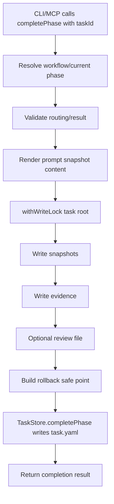
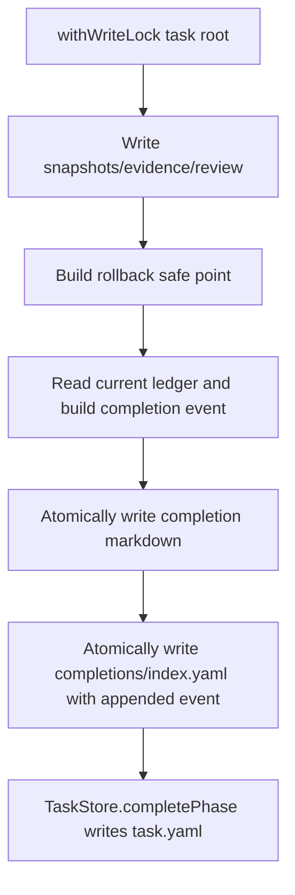

# phase_completion_ledger Technical Spec

## Scope

Implement a per-task phase completion ledger for completed workflow phases. The ledger complements `task.yaml` `phaseHistory`; it does not replace rollback state, task state, evidence files, snapshot files, or review files.

In scope:

- Append one typed completion event for each successful `PlaySpecCore.completePhase()` call.
- Persist `.playspec/tasks/active/<taskId>/completions/index.yaml`.
- Persist one copy-paste-friendly markdown file per completion event.
- Add read-only CLI commands `playspec log` and `playspec show-completion`.
- Keep existing evidence, snapshot, review, state sync, and rollback behavior intact.
- Add focused tests for core completion, gate routing, revision loops, final completion, markdown/index consistency, and CLI output.

Out of scope:

- Markdown viewer UI.
- Cache cleanup commands.
- Changing rollback to read markdown.
- Auto-applying evolution proposals.
- Any destructive git operation.
- Storing completion records outside `.playspec`.

## Use Case Alignment

Users need a durable audit trail similar to `git log`: each completed phase should be inspectable by sequence, phase, type/result, next transition, evidence, snapshots, rollback reference, and markdown body. The current `phaseHistory` is useful structured state, but it is not an append-only user-facing ledger and it has no stable completion event ID or markdown record.

## High-Level Current Implementation Summary

Verified behavior:

- `TaskRecord.phaseHistory` stores completed phase entries with optional `result`, `reviewFile`, `evidenceFiles`, `snapshotFiles`, `validationTemplate`, and `visitCount`.
- `PlaySpecCore.completePhase()` resolves current phase, validates routing, renders a prompt snapshot, enters a task-root write lock, writes snapshots, writes git evidence, optionally writes review metadata, builds a rollback safe point, then calls `TaskStore.completePhase()`.
- `YamlTaskStore.completePhase()` appends a completed `PhaseHistoryEntry`, updates status/current phase, writes `stateSync` and `rollback`, and atomically writes `task.yaml`.
- `RollbackManager` uses `task.rollback.lastSafePoint` and validated task snapshots. It does not use historical markdown or evidence records.
- CLI `complete` uses `ActiveTaskResolver` at the human boundary, then calls core with an explicit task ID.

Inferred behavior:

- Because completion artifact writes and `task.yaml` update are already guarded by `withWriteLock(taskRoot, ...)`, the ledger should be written in the same critical section to avoid duplicate or interleaved records.
- A ledger file separate from `task.yaml` avoids inflating core task state while still preserving a typed, durable audit artifact.

## Relevant Files Reviewed

- `src/core/types.ts`: task, workflow, completion result, rollback, and phase definitions.
- `src/core/schemas.ts`: zod schemas for task/workflow validation.
- `src/core/playspec-core.ts`: active completion path and artifact creation.
- `src/storage/task-store.ts`: persistence interface.
- `src/storage/yaml-task-store.ts`: YAML-backed task state and task directory creation.
- `src/utils/fs.ts`: atomic write and write-lock helpers.
- `src/utils/paths.ts`: workspace-derived `.playspec` paths.
- `src/cli/index.ts`: command registration and error handling.
- `src/cli/commands/complete.ts`: CLI completion pattern.
- `src/cli/commands/status.ts`: task resolution/output style.
- `src/preset/assets/workflows/mono-spec/workflow.yaml`: gate and non-gate phase IDs relevant to event type mapping.
- `tests/integration/completion-engine.test.ts`, `tests/integration/routing.test.ts`, `tests/integration/task-store.test.ts`, `tests/cli.test.ts`: existing completion, routing, artifact, rollback, and CLI coverage.

## Active Entry Points And Bypasses

Active mutation entry points:

- `PlaySpecCore.completePhase(taskId, options)` is the single core completion mutation path used by CLI and MCP.
- `YamlTaskStore.completePhase(taskId, input)` is the task YAML state mutation path.

Read-only entry points to add:

- `PlaySpecCore.listCompletionEvents(taskId)` for explicit task ID reads.
- `PlaySpecCore.getCompletionEvent(taskId, completionId)` or a storage helper equivalent.
- CLI `playspec log [--task <taskId>] [--markdown]`.
- CLI `playspec show-completion <completionId> [--task <taskId>]`.

Bypasses and constraints:

- CLI may resolve `.playspec/HEAD`; Core must receive explicit task IDs.
- MCP context resolution must continue to use existing MCP task resolution rules if future MCP read tools are added, but MCP support is not required by this issue.
- Manual `playspec evidence` and `playspec snapshot` must not create completion events because they do not complete a phase.
- `rewind` and rollback must preserve existing completion markdown and index files during normal operations.

## Current Architecture

Verified completion flow:



Proposed completion flow:



Ordering note: event creation needs `statusAfterCompletion`, `nextPhase`, and `rollbackSafePointId`; these are known before `TaskStore.completePhase()` from routed completion and rollback construction. The implementation must write markdown first, then atomically write `index.yaml`, then atomically write `task.yaml`, all inside the existing task-root write lock. This ordering means a write failure before `task.yaml` leaves task state unadvanced. Tests must assert one ledger event and one markdown file per successful completion.

## Verified Behavior

- Completion artifact filenames are task-root relative, for example `snapshots/phase1_before_complete.yaml` and `evidence/phase1_git_status.txt`.
- Task paths persisted in `TaskRecord.paths` are workspace-relative.
- `writeTextFileAtomic()` already provides atomic file replacement.
- `YamlTaskStore.createTask()` creates task artifact directories but not `completions`.
- Workflow phase schemas do not currently accept `completion.eventType` or `gate.eventTypes`.
- CLI command modules instantiate `YamlTaskStore`, resolve task IDs at CLI boundary, and call core/storage APIs.

## Problems

- No first-class completion event ID or sequence.
- No append-only completion ledger for user-facing inspection.
- No markdown record that can be copied, cached, or attached as evidence.
- `rollback.lastSafePoint` only exposes the latest rollback point, not a history of completion checkpoints.
- Workflow metadata lacks a way to define stable event types, so fallback mapping is required.

## Proposed Direction

Add typed completion records stored outside `task.yaml`:

```ts
interface CompletionEvent {
  id: string;
  sequence: number;
  taskId: string;
  phase: string;
  phaseTitle: string;
  completedAt: string;
  type: string;
  result?: string;
  previousPhase: string | null;
  nextPhase: string | null;
  statusAfterCompletion: 'active' | 'completed' | 'archived';
  gitHead: string | null;
  evidenceFiles: string[];
  snapshotFiles: string[];
  reviewFile?: string;
  rollbackSafePointId?: string;
  markdownFile: string;
}
```

Add a ledger file:

```ts
interface CompletionLedger {
  taskId: string;
  events: CompletionEvent[];
}
```

Store `markdownFile`, `evidenceFiles`, `snapshotFiles`, and `reviewFile` as paths relative to the task root. CLI can render task-root relative paths or workspace-relative paths for human output.

Event ID and filename:

- `sequence`: previous event count + 1.
- `id`: zero-padded four-digit sequence, for example `0001`.
- Markdown file: `completions/<sequence>-<phase>[-<type>].md`.
- Sanitize phase/type fragments through an existing slug-style helper or a small local filename-safe function.

Completion type resolution:

- If `definition.gate?.eventTypes?.[result]` exists, use it.
- Else if `definition.completion?.eventType` exists, use it.
- Else if a gate result exists, use that result.
- Else derive from phase ID using stable fallback rules:
  - contains `patch`: `patch_completed`
  - contains `draft`: `draft_completed`
  - contains `plan_create` or `implementation_plan_create`: `plan_created`
  - contains `implementation`: `implementation_completed`
  - contains `test`: `tests_completed`
  - contains `refactor`: `refactor_completed`
  - contains `pr`: `pr_prepared`
  - default: `phase_completed`

Schema updates:

- Extend `PhaseCompletionSchema` with optional `eventType`.
- Extend `PhaseGateSchema` with optional `eventTypes: z.record(z.string())`.
- Add zod schemas for `CompletionEvent` and `CompletionLedger`.

Storage API:

- Add a focused completion ledger store, preferably in `src/storage/completion-ledger-store.ts`, instead of widening `TaskStore` with artifact-specific behavior.
- The store should read a missing ledger as `{ taskId, events: [] }`.
- `appendEvent()` must validate, atomically write the markdown file, then atomically write `index.yaml` inside the caller-held task lock. It must not acquire its own lock.
- Read methods should validate `index.yaml` before returning events.

Core API:

- Add read-only core methods for listing events and reading markdown.
- Update `CompletionResult` to optionally include `completionEvent`.
- Create the event inside `completePhase()` after evidence/snapshot/review/rollback metadata and before returning.

Markdown output:

- Include task, phase, title, timestamp, type, result, previous/next phase, status, git head, rollback safe point, evidence, snapshots, review, and rollback notes.
- Use workspace-relative display paths inside markdown for easy copy/paste, while index paths remain task-root relative.

CLI behavior:

- `playspec log [--task <taskId>]`: print newest-first table rows: id, phase, type, completedAt.
- `playspec log --markdown [--task <taskId>]`: concatenate the markdown contents for all events newest-first, separated by a blank line and `---`. If there are no completions, print `No completion events found for task "<taskId>".`
- `playspec show-completion <completionId> [--task <taskId>]`: print markdown content for an exact event ID such as `0002`. Missing IDs should fail clearly and list available IDs when any exist.

## File-By-File Plan

- `src/core/types.ts`: add completion event/ledger types; extend phase metadata types; extend `CompletionResult`.
- `src/core/schemas.ts`: add completion schemas; extend workflow phase schemas for `completion.eventType` and `gate.eventTypes`.
- `src/utils/paths.ts`: add completion root/index helpers derived from workspace/task ID.
- `src/storage/completion-ledger-store.ts`: implement read, append, markdown read, and path helpers using zod and atomic writes.
- `src/storage/index.ts`: export the new store if index exports are maintained there.
- `src/core/playspec-core.ts`: instantiate ledger store; build event; write ledger/markdown inside completion lock; expose read-only methods.
- `src/cli/commands/log.ts`: implement task resolution and newest-first output.
- `src/cli/commands/show-completion.ts`: implement task resolution and markdown printing.
- `src/cli/index.ts`: register `log` and `show-completion`.
- Tests: add integration coverage in completion/routing tests and CLI tests; update task-store directory test if `completions` is created at task creation.

## Risks And Open Questions

- Atomic consistency: `index.yaml`, markdown, and `task.yaml` cannot be a true transaction. Keeping writes inside the existing task lock and ordering before `task.yaml` minimizes successful-completion-without-ledger risk.
- Workflow extension compatibility: adding optional schema fields is low risk, but existing workflows should not need changes.
- Filename collisions: sequence prefixes prevent collisions even across revision loops.
- `previousPhase` wording in the issue example appears to show the completed phase as previous in one row. This spec defines `previousPhase` as the task current phase before completion, which is normally the completed phase.
- Validation score history: Step 2 draft review score was 94/100. Resolved issues: `log --markdown` output is now specified as newest-first markdown concatenation; ledger write order is now explicit; completion ID lookup is exact. Remaining blockers: none known.

## Reader Aids

- Source of truth for state mutation remains `task.yaml`.
- Source of truth for rollback mutation remains validated task snapshots and `rollback.lastSafePoint`.
- Completion markdown files are audit/evidence records only.
- Core remains task-explicit; only CLI resolves HEAD.
