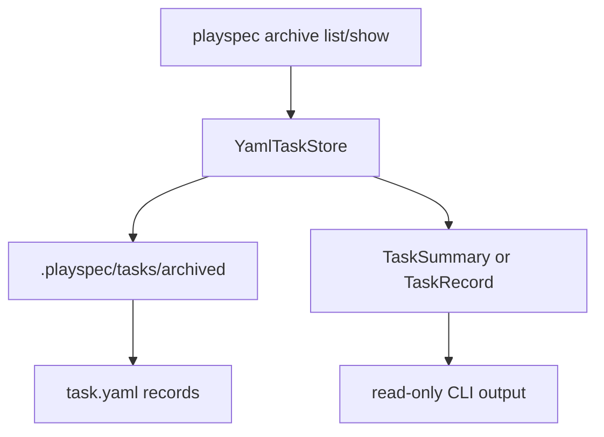

# PlaySpec Update 5.1 Technical Spec

## Scope

Implement exactly Phase 5.1: Archive Inspection And Context References.

In scope:
- Add archive-specific inspection commands: `playspec archive list` and `playspec archive show --task <taskId>`.
- Add `TaskStore.listArchivedTasks()` and a `YamlTaskStore` implementation that reads `.playspec/tasks/archived/{taskId}/task.yaml`.
- Preserve active-only lookup behavior for `getTask()`, HEAD resolution, `playspec list`, `playspec list-tasks`, prompt rendering task resolution, and MCP tools.
- Confirm active prompts can reference archived artifacts only through explicit workspace-relative `contextRefs`.

Out of scope:
- Restore/unarchive behavior.
- MCP archive lookup tools.
- Automatic archived context inclusion.
- Evolution proposal schemas, proposal storage, or validation.
- Viewer, harness, token/context modes, and later phases.
- Archive index files unless directory scanning proves insufficient; current implementation should keep task directories and `task.yaml` as source of truth.

## Use Case Alignment

A user closes completed tasks into `.playspec/tasks/archived/{taskId}/` through Phase 5 behavior. In Phase 5.1 they need to list archived tasks, inspect a specific archived record, and explicitly link archived artifacts such as specs, results, evidence, prompts, or snapshots into a new active task's `contextRefs`.

The archived task is read-only knowledge. It is never selected through HEAD, guessed by task ID, or automatically included in prompts.

## High-Level Current Implementation Summary

Verified code behavior:
- Phase 5 archive storage exists. `YamlTaskStore.archiveCompletedTask()` moves completed active tasks to `.playspec/tasks/archived/{taskId}/`, rewrites `task.yaml` to `status: archived`, and updates `paths.taskRoot`.
- `TaskStore.getArchivedTask()` and `YamlTaskStore.getArchivedTask()` read archived task YAML by explicit task ID.
- Active task lookup remains active-only because `getTask()` reads only `.playspec/tasks/active/{taskId}/task.yaml`.
- Prompt rendering validates all task `contextRefs` before rendering. The validation accepts existing workspace-relative files, which already includes explicit paths under `.playspec/tasks/archived/{taskId}/`.
- `playspec close --task <taskId>` exists as the only Phase 5 archive command.

Missing behavior:
- No `listArchivedTasks()` API exists.
- No archive command group exists.
- No archive-specific list/show CLI output exists.
- Phase 5 tests currently assert archive list/show are absent and must be updated for Phase 5.1.

## Relevant Files Reviewed

- `docs/features/playspec_evolution/playspec_evolution_phase_plan.md`
- `docs/features/playspec_evolution/playspec_evolution_total_spec.md`
- `docs/features/issue_45_playspec_update_5_archive_storage_and_close/spec.md`
- `docs/features/issue_45_playspec_update_5_archive_storage_and_close/plan.md`
- `src/utils/paths.ts`
- `src/storage/task-store.ts`
- `src/storage/yaml-task-store.ts`
- `src/core/playspec-core.ts`
- `src/core/types.ts`
- `src/core/schemas.ts`
- `src/core/errors.ts`
- `src/cli/index.ts`
- `src/cli/commands/close.ts`
- `src/cli/commands/add-context.ts`
- `src/cli/commands/list-tasks.ts`
- `src/cli/commands/current-task.ts`
- `src/template/variable-resolver.ts`
- `tests/integration/task-store.test.ts`
- `tests/integration/init-create-next.test.ts`
- `tests/cli.test.ts`

## Active Entry Points And Bypasses

Active entry points:
- `playspec close --task <taskId>` moves completed tasks into archive storage.
- `playspec add-context <file> --task <taskId>` can add explicit archived artifact paths today if the file exists.
- `playspec prompt --task <taskId> --no-copy` renders prompts after context reference validation.

New entry points:
- `playspec archive list`
- `playspec archive show --task <taskId>`

Bypasses to preserve:
- `ActiveTaskResolver` must continue resolving only active tasks.
- `playspec list` and `playspec list-tasks` must not mix archived tasks into active listings.
- MCP tools must not gain archive lookup commands and must continue using `resolveMcpTaskId()`.

## Current Architecture

Storage is rooted under `.playspec/tasks`:
- active: `.playspec/tasks/active/{taskId}/task.yaml`
- archived: `.playspec/tasks/archived/{taskId}/task.yaml`

`YamlTaskStore` owns task record loading and listing. `PlaySpecCore` delegates archive close to storage and owns prompt context validation. CLI command adapters call core/storage and print concise user-facing output.

## Verified Behavior

- Archived task roots already use canonical Phase 5 paths.
- `getArchivedTask(taskId)` reads only archived records.
- `getTask(taskId)` does not read archived records.
- Existing context reference validation rejects absolute, workspace-escaping, and missing files.
- Existing context reference validation allows existing workspace-relative archived files.
- Prompt context variables include linked context file paths and metadata; file bodies are not embedded in current prompt templates.

## Problems

1. Users cannot discover archived tasks from the CLI.
2. Users cannot inspect an archived task record from the CLI without browsing filesystem paths manually.
3. The storage interface lacks an archived listing method, so CLI list behavior would otherwise duplicate storage scanning.
4. Phase 5 regression tests that asserted no archive list/show surface now need to become Phase 5.1 positive tests.

## Proposed Direction

Add archived listing as a storage concern, then expose it through a small archive command group.

Proposed flow:

Do not add an archive index. Directory scanning matches current active/completed listing behavior and keeps `task.yaml` as source of truth.

## File-By-File Plan

- `src/storage/task-store.ts`
  - Add `listArchivedTasks(): Promise<TaskSummary[]>`.

- `src/storage/yaml-task-store.ts`
  - Implement `listArchivedTasks()` by scanning `getArchivedTasksRoot()`.
  - Reuse `getArchivedTask(entry)` and include only records with `status: archived`.
  - Skip unreadable entries consistently with active/completed listing behavior.

- `src/cli/commands/archive.ts`
  - Add `runArchiveList(workspaceRoot)`.
  - Add `runArchiveShow(workspaceRoot, taskId)`.
  - Print concise fields: ID, title, status, workflow, current phase, task root, project docs root, context ref count, created/updated timestamps.
  - For show, include context refs and phase history summary when present.

- `src/cli/index.ts`
  - Register `archive list`.
  - Register `archive show --task <taskId>`.
  - Do not register restore/unarchive or MCP archive tools.

- `tests/integration/task-store.test.ts`
  - Add coverage for `listArchivedTasks()` returning archived tasks only.

- `tests/integration/init-create-next.test.ts`
  - Replace Phase 5 "no archive list/show" assertions with Phase 5.1 positive CLI list/show coverage.
  - Add regression that normal active list commands exclude archived tasks.

- `tests/cli.test.ts`
  - Add or update prompt/context coverage proving an active task can explicitly reference an archived artifact path and render successfully.
  - Add missing archived context reference failure if not already covered.

## Risks And Open Questions

- Existing context validation already permits any existing workspace-relative file, so Phase 5.1 archived reference acceptance may require little or no core change. Tests should document this behavior rather than adding special-case archive code.
- `archive show` output should stay inspection-only. It must not become a task selection or restore affordance.
- Listing should not surface active completed tasks; only archived records under the archived root qualify.
- The issue refers to `playspec_evolution_total_spec.md.md`, but the repository contains `docs/features/playspec_evolution/playspec_evolution_total_spec.md`.

## Reader Aids

Definition of archived artifact for this phase: an existing workspace-relative file under `.playspec/tasks/archived/{taskId}/`, referenced explicitly in an active task's `contextRefs`.

Definition of archive inspection for this phase: read-only CLI listing/showing of archived task records, without mutation, restore, or MCP exposure.
