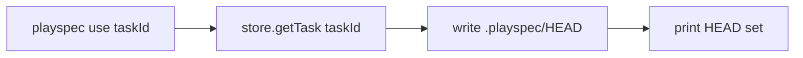
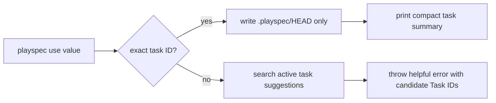

# playspec_use_task_identity_and_phase_summary Technical Spec

## Scope

Implement issue #25 only: make task identity copy-safe and explicit in CLI task selection/display, add a compact current-task summary after `playspec use <taskId>`, and improve `playspec use` errors when a user supplies a title-like value instead of a task ID.

Out of scope: workflow model changes, MCP behavior, context reference validation, phase completion behavior, viewer work, and destructive task mutation.

## Use Case Alignment

Users currently see ambiguous labels like `ID` and `Title`, copy a title, then run `playspec use "some title"` even though `use` requires the slug task ID. The CLI should consistently communicate that the copyable identity is `Task ID`, and a successful `use` should immediately show where the task is in the workflow and what to run next.

## High-Level Current Implementation Summary

Verified behavior:
- `src/cli/commands/use.ts` validates the explicit `taskId` with `store.getTask()`, writes `.playspec/HEAD`, and prints only `HEAD set to: <taskId>`.
- No-arg `use` builds interactive rows from active tasks and existing phase display helpers.
- `src/cli/commands/list-tasks.ts` prints task rows without a header; the first visible token is currently the task ID.
- `src/cli/commands/current-task.ts` prints `ID:` instead of `Task ID:`.
- `src/cli/cli-utils.ts` already computes effective first phase for `currentPhase: null` and invalid phase display for unknown phase IDs.

Inferred behavior:
- `store.getTask(taskId)` is ID-only, so title input fails as `TaskNotFoundError` without suggestions.
- `use` does not currently validate context ref file existence because it only reads task YAML and writes HEAD.

## Relevant Files Reviewed

- `src/cli/commands/use.ts`
- `src/cli/commands/list-tasks.ts`
- `src/cli/commands/current-task.ts`
- `src/cli/commands/current.ts`
- `src/cli/cli-utils.ts`
- `src/core/errors.ts`
- `src/storage/task-store.ts`
- `tests/cli.test.ts`

## Active Entry Points and Bypasses

Active entry points:
- `playspec use [taskId]`
- `playspec list-tasks`
- `playspec current-task`
- deprecated `playspec current` and `playspec list` paths

Bypasses/alternate paths:
- `playspec get-task` also prints task identity and phase, but issue #25 only requires current/list/use identity clarity.
- Interactive no-arg `use` must keep working and should use copy-safe rows.
- Existing `resolveEffectivePhaseDisplay()` is shared by prompt/current/list/use selector and should remain read-only.

## Current Architecture

CLI command modules instantiate `YamlTaskStore`, resolve workflow display with `WorkflowLoader`, and print directly to stdout. There is no shared task-summary formatter. Phase display is already centralized in `cli-utils.ts`, which is the right place for small reusable formatting helpers that need task + workflow display data but not storage mutation.

## Verified Behavior

- `current-task` displays `ID:` and phase details.
- `list-tasks` marks HEAD and displays phase state but no `Task ID` header.
- Explicit `use` only writes `.playspec/HEAD` after task lookup.
- Tests already cover read-only behavior for prompt/current-task/list-tasks/get-task and interactive `use` not mutating `task.yaml`.

## Problems

1. `ID` is ambiguous in task identity outputs.
2. `use` success output lacks workflow phase and next action.
3. `list-tasks` has no explicit copyable `Task ID` header.
4. Title-like `use` input fails without a corrective task ID suggestion.
5. Invalid phase display uses lowercase `allowed:` inline, while the requested output calls for a clear `Allowed:` line/value.

## Proposed Direction

Add shared CLI helpers for:
- Formatting compact current task summary after `use`.
- Formatting list/selector rows with `Task ID` identity language.
- Finding title/slug/close matches among active tasks when exact ID lookup fails.

Keep `setHeadToTask()` safety intact:
- Exact ID lookup.
- Write only `.playspec/HEAD`.
- Print display-only summary after the write.
- Do not check context ref file existence.
- Do not call task update/complete APIs.

## File-by-File Plan

- `src/cli/cli-utils.ts`
  - Add task identity/summary formatting helpers.
  - Adjust invalid phase display to `INVALID (<id>)` plus `Allowed: ...` text.
- `src/cli/commands/use.ts`
  - On exact ID success, write HEAD then print compact current task summary.
  - On ID miss, list active tasks and suggest matching task IDs by ID/title/slug/case-insensitive/includes.
  - Update selector row format to make `Task ID` copy-safe.
- `src/cli/commands/list-tasks.ts`
  - Print `Task ID` as the first column header.
  - Keep each row beginning with the exact accepted task ID.
- `src/cli/commands/current-task.ts` and `src/cli/commands/current.ts`
  - Replace `ID:` with `Task ID:`.
- `tests/cli.test.ts`
  - Add/adjust tests for use summary, title suggestions, multiple candidates, copy-safe list header, context-ref safety, and invalid phase display.

## Risks and Open Questions

- Existing tests assert old labels and may need focused updates.
- Exact "close match" should stay deterministic and simple; title equality, slug equality, case-insensitive equality, and includes are sufficient for this issue.
- Summary formatting should not become a broad rendering framework.

## Reader Aids

Verified current explicit use flow:

Proposed flow:

