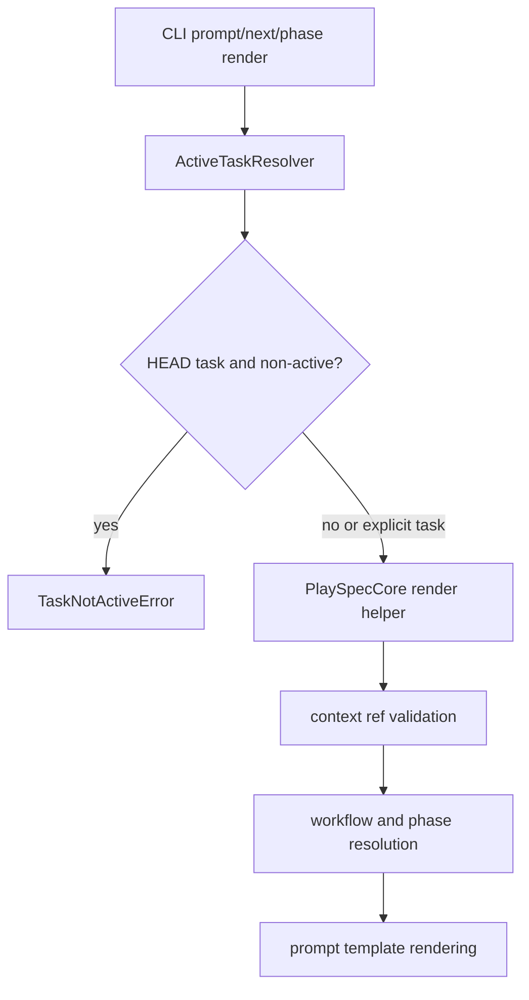
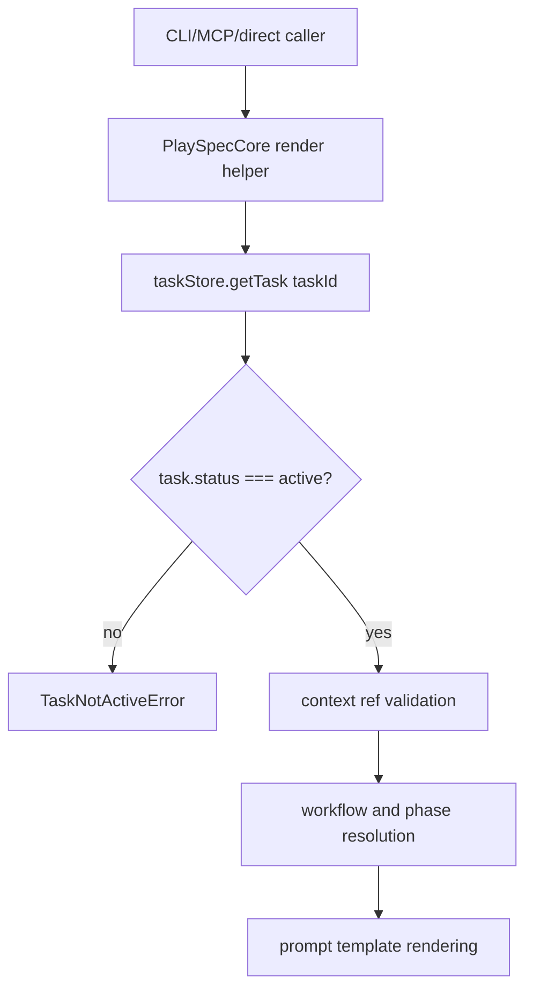

# Reject Completed Tasks for Explicit Prompt and Phase Rendering

## Scope

Add a consistent active-task lifecycle guard to prompt rendering so completed or archived tasks cannot render executable workflow prompts through explicit task IDs.

In scope:

- `PlaySpecCore.renderNextPrompt(taskId, ...)`
- `PlaySpecCore.renderExplicitPhasePrompt(taskId, phaseId, ...)`
- CLI regression coverage for explicit completed tasks:
  - `playspec prompt --task <completed-task-id>`
  - `playspec next --task <completed-task-id>`
  - `playspec phase 1 --task <completed-task-id>`
- Preserve successful rendering for active tasks, including explicit `--task`.
- Preserve existing HEAD-based completed-task rejection.

Out of scope:

- Redesigning task resolution.
- Removing explicit `--task` support.
- Changing archive viewing or context reference behavior.
- Changing workflow templates or prompt text.

## Use Case Alignment

Prompt rendering is an active workflow operation. A task with status `completed` or `archived` is terminal for workflow execution, so it must not produce a next prompt or explicit phase prompt. Historical reference use cases should remain outside this active rendering path.

## High-Level Current Implementation Summary

Verified behavior from code:

- `src/cli/commands/prompt.ts` resolves a task with `ActiveTaskResolver`, rejects non-active HEAD tasks, then calls `PlaySpecCore.renderNextPrompt()`.
- `src/cli/commands/next.ts` follows the same pattern for the deprecated `next` command.
- The render-only positional path in `src/cli/commands/phase.ts` resolves a task, rejects non-active HEAD tasks, then calls `PlaySpecCore.renderExplicitPhasePrompt()`.
- `PlaySpecCore.completePhase()` calls `assertTaskIsActive(task)` after loading the task.
- `PlaySpecCore.renderNextPrompt()` and `PlaySpecCore.renderExplicitPhasePrompt()` load tasks without calling `assertTaskIsActive(task)`.

Inferred behavior:

- Explicit `--task <completed-task-id>` bypasses the CLI-only HEAD guard because the CLI condition is `if (!taskIdOption && task.status !== 'active')`.
- A core-level guard covers CLI, MCP, tests, and other direct callers consistently.

## Relevant Files Reviewed

- `src/core/playspec-core.ts`
- `src/core/errors.ts`
- `src/cli/commands/prompt.ts`
- `src/cli/commands/next.ts`
- `src/cli/commands/phase.ts`
- `src/storage/yaml-task-store.ts`
- `tests/cli.test.ts`
- `tests/integration/init-create-next.test.ts`

## Active Entry Points and Bypasses

Active entry points:

- `playspec prompt`
- `playspec prompt --task <task-id>`
- `playspec next`
- `playspec next --task <task-id>`
- `playspec phase <phase-id>`
- `playspec phase <phase-id> --task <task-id>`
- Direct calls to `PlaySpecCore.renderNextPrompt()`
- Direct calls to `PlaySpecCore.renderExplicitPhasePrompt()`

Bypass path verified in code:

- CLI commands only reject non-active tasks when no explicit task option was passed.
- Core render methods do not currently reject non-active task records.

Existing guarded path:

- `PlaySpecCore.completePhase()` already rejects non-active tasks through `assertTaskIsActive()`.

## Current Architecture

The current lifecycle guard is owned partly by CLI command handlers and partly by core mutation helpers. Render helpers are the missing shared boundary.

## Verified Behavior

- `TaskNotActiveError` already contains the correct user-facing error and recovery hint for non-active tasks.
- `YamlTaskStore.getTask()` reads active task storage only; archived task storage is available through `getArchivedTask()`.
- `archiveCompletedTask()` changes a task status to `archived` and moves its task root under `.playspec/tasks/archived`.
- CLI tests already include a HEAD-based completed-task rejection for `playspec phase 1`.
- CLI tests already include completed-task rejection for `playspec use <taskId>`.

## Problems

- Explicit completed task IDs can reach render helpers without an active-task check.
- Core render helpers allow non-active task records if the store returns them.
- Lifecycle ownership is inconsistent: completion is guarded in core, but prompt rendering depends on CLI call shape.

## Proposed Direction

Proposed flow:

Implementation direction:

- Add `this.assertTaskIsActive(task)` immediately after `taskStore.getTask(taskId)` in `renderNextPrompt()`.
- Add `this.assertTaskIsActive(task)` immediately after `taskStore.getTask(taskId)` in `renderExplicitPhasePrompt()`.
- Keep existing CLI HEAD guards in place to preserve current command behavior and messages.
- Add CLI regression tests proving explicit completed tasks are rejected through prompt, next, and phase rendering.
- Add core integration tests for completed and archived task records if practical. For archived records, use a lightweight fake `TaskStore` or another existing test pattern if needed, because `YamlTaskStore.getTask()` does not load archived storage.

## File-by-File Plan

- `src/core/playspec-core.ts`
  - Add active-task assertions to both prompt render methods.

- `tests/cli.test.ts`
  - Add explicit completed-task regressions for `prompt`, `next`, and `phase`.
  - Assert `TaskNotActiveError` text appears.
  - Confirm active explicit task rendering still succeeds if nearby coverage is insufficient.

- `tests/integration/init-create-next.test.ts`
  - Add focused core render helper coverage if CLI tests alone do not prove direct core behavior.

## Risks and Open Questions

Risks:

- Users who intentionally re-render prompts from completed tasks for reference will now receive `TaskNotActiveError`.
- Direct callers outside CLI and MCP will observe the stricter core lifecycle boundary.

Open questions:

- Whether archived-task direct core coverage should use a fake store or be omitted because production `YamlTaskStore.getTask()` does not resolve archived tasks.

## Reader Aids

- `TaskNotActiveError` is the intended error class for `completed` and `archived` statuses.
- The change should be near the top of each render helper, before context refs, workflow loading, phase resolution, or template rendering.
- No template, archive command, viewer, or task resolver redesign is required.
