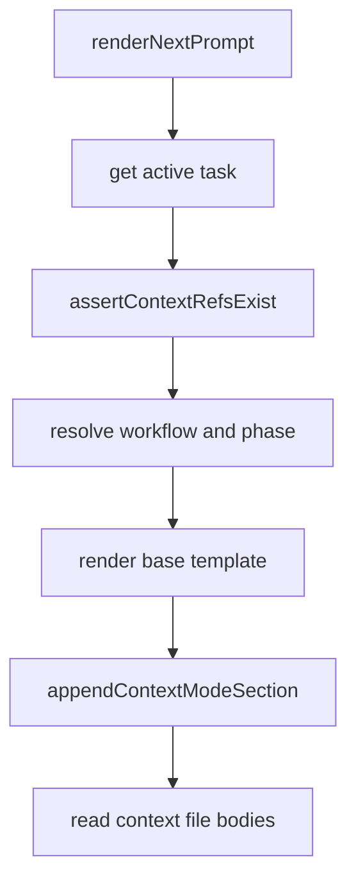

# Reject sibling-prefix contextRefs during prompt rendering

## Scope

This issue is scoped to prompt-render-time validation of stored task `contextRefs`.

Implementation must ensure `PlaySpecCore.renderNextPrompt()` rejects any stored relative context ref that resolves outside the workspace root, including sibling paths whose absolute string begins with the workspace path. Valid workspace-relative refs must continue to render in compact, strict, and full context modes. Explicit refs under `.playspec/tasks/archived/...` remain valid when the file exists.

Out of scope:

- Changing the `contextRefs` schema shape.
- Redesigning archived context references.
- Changing template include validation, workflow loading, or relevant-file discovery.
- Adding automatic archived context inclusion.

## Use Case Alignment

A user or migration may store `contextRefs` directly in a task record. Prompt rendering then reads those files to build compact, strict, or full context sections. The safety contract is that prompt rendering may read only files inside the workspace. A manually edited path such as `../playspec-sibling/source.md` must fail closed even if the target file exists and the absolute path shares the workspace path prefix.

## High-Level Current Implementation Summary

Verified behavior:

- `PlaySpecCore.renderNextPrompt()` loads the task, verifies it is active, calls `assertContextRefsExist()`, resolves the workflow phase, and renders the phase prompt.
- `appendContextModeSection()` later reads each `contextRefs` path with `path.resolve(this.workspaceRoot, ref.path)`.
- `addContextRef()` already rejects absolute paths, paths outside the workspace, and missing files before storing a context ref.
- `assertContextRefsExist()` now uses the same root-or-root-plus-separator boundary helper as `addContextRef()`.
- `tests/integration/init-create-next.test.ts` already includes a sibling-prefix negative regression test and a compact/strict/full positive rendering test.

Inferred behavior:

- Older task records that already contain invalid escaping `contextRefs` now fail at prompt rendering with `MissingContextRefError`.
- Existing valid archived artifact refs remain accepted because `.playspec/tasks/archived/...` resolves inside the workspace root.

Open question:

- None for implementation; the remaining useful work is focused regression coverage for explicit archived context refs in the same integration file that covers prompt rendering context refs.

## Relevant Files Reviewed

- `src/core/playspec-core.ts`
  - `renderNextPrompt()`
  - `addContextRef()`
  - `appendContextModeSection()`
  - `assertContextRefsExist()`
  - `isWithinWorkspace()`
- `src/core/errors.ts`
  - `MissingContextRefError`
  - `ContextPathEscapesWorkspaceError`
  - `ContextFileNotFoundError`
- `tests/integration/init-create-next.test.ts`
  - Missing context ref rejection.
  - Sibling-prefix escaping context ref rejection.
  - Compact/strict/full context mode rendering.
- `tests/cli.test.ts`
  - Existing CLI-level archived artifact context coverage.

## Active Entry Points And Bypasses

Active entry points:

- `PlaySpecCore.renderNextPrompt(taskId, options)`
- `PlaySpecCore.renderExplicitPhasePrompt(taskId, phaseId, options)`
- CLI prompt/next commands that call prompt rendering through `PlaySpecCore`.

Bypass paths:

- A stored task YAML file can contain `contextRefs` that were not added through `addContextRef()`.
- Migration code can add `contextRefs` to task records.

The render-time validator is the required shared guard for those bypass paths.

## Current Architecture

Verified flow:

The safety boundary must be enforced before `appendContextModeSection()` reads file bodies.

## Verified Behavior

- Absolute stored context refs are rejected with `MissingContextRefError`.
- Missing stored context refs are rejected with `MissingContextRefError`.
- Stored context refs resolving outside the workspace are rejected with `MissingContextRefError`.
- Sibling-prefix paths such as `../<workspace-basename>-sibling/context.md` are rejected even when the sibling file exists.
- Normal workspace-relative context refs render in compact, strict, and full modes.

## Problems

The issue report described a previous loose string-prefix check in `assertContextRefsExist()`. In the current target branch, that problem is already fixed by `isWithinWorkspace()`, which accepts only:

- the workspace root itself, or
- paths starting with `workspaceRoot + path.sep`.

The remaining gap is that focused integration coverage does not directly prove the archived positive case in `tests/integration/init-create-next.test.ts`; it is covered at CLI level instead.

## Proposed Direction

Keep production code unchanged unless testing reveals a failure. Add one focused integration test in `tests/integration/init-create-next.test.ts` that:

- creates an explicit file under `.playspec/tasks/archived/<id>/outputs/result.md`;
- stores that workspace-relative path in an active task `contextRefs`;
- verifies `renderNextPrompt()` succeeds in compact, strict, and full modes;
- verifies the archived path and content appear in the expected context sections.

## File-By-File Plan

- `tests/integration/init-create-next.test.ts`
  - Add a positive archived context ref test beside existing context ref prompt-rendering tests.
- `src/core/playspec-core.ts`
  - No planned change unless tests expose a regression.
- `docs/features/reject_sibling_prefix_contextrefs_during_prompt_rendering/result.md`
  - Record implementation and validation results after the test patch.
- `docs/features/reject_sibling_prefix_contextrefs_during_prompt_rendering/pr.md`
  - Prepare PR summary and test commands.

## Risks And Open Questions

Risk is low. The production boundary behavior is already strict, and the planned change is test-only. The main compatibility effect remains intentional: invalid manually edited context refs that previously escaped the workspace must fail closed with `MissingContextRefError`.

## Reader Aids

- `MissingContextRefError` is the expected render-time error for rejected stored context refs, even when the underlying reason is workspace escape.
- `ContextPathEscapesWorkspaceError` is used by `addContextRef()`, not by prompt rendering of already stored refs.
- Strict and full context modes both include full context file bodies today.
