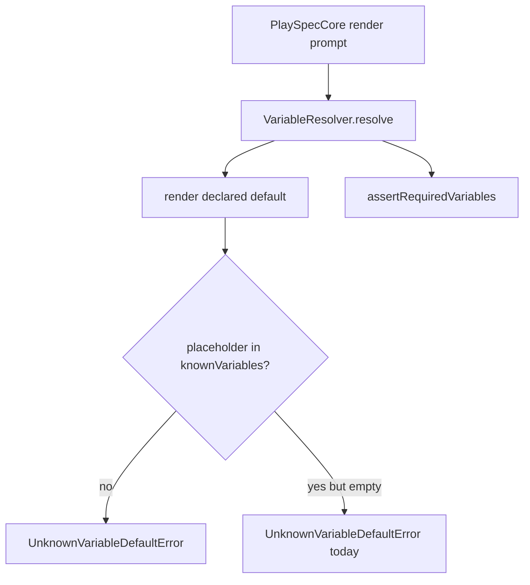
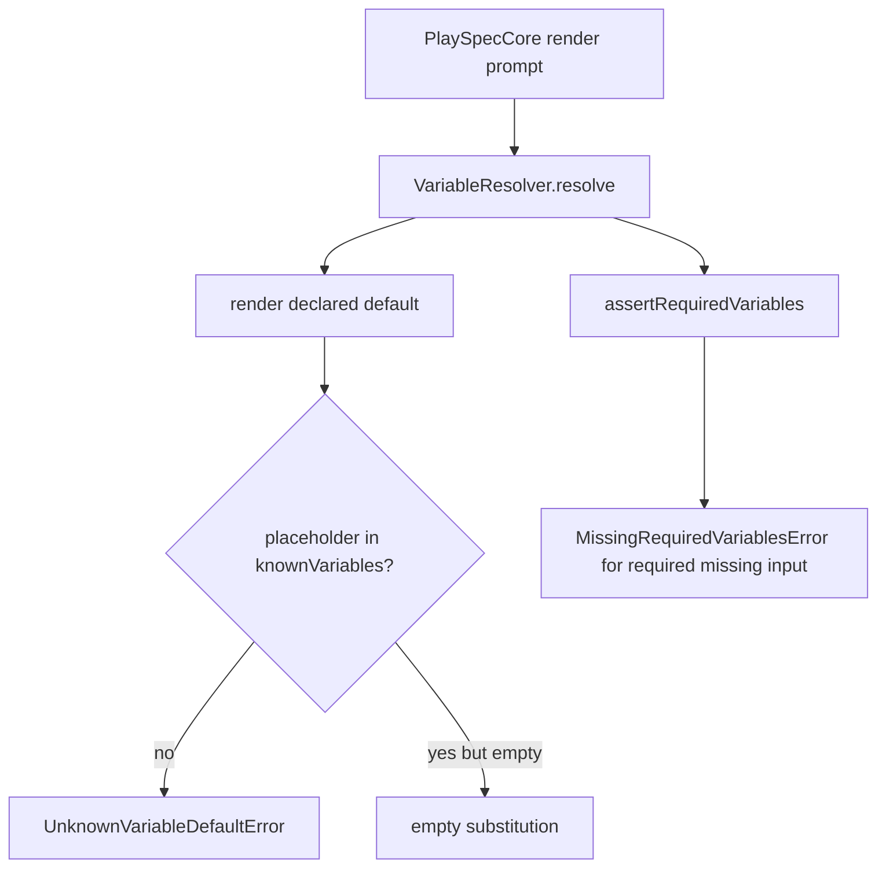

# Report missing known default dependencies as missing required variables

## Scope

Fix variable default dependency resolution so a default that references a declared-but-unset required variable is not reported as an unknown variable. Preserve strict errors for genuinely undeclared placeholder names, circular defaults, explicit task overrides, and chained defaults.

## Use Case Alignment

Workflow authors may declare a required input such as `PROJECT_KEY` and define another variable default such as `OUTPUT_FILE: "docs/{{PROJECT_KEY}}/out.md"`. If the task omits `PROJECT_KEY`, prompt rendering should report the missing required input instead of saying `PROJECT_KEY` is unknown.

## High-Level Current Implementation Summary

Verified behavior:

- `src/template/variable-resolver.ts` builds engine variables, workflow/phase declarations, task variables, and a `knownVariables` set.
- Default rendering calls a lookup for each `{{PLACEHOLDER}}`.
- The lookup correctly throws `UnknownVariableDefaultError` when a placeholder is absent from `knownVariables`.
- For known variables with no value, the lookup returns `resolveOne(...) ?? ''`.
- `renderDefault()` treats any empty lookup value as `UnknownVariableDefaultError`, so declared missing dependencies are mislabeled as unknown.
- `src/core/playspec-core.ts` calls `assertRequiredVariables()` after resolver completion, but the current resolver error can prevent that path.

Inferred behavior:

- Letting known-but-empty dependencies render as empty during default resolution allows core required-variable validation to identify the missing declared required variable.
- Optional variables referenced by optional defaults can still render empty path segments unless they are marked required or included in `requiredVariables`; issue scope only requires avoiding a false unknown-variable classification and preserving required validation.

## Relevant Files Reviewed

- `src/template/variable-resolver.ts`
- `src/core/playspec-core.ts`
- `src/core/required-variables.ts`
- `src/core/errors.ts`
- `tests/unit/variable-resolver.test.ts`
- `tests/integration/init-create-next.test.ts`

## Active Entry Points and Bypasses

Active entry points:

- `PlaySpecCore.renderNextPrompt()` resolves the workflow phase, resolves variables, asserts required variables, and renders the template.
- `VariableResolver.resolve()` is the shared resolver used before prompt rendering and completion snapshot generation.

Bypasses:

- Direct `VariableResolver.resolve()` callers can observe empty rendered defaults when referenced dependencies are declared but unset.
- `UnknownVariableDefaultError` should still originate in the resolver for undeclared placeholders before template rendering.

## Current Architecture

`PlaySpecCore` stays responsible for workflow-phase prompt rendering and required variable validation. `VariableResolver` resolves engine/task/declaration defaults and detects unknown or circular default references. This fix should keep that ownership split.

## Verified Behavior

Verified from code:

- Required validation treats `undefined` and `''` as missing.
- Required validation checks workflow variable declarations, phase variable declarations, and phase `requiredVariables`.
- Existing tests cover unknown default references and circular defaults.
- Integration coverage already verifies a directly missing required phase variable surfaces `MissingRequiredVariablesError`.

## Problems

- `renderDefault()` cannot distinguish "known dependency resolved to empty" from "unknown dependency" because lookup returns a bare string.
- The resolver already knows whether a dependency is unknown inside the lookup callback, so the second empty-value-to-unknown check is over-broad.
- This can mask the more precise missing required variable error from core.

## Proposed Direction

Keep unknown detection in the lookup callback where `knownVariables` is available. Remove the `renderDefault()` empty-value unknown classification so declared-but-empty dependencies are not mislabeled. Then rely on `assertRequiredVariables()` to reject required missing values during prompt rendering.

If tests expose a need for a more explicit contract, update `renderDefault()` to treat lookup as authoritative: unknown dependencies must be thrown by lookup, and returned strings are substitution values.

## File-by-File Plan

- `src/template/variable-resolver.ts`: adjust `renderDefault()` so empty values returned by lookup are not converted to `UnknownVariableDefaultError`.
- `tests/unit/variable-resolver.test.ts`: add a focused test where a declared required dependency is referenced by a default and omitted from task variables; verify no `UnknownVariableDefaultError` and resulting default contains the empty substitution.
- `tests/integration/init-create-next.test.ts`: add prompt-rendering coverage for an indirectly referenced required workflow variable; verify `PlaySpecCore.renderNextPrompt()` throws `MissingRequiredVariablesError`.
- `src/core/playspec-core.ts`: no change expected unless integration tests reveal required validation is bypassed.

## Risks and Open Questions

- Optional declared dependencies referenced by defaults will now substitute empty strings instead of failing as unknown. That aligns with the issue distinction, but workflows that depended on the old misclassification may see a different outcome.
- Required variables remain protected by `assertRequiredVariables()`.
- No schema or workflow design changes are planned.

## Reader Aids

Verified current flow:

Proposed flow:

