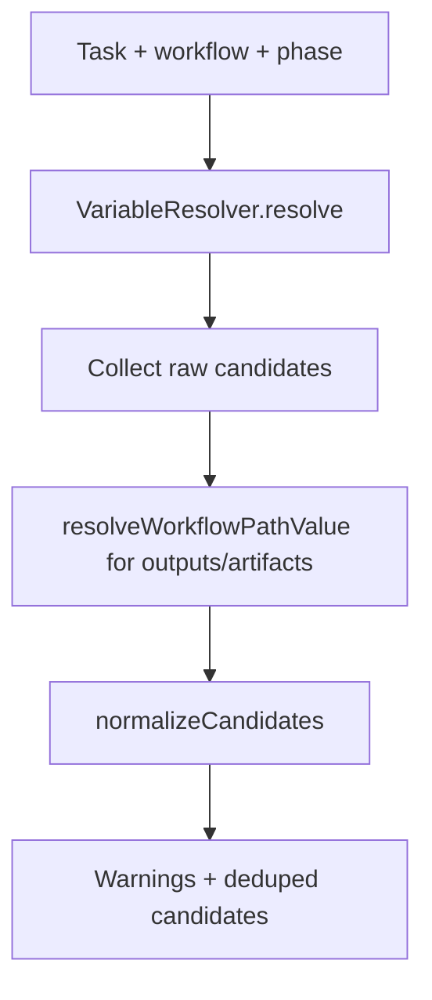
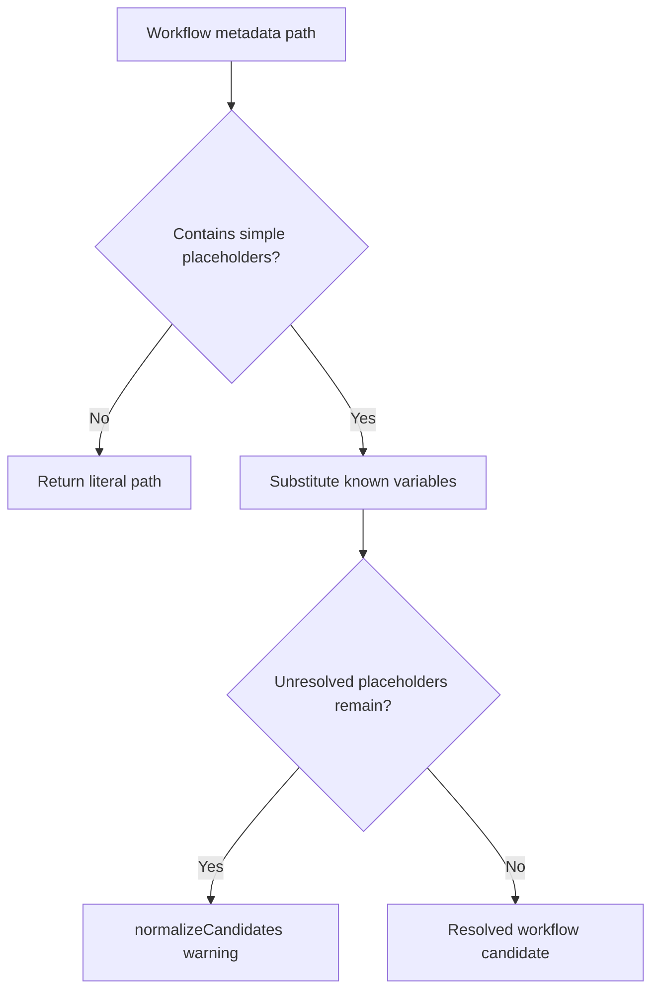

# Resolve embedded workflow output and artifact variables during relevant file discovery

## Scope

Fix relevant file discovery for workflow metadata paths only:

- phase `outputs`
- workflow `artifacts[*].path`

The change must resolve simple `{{VARIABLE_NAME}}` placeholders when they appear inside a larger path string, while preserving existing whole-placeholder behavior such as `{{RESULT_FILE}}`.

Out of scope: workflow schema changes, task storage changes, prompt rendering changes, artifact persistence changes, issue-scope-create defaults, and broader Handlebars expression support.

## Use Case Alignment

Agents and users rely on `playspec specs` and `discoverRelevantFiles()` to inspect task evidence, declared outputs, and workflow artifacts. A workflow artifact like `docs/features/{{FEATURE_SLUG}}/generated.md` should point at the resolved task path, not a literal path containing braces.

## High-Level Current Implementation Summary

Verified behavior:

- `src/core/relevant-files.ts` builds resolved task variables with `VariableResolver.resolve()`.
- It collects candidates from context refs, task source files, path-like variables, required variables, phase `outputs`, workflow `artifacts`, rendered prompt backtick paths, and the project doc root.
- Candidates are normalized, validated, workspace-confined, and deduplicated by source priority.
- `resolveWorkflowPathValue()` currently resolves a value only when the entire string is a single placeholder matching `{{NAME}}`.

Inferred behavior:

- Embedded workflow metadata paths are intended to use the same simple variable contract as workflow variable defaults.
- Existing invalid-path safeguards should continue to reject unresolved brace paths as shell-looking values because `{` or `}` are not accepted path characters elsewhere in discovery.

## Relevant Files Reviewed

- `src/core/relevant-files.ts`: relevant file discovery implementation, candidate normalization, warning style, dedupe priority, and current `resolveWorkflowPathValue()` helper.
- `tests/unit/relevant-files.test.ts`: unit fixture and existing coverage for literal workflow output paths, whole-placeholder artifact paths, variable candidates, rendered prompt paths, invalid path warnings, symlink safety, and legacy variable-derived files.
- `src/template/variable-resolver.ts`: confirms workflow variables are already resolved before relevant file discovery consumes them.
- `src/core/types.ts`: confirms phase `outputs` are strings and workflow artifact paths are metadata strings.

## Active Entry Points And Bypasses

Active entry point:

- CLI `specs` command calls `discoverRelevantFiles()`.

Bypass paths:

- Rendered prompt path discovery uses `TemplateRenderer` and backtick parsing, independent of workflow metadata path resolution.
- Variable candidates are already resolved through `VariableResolver`; this issue is only about metadata strings that embed those variables.
- Existing project doc root scanning can accidentally mask missing metadata resolution when the final file already exists.

## Current Architecture

Discovery flow:

Current problem:

- `resolveWorkflowPathValue("docs/features/{{FEATURE_SLUG}}/generated.md", variables)` returns the literal input.
- Normalization later treats the unresolved braces as an invalid or noisy path candidate instead of the intended artifact path.

## Verified Behavior

- Whole-placeholder paths such as `{{SPEC_FILE}}` resolve to the variable value and record the variable name.
- Literal output paths such as `docs/features/feature_x/generated.md` are discovered as workflow candidates.
- Source priority keeps higher-priority candidates when paths overlap: context refs beat task sources, variables, workflow metadata, rendered prompt paths, and project doc root scans.

## Problems

- Embedded placeholders in phase `outputs` and workflow `artifacts[*].path` are not substituted.
- Existing fixture coverage is ambiguous because the artifact path with `{{FEATURE_SLUG}}` overlaps a literal phase output path.
- Unknown embedded placeholders need to follow existing warning style rather than silently producing raw brace paths.

## Proposed Direction

Update `resolveWorkflowPathValue()` to perform simple placeholder substitution:

- Match only `{{ VARIABLE_NAME }}` placeholders where `VARIABLE_NAME` follows the existing uppercase variable-name shape.
- Replace every known placeholder with its resolved variable value.
- Preserve `variableName` for the single-placeholder case so existing metadata remains stable.
- Leave unknown placeholders in place so the existing invalid path handling emits a clear ignored-candidate warning for the unresolved metadata path.
- Do not evaluate arbitrary Handlebars expressions, helpers, partials, includes, or file IO.

Proposed flow:

## File-By-File Plan

- `src/core/relevant-files.ts`
  - Replace whole-string-only placeholder resolution with embedded simple variable substitution.
  - Keep unknown placeholders unresolved so existing validation and warning behavior remains centralized.

- `tests/unit/relevant-files.test.ts`
  - Make the existing fixture stop relying on a literal output for the embedded artifact path.
  - Add or update coverage proving an embedded artifact path is discovered only through artifact interpolation.
  - Add coverage proving an embedded phase output path is discovered.
  - Preserve existing coverage for literal output paths and whole-placeholder variable paths.

## Risks And Open Questions

- Risk: substituting variables that contain invalid path text could create invalid candidates. Mitigation: existing normalization still validates every candidate after substitution.
- Risk: supporting full Handlebars would broaden behavior unexpectedly. Mitigation: use a narrow regex for simple variable placeholders only.
- Open question: whether unknown embedded placeholders should be skipped earlier. Current warning style is centralized in normalization, so preserving the unresolved value is the smallest compatible approach.

## Reader Aids

Terms:

- Workflow metadata path: a path declared in phase `outputs` or workflow `artifacts[*].path`.
- Whole-placeholder path: a string like `{{RESULT_FILE}}`.
- Embedded-placeholder path: a string like `docs/features/{{FEATURE_SLUG}}/generated.md`.
