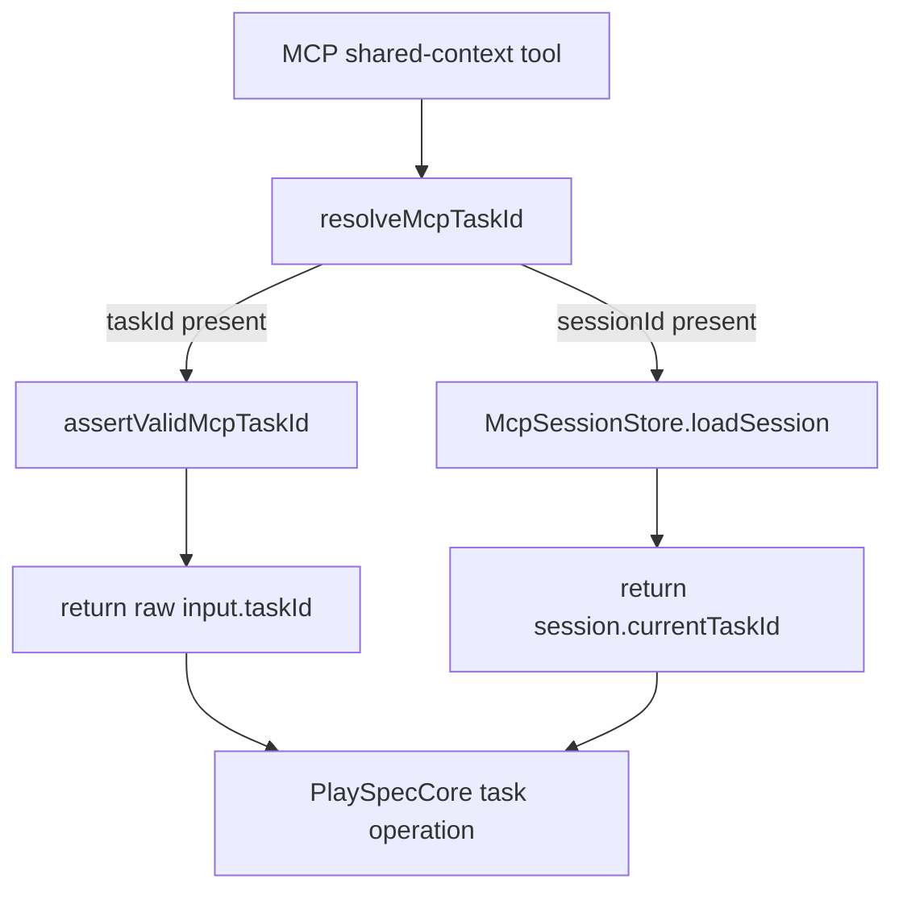
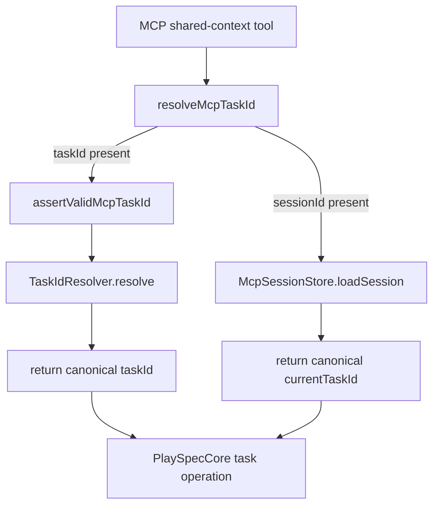

# Resolve MCP taskId Context Inputs Consistently With TaskIdResolver

## Scope

Update MCP task-context resolution so explicit `taskId` inputs accepted by shared-context MCP tools use the same exact-then-unique-prefix resolution contract as existing MCP link fields. Keep MCP routing explicit: no `.playspec/HEAD` fallback, explicit `taskId` precedence over `sessionId`, and session-bound task values stored canonically.

Out of scope: CLI active task behavior, `.playspec/HEAD` fallback for MCP, unrelated rollback/evolution behavior, and broad session storage redesign.

## Use Case Alignment

MCP callers should be able to pass a unique task ID prefix to task-operating tools such as `playspec_render_next_prompt`, `playspec_complete_phase`, `playspec_collect_evidence`, rollback, harness, context, and evolution tools. If the prefix is ambiguous, the call should fail with the existing `TaskIdResolver` ambiguity guidance. If a session is bound through `playspec_use_session_task`, later `sessionId` calls should route to the same canonical task ID as a full explicit task ID call.

## High-Level Current Implementation Summary

Verified behavior:

- `TaskIdResolver` in `src/core/task-id-resolver.ts` resolves exact task IDs first, then unique prefixes across active and completed tasks, and throws `AmbiguousTaskIdError` or `TaskIdResolutionError`.
- `buildMcpServer()` creates a `TaskIdResolver` in `src/mcp/server.ts`.
- `playspec_link_tasks` and `playspec_unlink_tasks` resolve `sourceTaskId` and `targetTaskId` with `TaskIdResolver`.
- Shared-context MCP tools call `resolveMcpTaskId(args, sessionStore)`, which validates direct `taskId` strings and returns them unchanged.
- `playspec_use_session_task` checks `taskStore.getTask(args.taskId)` and stores `args.taskId` unchanged in `McpSessionStore`.
- `resolveMcpTaskId()` does not read `.playspec/HEAD`; missing context throws `McpTaskContextRequiredError`.

Inferred behavior:

- A unique prefix used as shared `taskId` reaches core APIs unchanged and then fails when core calls `taskStore.getTask(prefix)`.
- A unique prefix used with `playspec_use_session_task` currently fails before binding because `taskStore.getTask(prefix)` requires the canonical ID.

## Relevant Files Reviewed

- `src/core/task-id-resolver.ts`
- `src/mcp/context.ts`
- `src/mcp/server.ts`
- `src/mcp/session-store.ts`
- `src/mcp/errors.ts`
- `tests/integration/mcp-server.test.ts`
- `README.md`

## Active Entry Points And Bypasses

Active entry points:

- `playspec_render_next_prompt`
- `playspec_render_phase_prompt`
- `playspec_complete_phase`
- `playspec_collect_evidence`
- `playspec_run_state_desync_check`
- `playspec_rollback_state`
- `playspec_add_context`
- `playspec_set_current_phase`
- `playspec_create_snapshot`
- `playspec_plan_rollback`
- `playspec_execute_git_rollback`
- `playspec_get_harness_status`
- `playspec_record_harness_attempt`
- `playspec_reset_harness`
- `playspec_generate_evolution_proposal`
- `playspec_link_tasks` and `playspec_unlink_tasks` when source is provided through `taskId`/`sessionId`
- `playspec_use_session_task`

Bypass paths:

- `playspec_get_task` currently fetches by exact task ID through `taskStore.getTask(args.taskId)` and is not described as a shared-context tool.
- `playspec_record_human_edit_observation` accepts optional `taskId` only as stored observation metadata and does not call shared context resolution.

## Current Architecture

Verified flow:

Proposed flow:

## Verified Behavior

- Explicit `taskId` wins over `sessionId` in `resolveMcpTaskId()`.
- Missing `taskId` and `sessionId` fails with `McpTaskContextRequiredError`.
- Invalid direct `taskId` values with path separators, control characters, null bytes, or length over 256 fail before core routing.
- Existing tests assert no HEAD fallback for missing MCP context.

## Problems

- Shared MCP `taskId` inputs do not use `TaskIdResolver`, so prefix support differs by field name.
- `playspec_use_session_task` stores only exact task IDs and cannot bind a unique prefix.
- If non-canonical task IDs are ever written to sessions, later `sessionId` calls can route differently from explicit canonical `taskId` calls or fail unexpectedly.
- README says MCP tools require `taskId` or `sessionId` but does not document prefix support for shared `taskId` inputs.

## Proposed Direction

- Change `resolveMcpTaskId()` to accept `TaskIdResolver` and resolve explicit `taskId` inputs after MCP safety validation.
- Keep session reads returning `session.currentTaskId` directly, with the invariant that `playspec_use_session_task` stores canonical IDs.
- Update `playspec_use_session_task` to resolve `args.taskId` with `TaskIdResolver` and store the returned canonical ID.
- Update `resolveMcpSourceTaskId()` to pass the resolver into `resolveMcpTaskId()` for the fallback `taskId`/`sessionId` source path.
- Update all shared-context call sites to pass `taskIdResolver`.
- Update tests for unique prefix rendering, ambiguity failure, canonical session binding, and no-HEAD fallback.
- Update README MCP guidance to state that MCP shared `taskId`, `sourceTaskId`, and `targetTaskId` accept exact IDs or unique prefixes, and ambiguous prefixes fail.

## File-By-File Plan

`src/mcp/context.ts`

- Import `TaskIdResolver` type.
- Extend `resolveMcpTaskId(input, sessionStore, taskIdResolver)`.
- For explicit `taskId`, keep `assertValidMcpTaskId()` and return `(await taskIdResolver.resolve(input.taskId)).taskId`.
- For `sessionId`, return stored `currentTaskId` unchanged.
- Preserve missing-context and session error behavior.

`src/mcp/server.ts`

- Update `playspec_use_session_task` to resolve `args.taskId` with `taskIdResolver` before `sessionStore.setSessionTask()`.
- Pass `taskIdResolver` into each `resolveMcpTaskId()` call.
- Update `resolveMcpSourceTaskId()` fallback to call `resolveMcpTaskId(input, sessionStore, taskIdResolver)`.
- Optionally include resolved metadata in `playspec_use_session_task` output if consistent with existing style; not required for acceptance.

`tests/integration/mcp-server.test.ts`

- Update direct `resolveMcpTaskId` tests to construct and pass a `TaskIdResolver`.
- Add coverage that `playspec_render_next_prompt` accepts a unique `taskId` prefix and returns the canonical task ID.
- Add coverage that an ambiguous MCP `taskId` prefix fails with `TaskIdResolver` ambiguity text.
- Add coverage that `playspec_use_session_task` with a unique prefix stores the canonical task ID and rejects ambiguous prefixes.
- Keep missing context/no-HEAD tests intact.

`README.md`

- Update MCP context guidance to document exact or unique-prefix task ID support and ambiguity failure.
- State that `playspec_use_session_task` stores the canonical resolved ID.

## Risks And Open Questions

Risks:

- A missed `resolveMcpTaskId()` call site would keep inconsistent routing.
- Resolving session values on every read would hide bad historical session data but weaken the canonical-storage invariant; this spec prefers canonical storage on bind.
- `playspec_get_task` may remain exact-only unless intentionally changed; issue scope targets shared task context, not direct lookup.

Open questions:

- None blocking. The issue explicitly prefers canonical session storage from `playspec_use_session_task`.

## Reader Aids

- "Shared-context MCP tools" means tools whose schema includes optional `taskId`/`sessionId` and whose implementation currently calls `resolveMcpTaskId()`.
- "Canonical task ID" means the full task ID persisted in `.playspec/tasks/active/<id>` or `.playspec/tasks/completed/<id>`.
- "Unique prefix" means a string that matches exactly one active or completed task ID via `TaskIdResolver`.
