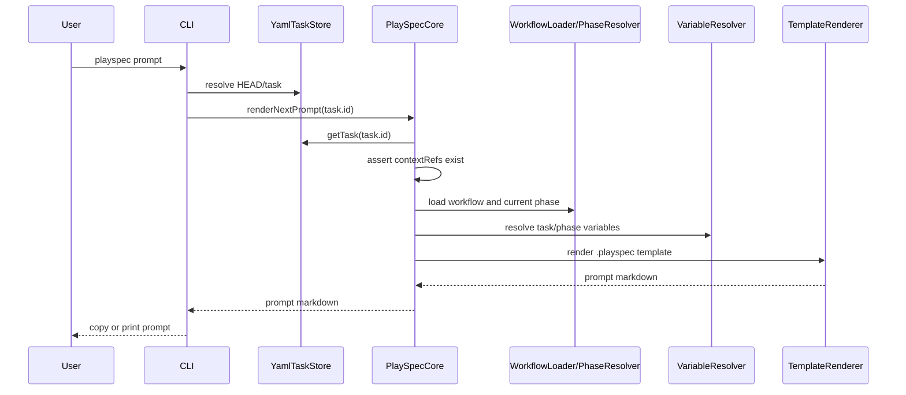
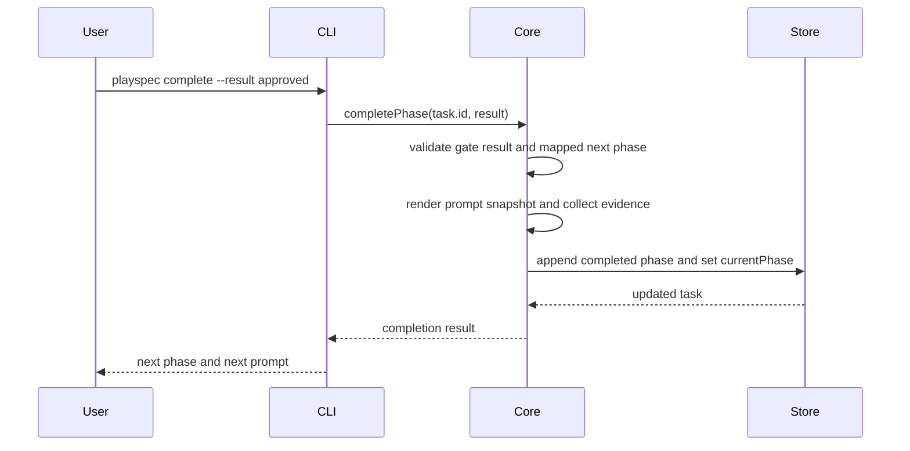
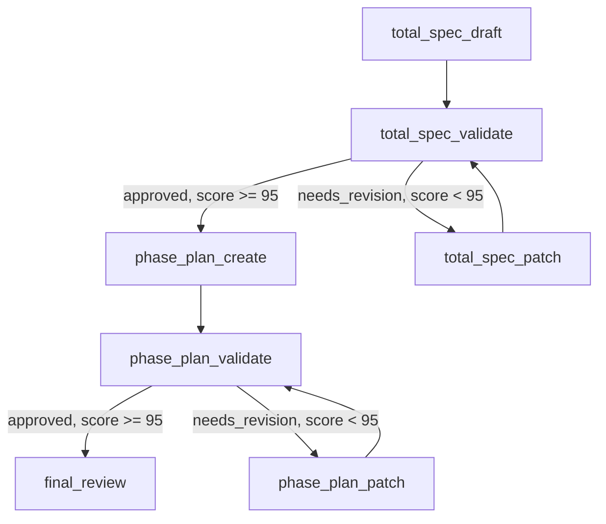

# Total Spec And Plan Template - Technical Spec Draft

## Scope

This feature adds a repository preset workflow and English prompt templates for planning large features before they are split into phase execution tasks. The workflow should help a user produce:

- a total technical specification for the requested feature
- a risk-reviewed phase implementation plan that can be split into mono-spec-sized implementation phases
- validation/update loops for both the total spec and the phase plan

This spec is limited to the workflow/template layer, prompt rendering, task creation compatibility, and tests needed to prove the active prompt path works. It does not implement MCP changes, migration changes, a viewer, DAG execution, archive behavior, rollback behavior, or automatic creation of child phase tasks.

## Use Case Alignment

### Current user-facing problem

Verified from the current default preset, PlaySpec has `mono-spec`, `multi-spec`, `simple-bug`, and `phase-execution` workflows. `mono-spec` is useful for one feature implementation stream, but it does not provide a dedicated planning workflow whose final outputs are a total spec plus a phase plan suitable for later phase execution tasks.

The source problem asks for a workflow that starts from `create --edit`, drafts a total technical spec, validates it until the score is at least 95, updates the total spec when validation fails, creates a phase implementation plan only after the total spec is accepted, validates that plan until score is at least 95, updates the plan when validation fails, and then performs final review.

### Intended user-facing behavior

A user should be able to create a planning task for a large feature with a named workflow, provide the source problem through `playspec create ... --edit`, and then use `playspec prompt` or deprecated `playspec next` to receive phase-specific English prompts. The workflow should route validation failures back to patch/update phases and route approved validation results forward.

The planning workflow id is `total-plan`. The planning workflow should produce files that the existing phase-execution task creation path can later link:

- `docs/features/<featureSlug>/<featureSlug>_total_spec.md`
- `docs/features/<featureSlug>/<featureSlug>_phase_plan.md`

It may also keep the existing normal mono-spec variables (`SPEC_FILE`, `PLAN_FILE`, `RESULT_FILE`, `PR_FILE`) visible for compatibility, but the total planning workflow must not rely only on `spec.md` and `plan.md` if the output is intended to seed phase execution tasks.

### Main and Alternative Scenarios

Main success path:

1. User runs `playspec create total-plan "Large Feature" --edit`.
2. PlaySpec stores the edited source problem in `.playspec/tasks/active/<taskId>/sources/source_problem.md`.
3. User runs `playspec prompt` or `playspec next`.
4. The first workflow phase renders an English total-spec draft prompt that points to the source problem and total spec output file.
5. User completes validation phases with `--result approved` only when the validation score is at least 95.
6. User completes validation phases with `--result needs_revision` when the validation score is below 95, and the workflow routes back to the appropriate update phase.
7. The accepted planning task leaves total spec and phase plan files in names that later phase-execution tasks can link.

Alternative path:

- A user may create the task with `--stdin` or `--from-file` instead of `--edit`; the same source problem/context variables should render in prompts.

No-op path:

- If a planning task has no source problem, the prompts still render with `(not provided)`/`(none)` context values, but the template should explicitly instruct the agent to start from the task title and current repo code.

Failure path:

- If a task contains `contextRefs` to missing files, `PlaySpecCore.renderNextPrompt()` fails before rendering. This is already enforced and should not be weakened.

Out of scope:

- Automatically applying validation results.
- Automatically creating phase execution tasks.
- Adding a markdown viewer.
- Changing Core to depend on CLI behavior.

## High-Level Current Implementation Summary

Verified behavior:

- Preset initialization copies everything under `src/preset/assets/default` into `.playspec`.
- Workflows are loaded from `.playspec/workflows/<workflowType>.yaml`.
- Templates are rendered from `.playspec/templates/<templatePath>`.
- `playspec create <workflowType> <title> --edit` stores the edited source problem and creates a normal task with `workflowType`.
- `playspec prompt` is the canonical active prompt entry point; `playspec next` is a deprecated alias path with similar rendering behavior.
- The current `mono-spec` workflow already has draft, validation, patch, plan, plan-validation, plan-patch, implementation, tests, refactor, and PR phases.
- Gated routing already exists through phase `gate.results` and `gate.nextByResult`.

Inferred behavior:

- A new planning workflow can be added mostly as preset assets because the schema, renderer, variable resolver, and routed completion logic already support the needed phase graph.
- Existing prompt path discovery will pick up backticked file paths in rendered templates, so output files should be explicitly backticked in templates.

Resolved planning decisions:

- The canonical user-facing workflow id is `total-plan`.
- The source asks for "7Step final review" after Step 5 approval, but also says Step 4 is phase plan implementation and Step 5 validates the plan. This spec interprets Step 7 as final planning review, not code implementation.
- `final_review` writes or updates `RESULT_FILE` as a final planning review note. It must review `TOTAL_SPEC_FILE` and `PHASE_PLAN_FILE`, must not create implementation code, and `RESULT_FILE` is not an input to phase-execution task creation.
- Rollout is limited to fresh default preset initialization or explicit re-init/manual asset copy into existing workspaces. No migration is included in this feature.

## Relevant Files Reviewed

Must-read files reviewed:

- `.playspec/tasks/active/total_spec_and_plan_template/sources/source_problem.md`
- `.playspec/tasks/active/total_spec_and_plan_template/task.yaml`
- `src/preset/assets/default/workflows/mono-spec.yaml`
- `src/preset/assets/default/workflows/multi-spec.yaml`
- `src/preset/assets/default/templates/mono-spec/tech_spec_draft.md`
- `src/preset/assets/default/templates/mono-spec/tech_spec_validate.md`
- `src/preset/assets/default/templates/mono-spec/tech_spec_patch.md`
- `src/preset/assets/default/templates/mono-spec/implementation_plan_create.md`
- `src/preset/assets/default/templates/mono-spec/implementation_plan_validate.md`
- `src/preset/assets/default/templates/mono-spec/implementation_plan_patch.md`
- `src/core/types.ts`
- `src/core/schemas.ts`
- `src/workflow/workflow-loader.ts`
- `src/workflow/phase-resolver.ts`
- `src/template/variable-resolver.ts`
- `src/template/template-renderer.ts`
- `src/core/playspec-core.ts`
- `src/preset/preset-manager.ts`
- `src/cli/commands/create.ts`

Maybe-read files reviewed because they verify active paths:

- `src/cli/index.ts`
- `src/cli/commands/prompt.ts`
- `src/cli/commands/next.ts`
- `src/cli/commands/complete.ts`
- `src/core/relevant-files.ts`
- `tests/integration/routing.test.ts`
- `tests/integration/init-create-next.test.ts`

Existing feature docs:

- `docs/features/total_spec_and_plan_template/*` did not exist before this draft.

## Active Entry Points And Bypasses

| Entry point / call site | Current behavior | Status | Why it matters to user-visible behavior |
| --- | --- | --- | --- |
| `playspec init --preset default` -> `PresetManager.initWorkspace()` | Copies default workflows, templates, rules, sessions, and config into `.playspec`. | Done for existing assets; missing for this feature. | New workflow/templates must be added under preset assets or users cannot create tasks with the new workflow after init. |
| `playspec create <workflowType> <title> --edit` -> `runCreate()` | Opens editor, stores source problem, creates task with requested workflow type, sets HEAD. It does not validate the workflow type at creation time. | Partial for this feature. | User can create a task before prompt rendering, but a missing workflow fails later when prompt is rendered. |
| `playspec create` interactive wizard | Prompts for workflow type, title, and source input mode, defaulting to `mono-spec`. | Alternate active path. | If the new workflow is available, users can type it manually; no selector lists workflow choices. |
| `playspec prompt` -> `runPrompt()` -> `PlaySpecCore.renderNextPrompt()` | Resolves HEAD/task, checks context refs, loads workflow, resolves current phase, resolves variables, renders template. | Done. | This is the canonical prompt path the new workflow must satisfy end to end. |
| `playspec next` -> `runNext()` | Deprecated alias that still renders prompt with context and phase metadata. | Done but old path. | Templates/workflow must render here too because users may still run `next`. |
| `playspec complete --result <value>` -> `PlaySpecCore.completePhase()` | Requires result for gated phases, validates result/mapping, writes snapshots/evidence, updates current phase. | Done. | The validation/update loops can use existing gate routing. |
| `playspec complete` without `--result` on a gated phase | In interactive TTY, prompts for a result; non-interactive throws `MissingResultError`. | Done. | The workflow should keep gated validation phases explicit so plain non-interactive completion cannot silently route. |
| Phase-execution creation: `playspec create <workflowType> <title> --phase <n> --from <planningTaskId>` | Requires `<featureSlug>_total_spec.md` and `<featureSlug>_phase_plan.md` under the completed planning task doc root, then links both as context refs. | Done in code; missing output compatibility in current mono-spec templates. | Planning workflow outputs must use these names if phase execution is the downstream user-visible goal. |
| `playspec specs` relevant file discovery | Discovers context refs, source files, path variables, workflow outputs, backticked rendered prompt paths, and existing project docs. | Done. | New templates should backtick output paths and workflow phases may declare outputs to make file discovery useful. |

Old paths / bypasses / partial migrations:

- `playspec next` remains an old active path and must keep rendering the new workflow.
- Current `mono-spec` has similar phases, but it writes `SPEC_FILE=docs/features/<slug>/spec.md` and `PLAN_FILE=docs/features/<slug>/plan.md`. Treating it as the requested total planning workflow would miss the phase-execution filenames.
- `MASTER_SPEC_FILE` and `MASTER_PHASE_FILE` variables still exist in `VariableResolver`, but current mono-spec templates intentionally do not expose them. Reusing those names without aligning phase-execution `runCreate()` would create another naming path.
- `multi-spec` currently uses numeric phases and one generic phase template. It is not the requested risk-scored total planning workflow.

## Current Architecture

Verified current flow:

Routing flow already available:

Data ownership:

- `TaskRecord.workflowType` selects the workflow file.
- `TaskRecord.currentPhase` owns the current phase state. `null` means first phase.
- `TaskRecord.contextRefs` owns source/problem and planning-context links.
- `VariableResolver` derives file path variables from `task.paths.projectDocRoot` and task variables.
- `TemplateRenderer` only renders templates; it does not create output docs.
- Phase completion writes snapshots/evidence and task state, not spec/plan content.

## Verified Behavior And Constraints

Verified from code:

- Workflow definitions support `mode: linear`, `phaseOrder`, per-phase templates, required variables, optional `next`, optional `gate.results`, `gate.nextByResult`, and `maxVisits`.
- The schema supports routed phases through both nested `gate` and legacy top-level `results`/`nextByResult`.
- `PhaseResolver.resolveCurrentPhase()` returns the first phase when `currentPhase` is `null`.
- `PhaseResolver.resolveNextPhase()` uses a phase-level `next` when present; otherwise it advances by `phaseOrder`.
- `PlaySpecCore.completePhase()` rejects missing results on gated phases and unexpected results on non-gated phases before mutation.
- `TemplateRenderer` expands `{{include:...}}` from `.playspec`, checks include paths stay inside `.playspec`, and fails unresolved placeholders.
- Default `SPEC_FILE` is `docs/features/<slug>/spec.md`; default `PLAN_FILE` is `docs/features/<slug>/plan.md`.
- Phase-execution creation currently requires `docs/features/<slug>/<slug>_total_spec.md` and `docs/features/<slug>/<slug>_phase_plan.md`.
- `PresetManager.initWorkspace()` copies preset assets from `src/preset/assets/default` into `.playspec`.

Inferred from code:

- A new workflow file plus new template folder under `src/preset/assets/default` is sufficient for newly initialized workspaces.
- Tests should also verify rendering through initialized `.playspec` assets because runtime rendering reads `.playspec`, not directly from `src/preset/assets/default`.

Constraints:

- Cross-module imports must keep using path aliases.
- Core must not be coupled to CLI.
- No destructive operations.
- Do not add viewer or future-phase behavior.
- Templates should be English, per the source problem.

## Problems In Current Design For This Feature

1. No dedicated total planning workflow exists.
   - Current `mono-spec` is close in structure but is implementation-oriented and routes approved plan validation to code implementation, not final planning review.

2. Output filename mismatch.
   - Normal mono-spec variables point to `spec.md` and `plan.md`.
   - Phase-execution linking requires `<slug>_total_spec.md` and `<slug>_phase_plan.md`.
   - Without explicit compatibility, a planning task could appear complete but fail when a user tries to create a phase execution task from it.

3. Validation score threshold is currently prompt policy, not engine state.
   - The engine accepts arbitrary gate result labels and does not store/read numeric scores.
   - The 95 threshold should be enforced by template instructions and gate result naming, not by new engine logic in this phase.

4. `create` does not validate workflow type at task creation.
   - A typo in workflow type is only discovered later when rendering the prompt.
   - This is existing behavior and should not be changed unless a later implementation plan deliberately includes a narrow validation improvement.

5. Existing workflow/template tests do not cover the requested planning workflow.
   - Tests currently cover mono-spec rendering and routing primitives, not a total planning workflow with phase-execution-compatible outputs.

## Proposed Direction

Add a new default preset workflow, id `total-plan`, with English templates and no Core schema changes unless implementation discovers a concrete gap.

Proposed workflow phases:

1. `total_spec_draft`
   - Draft or update `<featureSlug>_total_spec.md`.
   - Align user-facing use case first, summarize current implementation, inspect minimal files, and write a code-level total spec.

2. `total_spec_validate`
   - Produce a validation/risk ledger for the total spec.
   - Gate results: `approved`, `needs_revision`.
   - Template must say `approved` means readiness score is 95 or above, and `needs_revision` means the score is below 95 or blockers remain.
   - This score threshold is prompt policy only. The engine does not parse or enforce numeric scores.
   - Route `approved` to `phase_plan_create`; route `needs_revision` to `total_spec_patch`.

3. `total_spec_patch`
   - Patch `<featureSlug>_total_spec.md` using validation findings.
   - `next: total_spec_validate`.

4. `phase_plan_create`
   - Create `<featureSlug>_phase_plan.md` from the approved total spec.
   - Split the work into mono-spec-sized phase implementation plans.

5. `phase_plan_validate`
   - Cross-check the phase plan and produce a risk ledger.
   - Gate results: `approved`, `needs_revision`.
   - Template must say `approved` means readiness score is 95 or above, and `needs_revision` means the score is below 95 or blockers remain.
   - This score threshold is prompt policy only. The engine does not parse or enforce numeric scores.
   - Route `approved` to `final_review`; route `needs_revision` to `phase_plan_patch`.

6. `phase_plan_patch`
   - Patch `<featureSlug>_phase_plan.md` using validation findings.
   - `next: phase_plan_validate`.

7. `final_review`
   - Review both total spec and phase plan for downstream phase-execution readiness.
   - Write or update `RESULT_FILE` with the final planning review note, including any remaining warnings or explicit "ready for phase execution" conclusion.
   - No implementation prompt should run in this planning workflow.

Proposed output variables:

- Prefer introducing explicit resolved variables:
  - `TOTAL_SPEC_FILE=docs/features/<slug>/<slug>_total_spec.md`
  - `PHASE_PLAN_FILE=docs/features/<slug>/<slug>_phase_plan.md`
- Keep existing `SPEC_FILE`, `PLAN_FILE`, `RESULT_FILE`, and `PR_FILE` available for compatibility.
- Update relevant templates to backtick `TOTAL_SPEC_FILE` and `PHASE_PLAN_FILE`.
- `TOTAL_SPEC_FILE` and `PHASE_PLAN_FILE` are the authoritative output variables for this workflow and for downstream phase-execution compatibility. Do not substitute `SPEC_FILE`, `PLAN_FILE`, `MASTER_SPEC_FILE`, or `MASTER_PHASE_FILE` in total-plan templates where phase-execution-compatible planning outputs are intended.

If adding new variables is considered too broad during implementation, the narrow fallback is to set workflow-required variables to existing `MASTER_SPEC_FILE` and `MASTER_PHASE_FILE` only if those paths are also aligned with phase-execution creation. Current defaults are not aligned: `MASTER_SPEC_FILE` defaults to `<slug>_master_spec.md`, while phase execution expects `<slug>_total_spec.md`.

Template constraints:

- Templates must clearly instruct the agent to create or update exact backticked output paths for `TOTAL_SPEC_FILE`, `PHASE_PLAN_FILE`, and `RESULT_FILE` where those artifacts are owned by the phase.
- Templates should avoid includes unless they remove real duplication. Any include usage must remain inside `.playspec`, relying only on the existing renderer's include path guard.
- Templates must not rely on CLI-only behavior; prompt rendering must work through `PlaySpecCore.renderNextPrompt()`.

Proposed flow:

## File-By-File Plan

Implementation should be narrow and asset-focused.

1. `src/template/variable-resolver.ts`
   - Add `TOTAL_SPEC_FILE` and `PHASE_PLAN_FILE` resolved variables.
   - Defaults should be:
     - `docs/features/<featureSlug>/<featureSlug>_total_spec.md`
     - `docs/features/<featureSlug>/<featureSlug>_phase_plan.md`
   - Preserve existing variables and behavior.

2. `src/preset/assets/default/workflows/total-plan.yaml`
   - Add the seven-phase planning workflow.
   - Use existing `gate.results` and `gate.nextByResult`.
   - Add `outputs` for total spec and phase plan where useful so `playspec specs` can discover missing/planned outputs.
   - Required variables should include `FEATURE_SLUG`, `TASK_TITLE`, `SOURCE_PROBLEM_FILE`, `CONTEXT_FILES`, `CONTEXT_REFS_DETAIL`, `TOTAL_SPEC_FILE`, and `PHASE_PLAN_FILE` where used.

3. `src/preset/assets/default/templates/total-plan/total_spec_draft.md`
   - English prompt for drafting the total spec.
   - Must include use-case alignment, high-level implementation summary before deep reading, minimal file discovery, entry-point audit, verified/inferred/open separation, and output to `TOTAL_SPEC_FILE`.

4. `src/preset/assets/default/templates/total-plan/total_spec_validate.md`
   - English validation prompt for total spec readiness.
   - Must require score and route guidance:
     - `approved` only at 95 or above
     - `needs_revision` below 95

5. `src/preset/assets/default/templates/total-plan/total_spec_patch.md`
   - English patch prompt for total spec updates.
   - Must patch existing total spec in place, not rewrite broadly.

6. `src/preset/assets/default/templates/total-plan/phase_plan_create.md`
   - English prompt for creating the phase plan from approved total spec.
   - Must require mono-spec-sized phase breakdowns and phase-execution-ready filenames.

7. `src/preset/assets/default/templates/total-plan/phase_plan_validate.md`
   - English validation prompt for phase plan readiness.
   - Must require score and route guidance matching the 95 threshold.

8. `src/preset/assets/default/templates/total-plan/phase_plan_patch.md`
   - English patch prompt for phase plan updates.
   - Must route back to validation.

9. `src/preset/assets/default/templates/total-plan/final_review.md`
   - English final review prompt for checking the total spec and phase plan before downstream phase execution.
   - Must write/update `RESULT_FILE` as the final planning review note.
   - Must not instruct code implementation.

10. Tests
   - Add integration or unit coverage that initializes a default workspace and verifies `total-plan` renders the first prompt.
   - Verify rendered first prompt contains `TOTAL_SPEC_FILE`, `PHASE_PLAN_FILE`, source problem/context variables, and no unresolved placeholders.
   - Verify every `total-plan` phase template renders without unresolved placeholders.
   - Verify a no-source planning task renders fallback source/context text such as `(not provided)` and `(none)`, and tells the agent to start from `TASK_TITLE` and current repository code.
   - Verify validation prompts contain both routing rules:
     - `approved` only at score `>= 95`
     - `needs_revision` below `95` or with unresolved blockers
   - Verify routed completion from total spec validation:
     - `approved` -> `phase_plan_create`
     - `needs_revision` -> `total_spec_patch`
   - Verify routed completion from phase plan validation:
     - `approved` -> `final_review`
     - `needs_revision` -> `phase_plan_patch`
   - Verify `playspec prompt` renders the workflow through the active prompt path.
   - Verify deprecated `playspec next` renders the same workflow through the shared render path, or document in the test why direct `renderNextPrompt()` coverage is sufficient if the implementation only changes shared rendering assets.
   - Verify phase-execution creation can find the total spec and phase plan filenames after a completed planning task has those files. The test must create `docs/features/<featureSlug>/<featureSlug>_total_spec.md` and `docs/features/<featureSlug>/<featureSlug>_phase_plan.md` under the completed planning task doc root before invoking phase-execution creation; rendered path text alone is not sufficient proof.
   - Verify `final_review` renders `RESULT_FILE` and does not route into implementation, tests, refactor, PR, or any child phase task creation.

## Risks And Open Questions

Finalized risk ledger:

| Risk ID | Classification | Status | Resolution / required action |
| --- | --- | --- | --- |
| R1 Existing workspace rollout | Medium | Remains active, downgraded from ambiguous to documented rollout constraint | New assets are available after fresh init, re-init, or manual asset copy only. No migration is included. Implementation result must mention this lifecycle if relevant. |
| R2 Final review output ownership | Medium | Resolved | `final_review` writes/updates `RESULT_FILE` as a final planning review note. Phase-execution creation still depends only on `TOTAL_SPEC_FILE` and `PHASE_PLAN_FILE`. |
| R3 Score threshold enforcement | Low/medium | Remains active as prompt-policy risk | Validation templates must state `approved` only at score `>= 95` and `needs_revision` below `95` or with blockers. No engine-level numeric enforcement is claimed. |
| R4 Phase-execution compatibility proof | Medium | Remains active as test requirement | Tests must create the expected total spec and phase plan files before verifying phase-execution task creation. Rendered filenames alone are not enough. |
| R5 Workflow id naming | Low | Resolved | `total-plan` is canonical. |
| R6 Output variable authority | Low | Resolved | `TOTAL_SPEC_FILE` and `PHASE_PLAN_FILE` are authoritative for this workflow. `MASTER_SPEC_FILE` and `MASTER_PHASE_FILE` remain existing variables but are not used as substitutes here. |
| R7 All-phase template coverage | Medium | Remains active as test requirement | Add render smoke coverage for every total-plan phase with no unresolved placeholders. |
| R8 No-source fallback | Low | Remains active as test requirement | Add a no-source render test that asserts fallback source/context text and title/current-code instructions. |
| R9 Deprecated `playspec next` path | Low | Remains active as compatibility requirement | Cover `next` directly or document why shared render-path coverage is sufficient for this asset-only change. |
| R10 Template include safety | Low | Downgraded to template constraint | Avoid unnecessary includes; any include usage must stay inside `.playspec` and use existing renderer guards. |

Known existing behavior kept out of scope:

- `playspec create` does not validate workflow existence immediately; a typo fails later during prompt rendering. This may be improved later, but it is not part of this feature.
- Existing initialized workspaces do not receive new preset assets automatically through a migration.

## Reader Aids

### How To Read This Spec

- "Verified" means behavior was traced in current code.
- "Inferred" means the current architecture strongly supports it, but a new workflow/template implementation still needs tests.
- "Proposed" means the intended implementation direction for later steps.
- "Finalized risk ledger" records which validation issues are resolved, downgraded, or remain active as implementation/test requirements.

### Current Implementation Vs Proposed Direction

Current implementation:

- Provides generic workflow loading, template rendering, variable resolution, prompt output, and gated completion.
- Provides a `mono-spec` workflow that resembles the requested loop but continues into implementation/test/refactor/PR phases.
- Provides phase-execution creation that expects `<slug>_total_spec.md` and `<slug>_phase_plan.md`.

Proposed direction:

- Add a dedicated planning workflow that stops at final planning review.
- Add explicit total-spec and phase-plan variables that match downstream phase-execution linking.
- Keep the implementation localized to preset assets, variable resolution, and tests.

### Already Implemented Vs Still Needs Verification

Already implemented:

- Workflow loading from `.playspec/workflows`.
- Template rendering from `.playspec/templates`.
- Context ref validation before prompt rendering.
- Gated completion routing.
- Prompt output through both `prompt` and deprecated `next`.
- Phase-execution linking to total spec and phase plan filenames.

Still needs implementation/verification:

- New `total-plan` workflow asset.
- New English `total-plan` templates.
- `TOTAL_SPEC_FILE` and `PHASE_PLAN_FILE` variable resolution.
- Tests proving the active prompt path renders the new workflow.
- Tests proving gate routing for both validation loops.
- Tests or integration coverage proving output filenames align with phase-execution linking.
