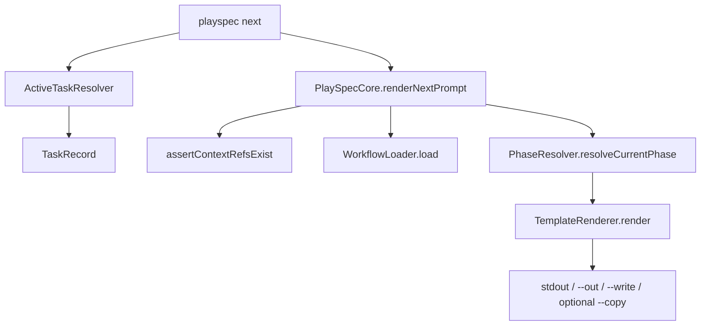
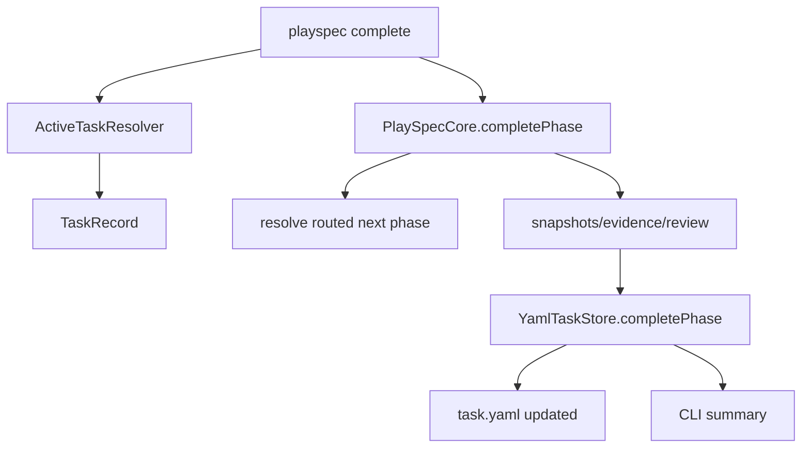
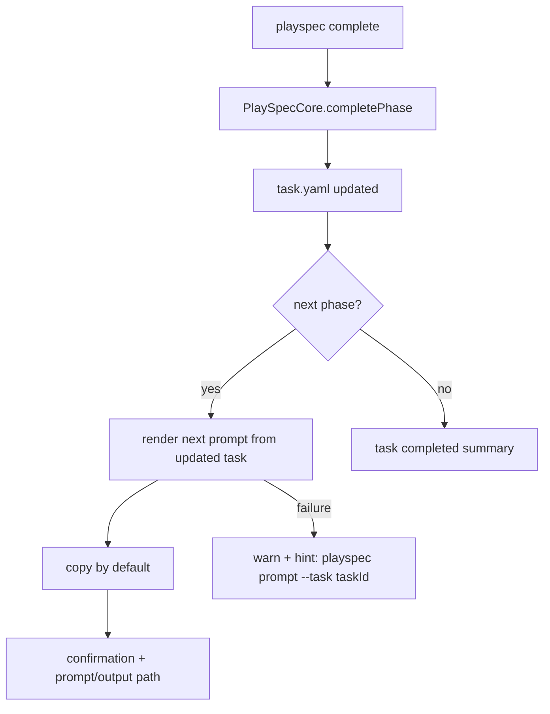

# ui ux update 260427 — Initial Technical Spec

## Scope

This step documents the code-level technical spec for the CLI UX redesign described in `.playspec/tasks/active/ui_ux_update_260427/sources/source_problem.md`.

In scope:

- Add a user-intent command surface around `prompt`, `complete`, `add-context`, `current-task`, `list-tasks`, and `get-task`.
- Preserve old commands as deprecated aliases where requested.
- Make human-facing phase display use the effective current phase when `task.currentPhase` is `null`.
- Keep read-only commands from mutating `task.yaml`.
- Route explicit mutations through Core and TaskStore.
- Improve prompt copy/fallback behavior, including Linux PRIMARY best-effort and EPIPE handling.

Out of scope:

- Workflow redesign.
- MCP behavior changes.
- Migration behavior changes.
- Viewer/markdown UI work.
- Destructive git operations or file deletion outside `.playspec`.

## Use Case Alignment

Verified source problem intent:

The user wants PlaySpec to feel like a stateful prompt system:

```bash
playspec create ...
playspec add-context ...
playspec prompt
playspec complete
```

The CLI should match the user's mental model:

- `playspec prompt` means "show/copy what I should work on now" and must be read-only for task state.
- `playspec complete` means "finish the current step and immediately give me the next prompt."
- `playspec add-context <file>` should work against HEAD in interactive use, with confirmation before mutation.
- `playspec add-context` should support additional user-friendly input modes, including the source problem's final `--edit` request.
- `playspec current-task` and `playspec list-tasks` should show actionable current work, not raw internal state like `(not started)`.

Open question:

- The source problem names `playspec prompt --print-only`, but existing `next` behavior already prints by default unless copy/out status-only mode is active. The implementation plan should define whether `--print-only` means "print and do not copy" or "print without metadata/context header".

## High-Level Current Implementation Summary

Verified code behavior:

- CLI commands are registered in `src/cli/index.ts`.
- `playspec next` is the active prompt rendering command. It resolves a task, validates context refs through Core, resolves the effective phase, renders a template, optionally copies, optionally writes output, and prints prompt content.
- `playspec complete` completes the current phase through Core and TaskStore, writes completion artifacts, advances `currentPhase`, and prints a summary. It does not render or copy the next prompt.
- `playspec add-context <file> --task <id>` already mutates through `PlaySpecCore.addContextRef()` and `YamlTaskStore.updateTask()`.
- `playspec add-context <file>` already resolves HEAD only in interactive mode and asks for confirmation before mutation.
- `playspec add-context` does not currently register an `--edit` option.
- `playspec get-task --task <id>` already requires `--task` and does not use HEAD fallback.
- Global EPIPE handling exists in `src/cli/index.ts`.
- `PhaseResolver.resolveCurrentPhase()` already treats `currentPhase: null` as the first workflow phase for prompt/core resolution.

Verified mismatches:

- There is no `playspec prompt` command.
- `playspec next` is still the primary command, not a deprecated alias.
- Prompt copying is opt-in via `next --copy`; the requested UX wants copy by default with `--no-copy`.
- `current-task`, `list-tasks`, `get-task`, `current`, and `list` display raw `(not started)` for `currentPhase: null`.
- `complete` does not render/copy the next prompt after state mutation.
- Linux clipboard code targets native clipboard/CLIPBOARD-style tools but does not attempt PRIMARY selection.
- `list-tasks` reports invalid non-null phases as `INVALID (...)` without allowed phase values.
- `get-task` has no `--json` option.
- `add-context` has no `--edit` input mode and still requires a positional file path.

## Relevant Files Reviewed

Must-read files reviewed:

- `.playspec/tasks/active/ui_ux_update_260427/sources/source_problem.md`
- `src/cli/index.ts`
- `src/cli/commands/next.ts`
- `src/cli/commands/complete.ts`
- `src/cli/commands/add-context.ts`
- `src/cli/commands/current-task.ts`
- `src/cli/commands/list-tasks.ts`
- `src/cli/commands/get-task.ts`
- `src/cli/commands/create.ts`
- `src/cli/commands/use.ts`
- `src/core/playspec-core.ts`
- `src/core/active-task-resolver.ts`
- `src/storage/task-store.ts`
- `src/storage/yaml-task-store.ts`
- `src/workflow/phase-resolver.ts`
- `src/workflow/phase-display.ts`
- `src/template/template-renderer.ts`
- `src/template/variable-resolver.ts`
- `src/utils/clipboard.ts`
- `tests/cli.test.ts`
- `tests/integration/init-create-next.test.ts`
- `tests/integration/completion-engine.test.ts`
- `tests/integration/task-store.test.ts`

Maybe-read files used for context:

- `src/cli/commands/current.ts`
- `src/cli/commands/list.ts`
- `src/cli/cli-utils.ts`

## Active Entry Points And Bypasses

Verified active entry points:

- `playspec next` -> `runNext()` -> `ActiveTaskResolver.resolveTask()` -> `PlaySpecCore.renderNextPrompt()` -> `PhaseResolver.resolveCurrentPhase()` -> template render -> stdout/copy/out files.
- `playspec complete` -> `runComplete()` -> optional result selection -> `PlaySpecCore.completePhase()` -> `YamlTaskStore.completePhase()` -> stdout summary.
- `playspec add-context` -> `runAddContext()` -> optional HEAD confirmation -> `PlaySpecCore.addContextRef()` -> `YamlTaskStore.updateTask()`.
- `playspec current-task` -> `runCurrentTask()` -> HEAD task -> direct display formatting.
- `playspec list-tasks` -> `runListTasks()` -> active task summaries -> direct display formatting.
- `playspec get-task --task <id>` -> `runGetTask()` -> direct display formatting.
- Deprecated/old active paths currently still registered as normal commands: `current`, `list`, and `next`.

Bypass and alternate paths:

- `current-task`, `list-tasks`, `get-task`, `current`, and `list` do not share one effective-phase display helper. This creates inconsistent display behavior.
- `next` performs some output-file writes even though prompt rendering is task-state read-only. This does not mutate `task.yaml`, but it is still a filesystem side effect.
- `add-context` CLI does not edit YAML directly. The mutation path is correctly centralized through Core.
- `add-context` currently accepts a required positional file path plus optional `--task`. Supporting `--edit` requires deciding whether the file path remains required or whether the command can create/edit a generated task-local context note before linking it.
- `use` writes `.playspec/HEAD` directly after validating the task exists. This is an intentional HEAD mutation command.

Partial migrations:

- The newer commands `current-task`, `list-tasks`, and `get-task` exist beside old `current` and `list`.
- Some UX improvements from an earlier update are present, including context details, `next --out`, `next --copy`, source-problem refs, interactive `add-context`, and global EPIPE handling.
- The source-problem command vocabulary has not been fully migrated from `next` to `prompt`.

## Current Architecture

Verified flow for current prompt rendering:



Verified flow for current completion:



Proposed flow for `complete` after this UX redesign:



## Verified Behavior

Verified code behavior:

- `PlaySpecCore.renderNextPrompt()` does not update task state. It loads the task, validates context refs, loads workflow, validates non-null `currentPhase`, resolves the current/effective phase, and renders the template.
- `PhaseResolver.resolveCurrentPhase()` maps `currentPhase: null` to the first workflow phase.
- `PlaySpecCore.completePhase()` is the current state mutation path for phase completion. It validates routing, writes snapshots/evidence/review, records sync/rollback metadata, and calls `TaskStore.completePhase()`.
- `YamlTaskStore.completePhase()` updates `status`, `currentPhase`, `updatedAt`, `phaseHistory`, `stateSync`, and `rollback`.
- `PlaySpecCore.addContextRef()` rejects absolute context paths, workspace escapes, missing files, and duplicate normalized paths.
- `runAddContext()` rejects omitted `--task` in non-interactive mode before mutation.
- `runAddContext()` confirms before mutating when it infers the task from HEAD in interactive mode.
- `installPipeHandlers()` exits cleanly on stdout/stderr `EPIPE`.

Inferred behavior:

- Because `next --copy` falls back to a prompt file when clipboard copying fails, the same helper can likely be reused for `prompt` and post-`complete` prompt generation after option semantics are adjusted.
- A shared phase-display helper would reduce drift across `current-task`, `list-tasks`, `get-task`, `current`, and `list`.

Open questions:

- Should absolute `--out` paths remain allowed? Existing `resolveOutputFilePath()` allows absolute paths and only prevents workspace escape for relative paths.
- Should deprecated aliases print warnings to stderr or stdout?
- Should `complete --quiet` suppress the rendered next prompt or only suppress headers/artifact detail?
- Should `get-task --json` emit the raw task record or a derived view with effective phase metadata?

## Problems

1. Missing command surface:
   `playspec prompt` is not registered, and `next` is not marked deprecated.

2. Prompt copy defaults are inverted:
   Current code copies only with `--copy`; requested behavior copies by default and disables copy with `--no-copy` or `--print-only`.

3. Completion flow stops too early:
   `complete` persists phase advancement but does not render/copy the next prompt or provide prompt-generation failure recovery.

4. Effective phase display is inconsistent:
   Core prompt resolution handles `currentPhase: null`, but human display commands often print `(not started)`.

5. Invalid phase diagnostics are incomplete:
   `list-tasks` displays `INVALID (...)` but does not show allowed phase IDs.

6. Clipboard support is incomplete:
   Linux PRIMARY selection is not attempted.

7. Duplicate display logic:
   Phase formatting is duplicated in multiple CLI commands, increasing the chance of future drift.

8. `get-task` is missing script output:
   `--json` is requested but not implemented.

9. `add-context --edit` is not represented:
   The source problem's final note asks for multiple `add-context` options such as `--edit`, but the current command requires a file path and only accepts `--task`.

## Proposed Direction

Implement the UX redesign as a focused CLI/core-adjacent change:

- Introduce `playspec prompt` as the canonical command and make `next` call the same implementation with a deprecation warning.
- Replace copy option semantics for the canonical prompt command with copy-by-default behavior:
  - default: render, copy, and print confirmation/prompt according to output mode.
  - `--no-copy`: render without clipboard.
  - `--print-only`: render to stdout and do not copy.
  - `--out <file>`: write prompt to the selected file.
- Extract shared prompt output handling so `prompt` and post-`complete` reuse the same copy/fallback/out behavior.
- After `complete` successfully persists state, render the next effective prompt from the updated task when the task remains active. If that render/copy fails, keep the completion and print a recovery hint.
- Add a shared effective-phase display helper for CLI read views.
- Update deprecated aliases `next`, `current`, and `list` to preserve compatibility while following the new display behavior.
- Extend clipboard support with Linux PRIMARY best-effort attempts without making PRIMARY failure fatal.
- Add tests around read-only behavior by comparing task YAML before/after read commands.

## File-By-File Plan

`src/cli/index.ts`

- Register `prompt` with `--task`, `--no-copy`, `--print-only`, and `--out`.
- Keep `next` registered as a deprecated alias to the prompt implementation.
- Consider adding warning output for `next`, `current`, and `list`.
- Add `get-task --json`.
- Add `add-context --edit` if this UX item remains in the implementation phase. Because the current command is `add-context <file>`, first decide whether `--edit` still requires a file path or makes the file argument optional.
- Add `complete --no-copy`; preserve existing `--quiet`, `--task`, `--with-review`, and `--result`.

`src/cli/commands/next.ts`

- Rename or refactor implementation behind a neutral prompt-render function.
- Preserve `runNext()` as a compatibility wrapper.
- Change canonical prompt semantics to copy by default.
- Keep `--out` support and fallback prompt-file writing.
- Ensure prompt command does not mutate task state.

`src/cli/commands/complete.ts`

- After `PlaySpecCore.completePhase()` returns, if `status` remains active and `nextPhase` is non-null, render the next prompt and copy/write/print according to options.
- If next prompt generation fails after completion, print a warning and `playspec prompt --task <taskId>` recovery hint without rolling back.

`src/cli/commands/add-context.ts`

- Preserve explicit `--task` mode with no confirmation.
- Preserve interactive HEAD confirmation before mutation.
- Keep all validation and mutation through `PlaySpecCore.addContextRef()`.
- Define `--edit` behavior before implementation. A conservative path is to open `$EDITOR` for a workspace-relative context file, then link that file through the same Core path after confirmation rules are satisfied.

`src/cli/commands/current-task.ts`

- Replace raw `(not started)` logic with shared effective-phase display.
- Include context ref count and paths as it does now.
- Display invalid non-null phases with allowed values.

`src/cli/commands/list-tasks.ts`

- Use effective phase display for null phases.
- Show invalid phase values with allowed phase IDs.
- Keep HEAD marker behavior.

`src/cli/commands/get-task.ts`

- Keep required `--task`; do not add HEAD fallback.
- Use effective phase display in human output.
- Add `--json` if accepted for this phase.

`src/cli/commands/current.ts` and `src/cli/commands/list.ts`

- Keep as deprecated aliases.
- Either delegate to `current-task`/`list-tasks` or share the same effective-phase display helper.

`src/cli/cli-utils.ts` or a new sibling CLI helper

- Add shared effective-phase display formatting for human CLI commands.
- Add shared deprecated-warning helper if needed.

`src/utils/clipboard.ts`

- Preserve existing clipboard/fallback behavior.
- On Linux, attempt CLIPBOARD and then PRIMARY selection best-effort using available tools such as `xclip`, `xsel`, or Wayland-compatible command paths where feasible.
- Return structured result details so CLI can warn when PRIMARY fails but CLIPBOARD succeeds.

`src/core/playspec-core.ts`

- Prefer no broad Core change. Existing `renderNextPrompt()`, `completePhase()`, and `addContextRef()` already provide the required state/data boundaries.
- Only add a Core helper if CLI cannot safely render the next prompt after completion without duplicating workflow logic.

`tests/cli.test.ts`

- Add coverage for `prompt`, `next` deprecation alias, copy defaults with clipboard disabled fallback, `--no-copy`, `--print-only`, and `--out`.
- Add coverage for `complete` rendering/copying the next prompt and for prompt-generation failure after persisted completion.
- Add read-only no-mutation checks for `prompt`, `current-task`, `list-tasks`, and `get-task`.
- Add effective-phase display expectations.

`tests/unit/clipboard.test.ts`

- Add Linux command selection coverage for CLIPBOARD plus PRIMARY best-effort if practical with mocked command execution.

## Risks And Open Questions

Risks:

- Copy-by-default can make tests flaky unless clipboard behavior is isolated behind env flags or mockable helpers.
- Reusing `next` output code without option cleanup may preserve confusing status-only behavior.
- Rendering after completion must load the updated task state. Rendering from the pre-completion task would show the wrong prompt.
- Alias warnings can break tests or scripts if printed to stdout. Prefer stderr for warnings.
- Linux PRIMARY support depends on local tools and display server availability; failure must remain non-fatal.

Open questions:

- What exact stdout contract should `prompt` use by default: full prompt plus confirmation, confirmation only, or prompt only?
- Should `--quiet` on `complete` suppress only headers, or also suppress the next prompt body?
- Should `get-task --json` include derived effective phase fields or only serialized task YAML/JSON?
- Should `prompt --out` also copy by default, or should writing to an explicit file imply status-only output unless `--print-only` is used?
- What should `add-context --edit` edit: a user-supplied file path, a generated task-local context note, or an existing context ref selected interactively?

## Reader Aids

Terminology:

- "Stored phase" means `task.currentPhase` in `task.yaml`.
- "Effective phase" means the phase the user should work on now. If stored phase is `null`, this is `workflow.phaseOrder[0]`.
- "Read-only command" means no `task.yaml` mutation. It may still print, copy, or write explicit prompt output files.
- "HEAD-inferred mutation" means a mutation command omitted `--task` and resolved task identity through `.playspec/HEAD`.

Acceptance checklist for later implementation:

- `playspec prompt` exists.
- `playspec next` remains and warns as deprecated.
- Prompt copy is default and failure writes a usable fallback path.
- Linux copy attempts CLIPBOARD and PRIMARY best-effort.
- EPIPE remains handled without a Node stack trace.
- `complete` persists completion, then renders/copies the next prompt.
- `complete` does not roll back if next prompt generation fails.
- `add-context` explicit and interactive HEAD modes remain routed through Core.
- `add-context --edit` behavior is specified before coding and, if implemented, still routes the final context link through Core.
- Read-only commands do not mutate `task.yaml`.
- Effective phase display replaces `(not started)` in human-facing command output.
- Invalid non-null phases show allowed values where requested.
