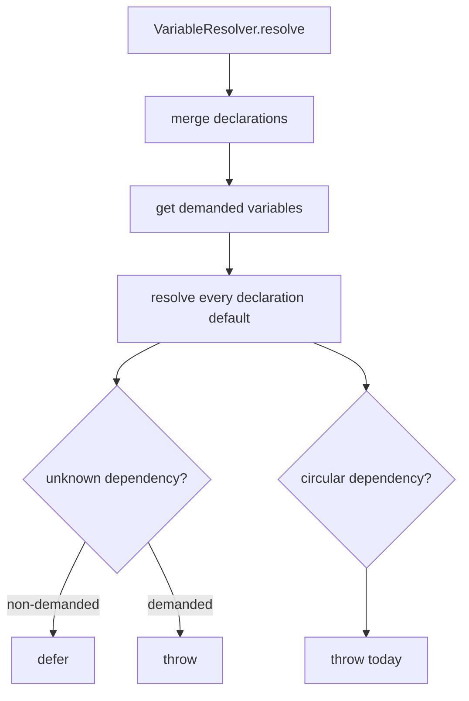
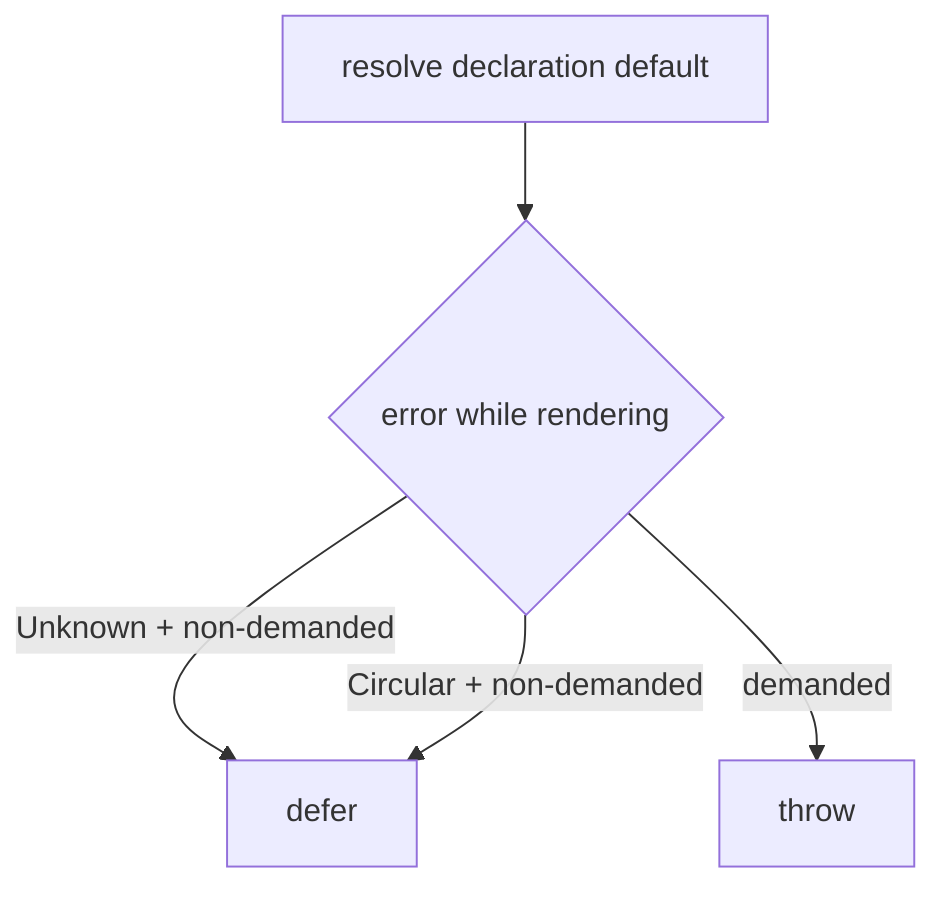

# Issue #237 unused circular workflow defaults spec

## Scope

Fix demand-aware default resolution in `src/template/variable-resolver.ts` so an unused workflow-level default cycle does not block resolving or rendering an unrelated active phase.

Out of scope:

- Workflow schema redesign.
- Phase engine or routing changes.
- MCP, rollback, harness, migration, or viewer behavior.
- Suppressing circular-default errors for variables demanded by the active phase.

## Use Case alignment

Workflow authors may define defaults for later or optional phases while working on an earlier phase. If those later defaults temporarily contain a cycle, the active phase should still render when it does not require, output, or otherwise depend on the cyclic variables.

## High-level current implementation summary

Verified in `src/template/variable-resolver.ts`:

- `VariableResolver.resolve()` builds engine variables, merges workflow and phase variable declarations, then calls `resolveDeclaredDefaults()`.
- `getDemandedVariableNames()` marks variables demanded when they are required declarations, active phase declarations unless explicitly optional, active phase `requiredVariables`, or active phase `outputs`.
- `resolveDeclaredDefaults()` iterates every declaration, including non-demanded workflow-level defaults.
- While resolving a default, unknown dependencies throw `UnknownVariableDefaultError`; this is suppressed only when the root variable is not demanded.
- Circular dependencies throw `CircularVariableDefaultError`; this currently escapes even when the root variable is not demanded.

Verified in `tests/unit/variable-resolver.test.ts`:

- Non-demanded defaults with unknown dependencies are already deferred and return `undefined`.
- Demanded unknown defaults still throw.
- Demanded circular defaults already throw.

## Relevant Files Reviewed

- `src/template/variable-resolver.ts`
- `tests/unit/variable-resolver.test.ts`
- `.playspec/tasks/active/issue_237_unused_circular_workflow_defaults/sources/source_problem.md`

## Active Entry Points and Bypasses

Active entry points:

- CLI and core prompt rendering call `VariableResolver.resolve()` through the existing workflow and phase definitions.
- Unit tests call `VariableResolver.resolve()` directly.

Bypass paths:

- Task variables with non-empty values bypass declaration default rendering for that variable.
- Engine variables are pre-populated and reserved metadata cannot be overridden by task variables.
- Empty task variables can still fall back to declaration defaults.

## Current Architecture

`resolveDeclaredDefaults()` owns declaration default evaluation. It tracks a shared `resolving` set to detect cycles and passes a root-level `demanded` boolean through recursive dependency resolution. This existing structure is enough for a focused fix because a cycle detected while resolving a non-demanded root can be deferred the same way unknown dependencies are already deferred.

## Verified Behavior

- A demanded variable `A` with defaults `A: "{{B}}"`, `B: "{{A}}"` throws `CircularVariableDefaultError`.
- A non-demanded variable with a missing dependency does not fail active phase resolution.
- A phase requiring only `FEATURE_SLUG` currently still fails if unrelated workflow variables contain `A: "{{B}}"` and `B: "{{A}}"`.

## Problems

The resolver is demand-aware for unknown default dependencies but not for circular default dependencies. Because it eagerly iterates all declarations, a future-phase or optional cycle can abort an unrelated active phase before required-variable validation and template rendering decide what is actually needed.

## Proposed Direction

Treat `CircularVariableDefaultError` like `UnknownVariableDefaultError` only when the root default being resolved is not demanded. Keep demanded resolution strict, including cycles reached through demanded defaults.

The intended behavior is:

- Non-demanded `A -> B -> A`: defer and omit unresolved values.
- Demanded `A -> B -> A`: throw `CircularVariableDefaultError`.
- Demanded `A -> B -> C -> A`: throw with the existing cycle message.
- Unknown dependency behavior remains unchanged.

## File-by-file Plan

- `tests/unit/variable-resolver.test.ts`: add a focused regression test where active phase `start` requires only `FEATURE_SLUG` and unused workflow variables `A` and `B` cycle. Assert resolution succeeds and `A`/`B` are undefined.
- `tests/unit/variable-resolver.test.ts`: keep existing demanded circular default coverage.
- `src/template/variable-resolver.ts`: update the non-demanded catch path in `resolveDeclaredDefaults()` to also defer `CircularVariableDefaultError`.

## Risks and Open Questions

Risk: Suppressing cycles too broadly could hide defaults required by the active phase. Mitigation: preserve the existing demanded flag propagation and add tests covering both unused and demanded cycle behavior.

Open question: none for this scoped fix.

## Reader Aids

Verified current flow:

Proposed flow:

