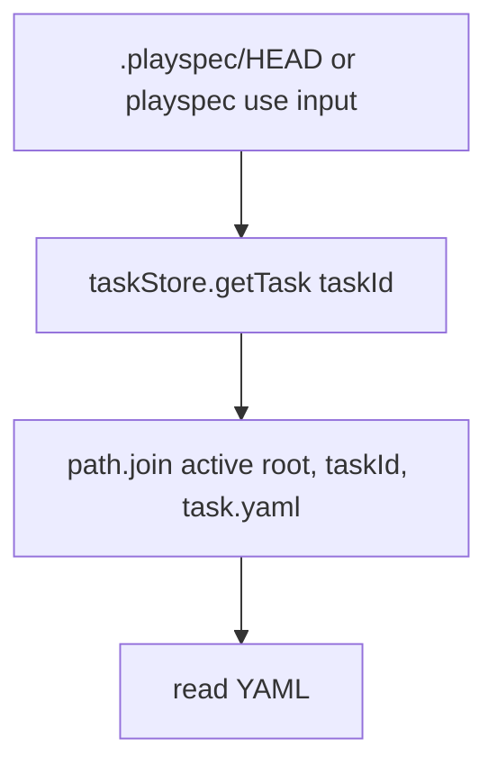
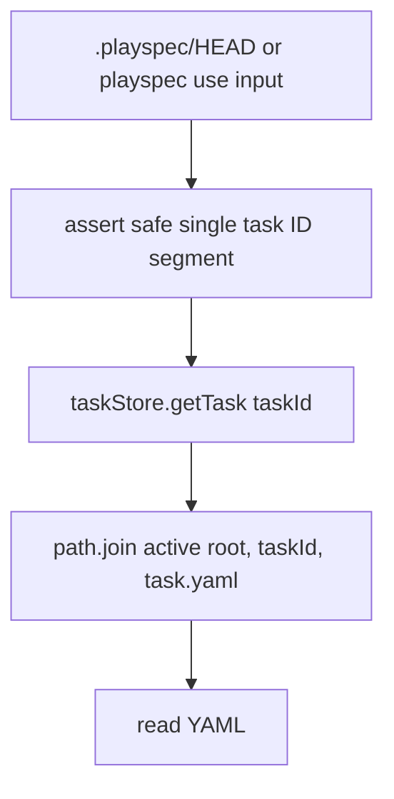

# Validate HEAD and Direct Task IDs Before Storage Paths

## Scope

Implement a task ID path-segment safety guard for lifecycle storage lookups. The guard must reject IDs containing path separators, absolute path syntax, `..`, or characters outside the task ID format generated by PlaySpec before active or archived task storage paths are constructed.

Out of scope: prefix matching redesign, generated task ID format changes, workflow template wording changes, viewer work, or broader lifecycle status policy changes.

## Use Case Alignment

Users can manually edit `.playspec/HEAD` or pass `playspec use <taskId>`. If either input is unsafe, PlaySpec should fail with a practical lifecycle error and should not attempt to read YAML outside `.playspec/tasks/active/<taskId>/task.yaml`.

Valid task IDs generated by `playspec create` use slug-style filesystem-safe strings and must continue to work through HEAD resolution, `playspec use`, listing, and `TaskIdResolver`-based commands.

## High-Level Current Implementation Summary

Verified:

- `ActiveTaskResolver.resolveTask()` reads `.playspec/HEAD`, trims it, and passes the result directly to `taskStore.getTask()`.
- `src/cli/commands/use.ts` passes explicit `taskId` input directly to `store.getTask(taskId)` before writing `.playspec/HEAD`.
- `YamlTaskStore.getTask()` builds its path via `taskYamlPath(taskId)`, which joins `getActiveTaskRoot(workspaceRoot, taskId)` with `task.yaml`.
- `YamlTaskStore.getArchivedTask()` does the same for archived task paths.
- `getActiveTaskRoot()` and `getArchivedTaskRoot()` currently use `path.join(..., taskId)`.

Inferred:

- `TaskIdResolver` is lower risk because it resolves from active and completed task lists, but store-level validation is still needed because several direct callers bypass `TaskIdResolver`.

## Relevant Files Reviewed

- `src/core/active-task-resolver.ts`
- `src/cli/commands/use.ts`
- `src/storage/yaml-task-store.ts`
- `src/utils/paths.ts`
- `src/core/errors.ts`
- `src/core/task-id-resolver.ts`
- `tests/cli.test.ts`
- `tests/integration/active-task-resolver.test.ts`
- `tests/integration/task-store.test.ts`

## Active Entry Points and Bypasses

Active entry points:

- HEAD-based lifecycle commands such as `current-task`, `next`, `prompt`, `complete`, and `status` without explicit task arguments call `ActiveTaskResolver.resolveTask()`.
- `playspec use <taskId>` calls `setHeadToTask()`, which directly reads the task before setting HEAD.
- Store APIs `getTask()`, `getArchivedTask()`, `updateTask()`, `completePhase()`, and `archiveCompletedTask()` accept task IDs that may originate from callers.

Bypass paths:

- `.playspec/HEAD` is trusted after trim.
- `playspec use <taskId>` bypasses `TaskIdResolver`.
- Core/store callers can pass arbitrary `taskId` values directly.

## Current Architecture

Task directories live under:

- `.playspec/tasks/active/<taskId>/task.yaml`
- `.playspec/tasks/archived/<taskId>/task.yaml`

Task creation stores `input.id` as both task ID and directory segment. Generated IDs come from slug generation and are single path-safe segments, but storage lookups do not currently enforce that assumption at the boundary.

## Verified Behavior

The current code rejects empty or missing HEAD via `NoActiveTaskError`, and rejects missing valid-looking task IDs via `TaskNotFoundError`. It does not reject path-like or traversal IDs before computing storage paths.

## Problems

- Storage boundary safety depends on convention rather than an explicit guard.
- HEAD content can influence a storage path before validation.
- Direct `playspec use <taskId>` input can influence a storage path before validation.
- Archived lookup uses the same path construction pattern and needs the same guard.

## Proposed Direction

Add `UnsafeTaskIdError` in `src/core/errors.ts` and a shared validator in `src/utils/task-id.ts`:

- `isSafeTaskId(taskId: string): boolean`
- `assertSafeTaskId(taskId: string): void`

The allowed format is exactly `/^[a-z0-9_]+$/`. This matches PlaySpec-generated slugs, rejects empty strings, path separators, absolute paths, `..`, whitespace, dashes, dots, and uppercase/non-ASCII characters, and guarantees the task ID is a single path segment.

Apply the guard inside `YamlTaskStore` before any active or archived path helper call that consumes a caller-provided ID. Specifically guard `taskYamlPath()`, `archivedTaskYamlPath()`, and `archiveCompletedTask()` before `getActiveTaskRoot()` or `getArchivedTaskRoot()` are called with method input. This centralizes protection for direct CLI, HEAD, core, migration, and archived paths.

`ActiveTaskResolver` should also call `assertSafeTaskId()` on explicit task IDs and trimmed HEAD content before calling `taskStore.getTask()`. This keeps the HEAD lifecycle error close to the source of unsafe HEAD content while the store remains the final path-construction boundary.

The error should identify the unsafe ID and provide a recovery hint such as:

```text
Unsafe task ID: ../outside
Use a single PlaySpec task ID segment. Run `playspec list-tasks`, then select an active task with `playspec use <TASK_ID>`.
```

## File-by-File Plan

- `src/core/errors.ts`: add an `UnsafeTaskIdError` extending `PlaySpecError`; message must include the unsafe ID.
- `src/utils/task-id.ts`: add `TASK_ID_PATTERN = /^[a-z0-9_]+$/`, `isSafeTaskId(taskId: string): boolean`, and `assertSafeTaskId(taskId: string): void`.
- `src/storage/yaml-task-store.ts`: call the guard before constructing active and archived task YAML paths and roots from method input.
- `src/core/active-task-resolver.ts`: call the guard on explicit task IDs and trimmed HEAD content before store lookup.
- `tests/cli.test.ts`: add coverage for unsafe HEAD on a HEAD-based command and unsafe explicit `playspec use <taskId>`.
- `tests/integration/task-store.test.ts` or resolver tests: add active and archived storage guard coverage for traversal-style IDs.

## Risks and Open Questions

Risk: manually created task IDs with characters outside generated slug format will now fail. This is acceptable because lifecycle storage safety is more important than supporting non-generated IDs.

Resolved validation issue from Step 2: helper location and allowed format are no longer implementation-time decisions. The concrete API is `src/utils/task-id.ts`, and the allowed format is `/^[a-z0-9_]+$/`.

## Reader Aids

Verified current flow:



Proposed flow:


