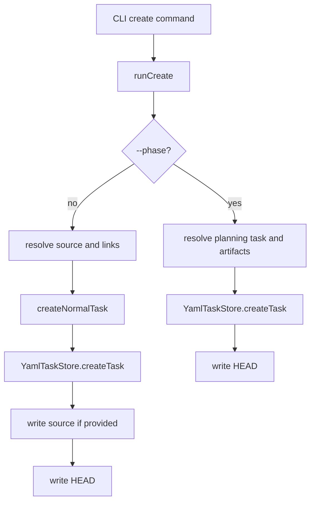
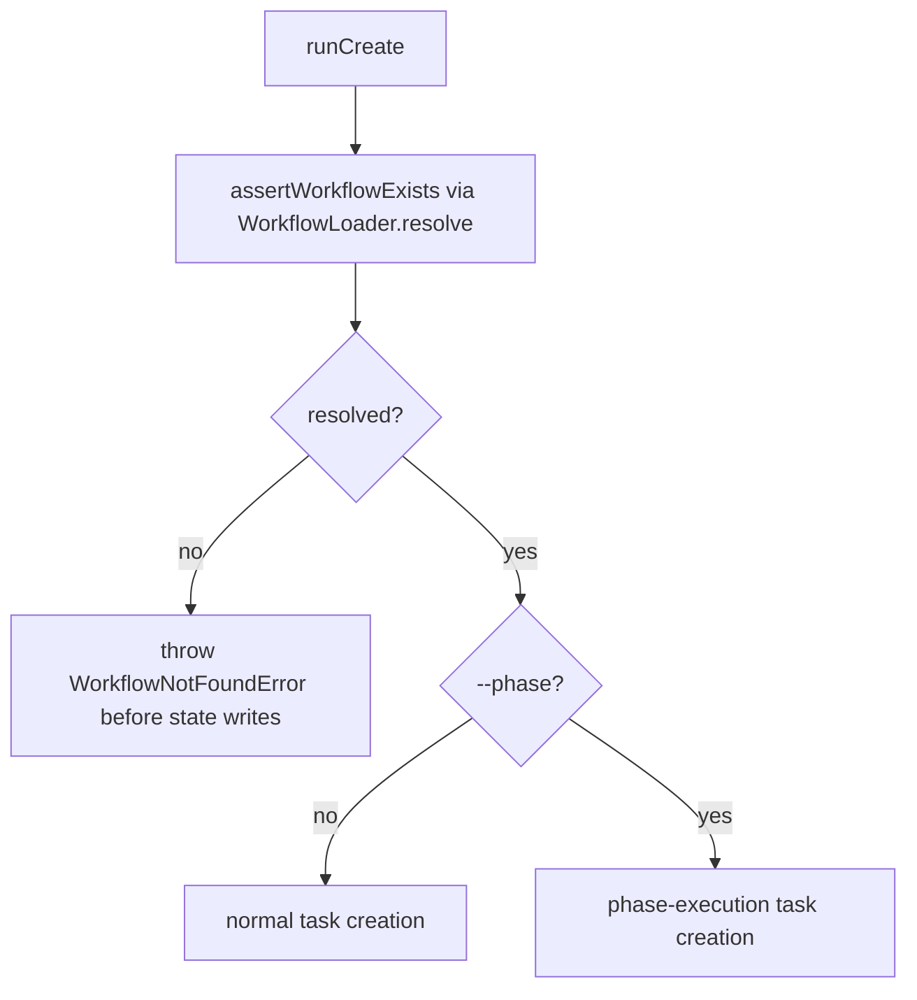

# Validate Workflow IDs During Task Creation Spec

## Scope

Fix `playspec create` so an explicit workflow ID is resolved before task state is written. The change covers both normal task creation and `--phase` execution task creation. It must preserve the existing default behavior where a title-only create uses `mono-spec`, and it must use the same workflow resolution precedence as prompt rendering: project workflows, then user workflows, then built-in workflows.

Out of scope: workflow aliases, intent routing, prompt rendering changes, phase routing changes, and workflow precedence changes.

## Use Case Alignment

Users and automation expect a successful `playspec create --workflow <id>` to produce a usable active task. Today an unknown workflow can become the active HEAD task, and the failure appears later during prompt rendering. The intended behavior is to reject the unknown workflow before creating a task directory, source file, or HEAD update, while printing actionable workflow-not-found guidance.

## High-Level Current Implementation Summary

Verified behavior:

- `src/cli/index.ts` defines `create` with `--workflow <id>` defaulting to `mono-spec`.
- `src/cli/commands/create.ts` receives the selected workflow string in `runCreate()`.
- Normal creation resolves source content and task links, then calls `createNormalTask()`.
- Phase-execution creation resolves planning context files, then calls `YamlTaskStore.createTask()` directly and writes HEAD.
- `createNormalTask()` writes task YAML through `YamlTaskStore.createTask()`, writes source content when present, then writes `.playspec/HEAD`.
- `WorkflowLoader.resolve()` delegates to `WorkflowRegistry.resolve()`, which implements project, user, built-in precedence and throws `WorkflowNotFoundError`.
- Prompt and planning artifact paths already use `WorkflowLoader`, so invalid workflow IDs fail later.

Inferred behavior:

- Because validation is absent before `YamlTaskStore.createTask()`, any unknown workflow ID can be persisted as task state.
- If a source problem is supplied, the source file is written after task YAML but before HEAD; a validation failure before task creation should prevent both writes.

## Relevant Files Reviewed

- `src/cli/commands/create.ts`: create command state-writing paths and phase-execution branch.
- `src/workflow/workflow-loader.ts`: workflow loading, schema validation, template validation.
- `src/workflow/workflow-registry.ts`: workflow source precedence and workflow-not-found error.
- `src/core/errors.ts`: existing `WorkflowNotFoundError` message and hint.
- `src/storage/yaml-task-store.ts`: task directory and YAML creation behavior.
- `tests/cli.test.ts`: existing CLI create coverage.
- `tests/integration/init-create-next.test.ts`: existing phase-execution create coverage.

## Active Entry Points and Bypasses

Active CLI entry points:

- Normal: `playspec create "Title" --workflow <id>`
- Default normal: `playspec create "Title"` -> `mono-spec`
- Phase execution: `playspec create "Planning Title" --workflow <id> --phase <n> --from <planningTaskId>`

Bypass paths:

- Direct calls to `YamlTaskStore.createTask()` are intentionally lower-level storage operations and should not start resolving workflow definitions. Core/storage must remain decoupled from CLI workflow policy.
- Prompt rendering remains separately validated through `WorkflowLoader` and should not change.

## Current Architecture

## Verified Behavior

- `WorkflowRegistry.resolve()` already returns the effective workflow location according to `project -> user -> builtin`.
- `WorkflowNotFoundError` already prints `Workflow file not found: <id>` and a hint to list/install workflows.
- `createNormalTask()` currently performs no workflow validation before state writes.
- The phase-execution branch currently performs no validation of the new execution task workflow before state writes.

## Problems

- Unknown workflow IDs are accepted during normal creation.
- Unknown workflow IDs are accepted during phase-execution creation.
- The command can mutate `.playspec/tasks/active` and `.playspec/HEAD` before any workflow-not-found error appears.
- Automation can treat creation as successful even though the next prompt is guaranteed to fail.

## Proposed Direction

Proposed flow:

Add a small CLI-layer helper in `src/cli/commands/create.ts`, for example `validateWorkflowExists(workspaceRoot, workflow)`, that calls `new WorkflowLoader(workspaceRoot).resolve(workflow)` and discards the result. Call it after workspace initialization and before any normal or phase-execution create path writes task state.

This keeps validation behavior aligned with prompt rendering and avoids coupling storage or core logic to CLI concerns.

## File-by-File Plan

- `src/cli/commands/create.ts`
  - Validate the requested workflow once near the start of `runCreate()` after `.playspec` existence is confirmed.
  - Keep the default `mono-spec` behavior unchanged because the CLI still supplies that default.
  - Ensure validation runs before source file writes, `YamlTaskStore.createTask()`, and HEAD writes.

- `tests/cli.test.ts`
  - Add coverage that an unknown workflow exits non-zero for normal create.
  - Assert the expected task directory is not created.
  - Assert HEAD remains unchanged when a previous task was active.
  - Assert the existing workflow-not-found guidance is printed.
  - Keep or extend valid built-in workflow coverage.

- `tests/integration/init-create-next.test.ts` or `tests/cli.test.ts`
  - Add phase-execution coverage proving unknown workflow rejection happens before the execution task directory is created and before HEAD changes.

## Risks and Open Questions

- Validation through `WorkflowLoader.resolve()` also validates workflow YAML and template existence, not only presence. This matches prompt rendering, but it means `create` can now fail earlier for malformed workflows. That is acceptable because the requested task would not be renderable.
- Phase-execution creation currently resolves the planning task workflow while finding planning artifacts. The new validation must target the new execution task workflow, not only the planning workflow.
- The existing hint says `playspec workflow list/install`, while this CLI currently exposes no `workflow` command in `--help`. Acceptance allows equivalent guidance or existing guidance, so preserving the current error is sufficient unless tests need only match the stable `Workflow file not found` text plus `list`/`install`.

## Reader Aids

Key invariant after the fix: if workflow validation fails, there must be no new task directory, no source problem file, and no HEAD change.
