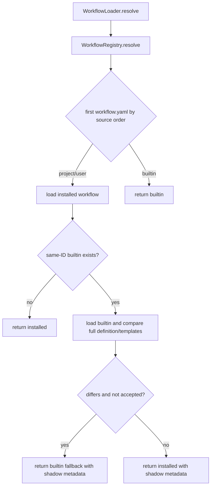
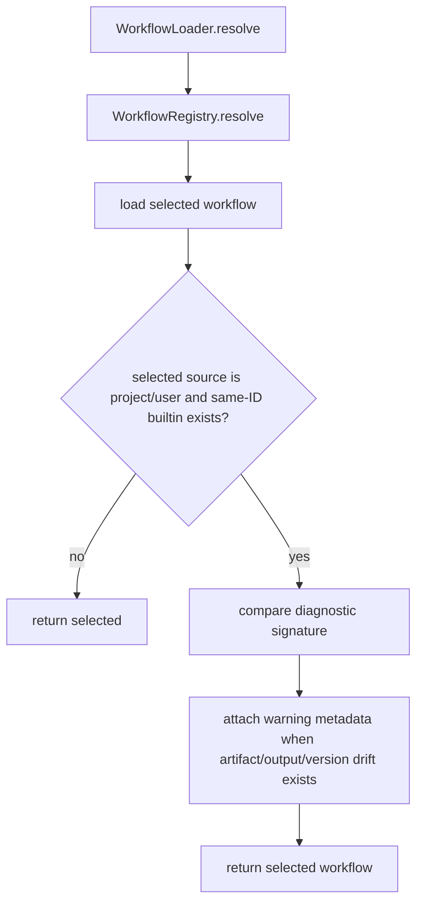

# Warn Workflow Shadow Artifact Drift Spec

## Scope

Implement a diagnostics-only warning path for project or user workflows that shadow a built-in workflow with the same ID when artifact/output-relevant definitions or workflow version metadata differ. Do not change source precedence, do not rewrite installed workflows, and do not auto-upgrade stale workflow copies.

## Use Case Alignment

Operators can install or customize workflows under `.playspec/workflows` or the user workflow root. Those installed workflows intentionally take precedence over built-ins, but the operator still needs a clear warning when the installed copy masks newer built-in artifact paths, outputs, or version metadata.

The concrete regression target is `issue-scope-create`, where stale installed definitions can keep using obsolete `DISCOVERY_FILE`, `CANDIDATE_ISSUES_FILE`, or `CREATED_ISSUES_FILE` behavior even after the bundled workflow has been corrected.

## High-Level Current Implementation Summary

Verified behavior:

- `WorkflowRegistry.resolve()` checks `project`, then `user`, then `builtin` and returns the first `workflow.yaml`.
- `WorkflowRegistry.list()` returns one effective location per workflow ID, preserving the same source priority.
- `WorkflowLoader.resolve()` currently detects an installed workflow with the same ID as a built-in workflow, compares full workflow definition and template assets, and may return the built-in workflow instead of the installed workflow unless `builtinShadow.accepted: true` is set.
- Existing tests now cover fallback-to-builtin behavior for stale project shadows and accepted-shadow preservation.

Problem:

- The current fallback changes effective resolution precedence. Issue #228 asks for warnings/status signals while preserving project/user override precedence.
- The current comparison is broad: it treats any definition or template difference as stale, not just artifact/output or version drift. That risks noisy diagnostics for intentional prompt-only customizations.

## Relevant Files Reviewed

- `src/workflow/workflow-registry.ts`: source ordering, location resolution, effective workflow listing.
- `src/workflow/workflow-loader.ts`: workflow YAML loading, validation, and current built-in shadow fallback logic.
- `src/core/types.ts`: workflow, phase, artifact, resolved workflow, and current `WorkflowBuiltinShadow` types.
- `src/core/schemas.ts`: workflow schema validation, including `version`, `artifacts`, phase `outputs`, and `builtinShadow`.
- `tests/integration/workflow-loader.test.ts`: built-in workflow assertions, source precedence tests, and current stale-shadow fallback tests.
- `src/preset/assets/workflows/issue-scope-create/workflow.yaml`: bundled artifact/output definitions for the concrete stale-shadow test.

## Active Entry Points And Bypasses

Active entry points:

- `WorkflowLoader.load(workflowId)` calls `resolve()` and returns only the selected definition.
- `WorkflowLoader.resolve(workflowId)` is the main loaded workflow entry point used by core prompt rendering and task execution paths.
- `WorkflowRegistry.list()` exposes effective workflow locations without loading definitions.

Bypasses and alternate paths:

- `WorkflowLoader.resolveFromDirectory(rootDir)` loads a specific workflow directory directly and should not emit same-ID built-in shadow diagnostics unless a later caller explicitly compares it with built-ins.
- `WorkflowRegistry.resolve()` returns a location only and cannot compare artifact/output definitions without loading YAML.
- Direct consumers of `WorkflowRegistry.list()` currently get no loaded definition or diagnostic details.

## Current Architecture

Verified resolution flow:

Required proposed flow:

## Verified Behavior

- Built-in `issue-scope-create` declares artifacts for `discovery`, `candidates`, and `createdIssues`, and uses task-specific `OUTPUT_DIR` defaults.
- Phase outputs are represented as `PhaseDefinition.outputs?: string[]`.
- Workflow-level artifact declarations are represented as `WorkflowDefinition.artifacts?: Record<string, ArtifactDeclaration>`.
- Workflow version metadata is represented as `WorkflowDefinition.version?: string | number`.
- Existing code already has access to the selected workflow location and the same-ID built-in location inside `WorkflowLoader.resolve()`.

## Problems

- Stale installed workflow copies are not surfaced as warnings; they are currently replaced by built-in fallback in `WorkflowLoader.resolve()`.
- The current shadow metadata lacks detailed drift fields such as `artifacts.discovery.path`, `phases.scoped_issue_discovery.outputs`, or `version`.
- `WorkflowRegistry.list()` can show that a project/user workflow is effective, but it cannot currently expose stale artifact/output diagnostics.
- Broad full-template comparisons are too noisy for this issue and can flag intentional prompt customization unrelated to artifacts, outputs, or version metadata.

## Proposed Direction

Add a small diagnostic model that can be attached to resolved workflows and returned by a loader listing diagnostics method for listing use cases.

Diagnostic comparison should be limited to:

- `version`
- `artifacts`
- per-phase `outputs`

The selected project/user workflow must remain selected even when drift is detected. The warning should include:

- workflow ID
- active source and root directory
- shadowed built-in source and root directory
- drift details identifying artifact/output/version fields that differ

No warning should be emitted when those diagnostic fields are equivalent, even if templates or other prompt text differ.

The public code contract for this change is:

- Keep `WorkflowRegistry.resolve()` and `WorkflowRegistry.list()` as location-only APIs with unchanged source precedence.
- Keep `WorkflowLoader.resolve(workflowId)` as the loading API and return the active project/user workflow when it wins registry precedence.
- Add `WorkflowLoader.listWithDiagnostics(): Promise<ResolvedWorkflow[]>` to load the effective workflows returned by `WorkflowRegistry.list()` and attach the same diagnostics that `resolve()` attaches.
- Expose warnings on `ResolvedWorkflow.diagnostics?: WorkflowDiagnostic[]`. Keep `shadow` only if needed for backward-compatible metadata, but do not use it to change the selected workflow.
- Use warning code `workflow_builtin_shadow_artifact_drift`.

## File-By-File Plan

- `src/core/types.ts`: add diagnostics-oriented types, including warning code/message and drift detail list. Keep any shadow metadata non-routing.
- `src/workflow/workflow-loader.ts`: remove built-in fallback behavior, compare only artifact/output/version diagnostic signatures, attach warnings while returning the installed workflow, and add `listWithDiagnostics()`.
- `src/workflow/workflow-registry.ts`: no precedence change; keep `list()` location-only. Add no YAML loading here.
- `tests/integration/workflow-loader.test.ts`: update stale-shadow tests to assert precedence is preserved, add project and user warning coverage, add a negative prompt-only/matching-artifact test, cover `issue-scope-create` with a copied older workflow definition, and assert `listWithDiagnostics()` exposes the warning.

## Validation Patch Ledger

- Step 2 score: 93/100.
- Resolved issue: listing diagnostic API ambiguity. The spec now requires `WorkflowLoader.listWithDiagnostics()` and explicitly leaves `WorkflowRegistry.list()` location-only.
- Downgraded risk: CLI printing remains out of scope for this issue because acceptance can be satisfied by loading/listing API diagnostics without changing command UX.
- Remaining blockers: none.

## Risks And Open Questions

- Open question: whether CLI commands should print warnings immediately or whether exposing warning metadata from loader/listing is sufficient for this issue. Acceptance requires loading or listing to expose warnings; tests can lock the programmatic surface first.
- Risk: changing current fallback behavior may affect tests or callers added by the earlier stale-shadow implementation. This is required to satisfy issue #228 precedence criteria.
- Risk: comparing JSON-serialized objects can be stable enough for validated YAML, but drift details should be field-based so warnings are actionable.

## Reader Aids

Diagnostic field examples:

- `version`
- `artifacts.discovery.path`
- `artifacts.candidates.path`
- `artifacts.createdIssues.path`
- `phases.scoped_issue_discovery.outputs`
- `phases.create_scoped_issues.outputs`

Suggested warning code:

- `workflow_builtin_shadow_artifact_drift`
