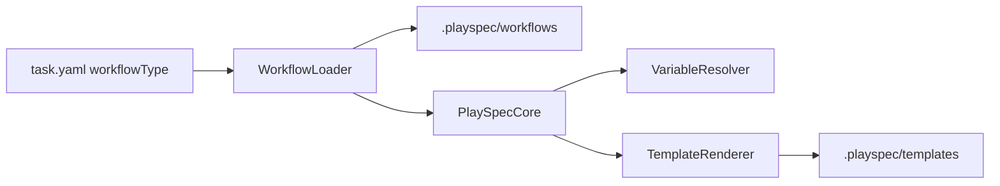
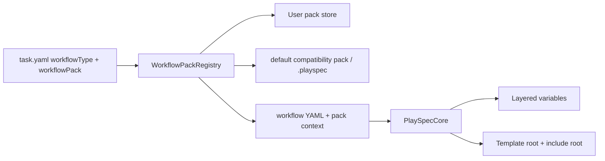

# Workflow Template Packs Technical Spec

## Scope

Implement GitHub issue #30: workflow/template packs as first-class runtime
assets with declarative variable defaults. The implementation must preserve
existing `.playspec` workflow/template compatibility while allowing installed
packs outside project state.

In scope:

- `playspec-pack.yaml` manifest validation.
- Local directory and `.tgz` archive install into user pack storage.
- Pack listing, show, remove, validate, install, and export CLI commands.
- `playspec create ... --pack <packId>` and persisted `workflowPack`.
- Workflow and template rendering from the selected pack.
- Declarative variables at pack, workflow, and phase layers.
- Clear failures for unknown/circular variable defaults and unresolved required
  variables.
- Default pack compatibility for existing tasks and preset workflows.
- Planning artifact declarations with legacy `TOTAL_SPEC_FILE` and
  `PHASE_PLAN_FILE` fallback.

Out of scope:

- Git URL pack install.
- Viewer behavior.
- Auto-apply evolution proposals.
- Removing `.playspec` runtime asset compatibility.

## Use Case Alignment

Template and workflow authors should be able to introduce variables like
`TECH_SPEC_FILE` in a pack manifest/workflow YAML and then use those variables
inside templates without editing TypeScript. Project `.playspec` remains task
state and a compatibility asset source, not the only runtime registry.

## High-Level Current Implementation Summary

Verified:

- `PresetManager.initWorkspace()` copies bundled assets into `.playspec`.
- `WorkflowLoader.load()` reads `.playspec/workflows/<workflowType>.yaml`.
- `TemplateRenderer.render()` reads `.playspec/templates/<templatePath>`.
- `VariableResolver.resolve()` hardcodes workflow-specific path variables.
- Tasks store `workflowType` but no pack identity.
- `create --phase --from` derives planning context filenames directly from
  legacy `TOTAL_SPEC_FILE`/`PHASE_PLAN_FILE` formulas.

Inferred:

- The current default preset behaves as both starter project state and runtime
  asset registry.
- Compatibility requires leaving the hardcoded legacy variable behavior in
  place unless a declarative default overrides it.

## Relevant Files Reviewed

- `src/template/variable-resolver.ts`
- `src/template/template-renderer.ts`
- `src/template/template-loader.ts`
- `src/workflow/workflow-loader.ts`
- `src/core/playspec-core.ts`
- `src/core/types.ts`
- `src/core/schemas.ts`
- `src/storage/yaml-task-store.ts`
- `src/utils/paths.ts`
- `src/preset/preset-manager.ts`
- `src/cli/commands/init.ts`
- `src/cli/commands/create.ts`
- `src/cli/commands/prompt.ts`
- `src/cli/commands/next.ts`
- `src/cli/commands/specs.ts`
- `src/core/relevant-files.ts`
- `src/preset/assets/default/workflows/mono-spec.yaml`
- `src/preset/assets/default/workflows/total-plan.yaml`
- relevant mono-spec and total-plan templates
- focused unit/integration/CLI tests listed in the issue

## Active Entry Points And Bypasses

Active entry points:

- CLI `create` creates tasks and sets HEAD.
- CLI `prompt` and deprecated `next` render prompts through `PlaySpecCore`.
- CLI `complete` snapshots prompts and advances workflow state.
- CLI `specs` discovers relevant files from variables, outputs, and templates.
- Direct core callers use `PlaySpecCore.renderNextPrompt()` and
  `renderExplicitPhasePrompt()`.

Bypasses and compatibility paths:

- Old tasks have no `workflowPack`; they must continue loading `.playspec`
  workflows/templates.
- Direct `YamlTaskStore.createTask()` callers need optional pack support without
  breaking tests.
- `TemplateLoader` is still a direct `.playspec` template reader and should keep
  compatibility unless callers opt into pack roots.
- Phase-execution linking currently bypasses workflow metadata and must gain an
  artifact-aware path before falling back.

## Current Architecture

Verified flow:

Proposed flow:

## Verified Behavior

- Missing required variables already fail through
  `MissingRequiredVariablesError`.
- Missing template variables already fail through `UnresolvedPlaceholderError`.
- Existing default workflows render from `.playspec`.
- Existing path variables include mono-spec stable files and total-plan legacy
  files.
- `specs` already benefits from resolved path-like variables and workflow
  `outputs`.

## Problems

- Workflow-specific defaults are hardcoded in TypeScript.
- Runtime workflows/templates are project-local, not shareable/versioned assets.
- Tasks cannot identify which pack supplied a workflow.
- Pack install/export/validation commands do not exist.
- Phase-execution planning context uses hidden filename formulas.
- Variable default failures cannot identify pack/workflow default cycles because
  declarative defaults do not exist yet.

## Proposed Direction

Add a `#pack` module containing:

- Manifest zod schema and type exports.
- User data pack storage path helpers.
- Installer/exporter for local directories and `.tgz` archives.
- Registry that resolves `(packId, workflowId)` to workflow content and template
  roots.

Extend workflow/task schemas:

- `workflowPack` task reference.
- `variables` declarations at workflow and phase levels.
- `artifacts` declarations at workflow level.

Layer variable resolution:

1. Engine built-ins.
2. Legacy compatibility file defaults.
3. Pack-level defaults.
4. Workflow-level defaults.
5. Phase-level defaults.
6. Task variables.

Evaluate declarative defaults as Handlebars templates over already resolved
variables. Detect unknown placeholders and dependency cycles before rendering
templates.

## File-By-File Plan

- `package.json`, `tsconfig.json`: add `#pack/*.js` alias and package archive
  support if no new runtime dependency is needed.
- `src/utils/paths.ts`: add OS user data and pack storage helpers.
- `src/pack/pack-schema.ts`: validate `playspec-pack.yaml`.
- `src/pack/pack-registry.ts`: resolve built-in/default, installed, archive, and
  `.playspec` compatibility sources.
- `src/pack/pack-installer.ts`: validate/copy/remove/export packs.
- `src/cli/commands/pack.ts`: implement pack subcommands.
- `src/cli/index.ts`: register `pack` and `create --pack`.
- `src/core/types.ts`, `src/core/schemas.ts`: add pack refs, variable
  declarations, artifacts.
- `src/storage/yaml-task-store.ts`: persist optional `workflowPack`.
- `src/workflow/workflow-loader.ts`: resolve pack workflows with fallback.
- `src/template/template-renderer.ts`: render from a selected template root and
  include root while preserving `.playspec` default behavior.
- `src/template/variable-resolver.ts`: add declarative layered defaults.
- `src/core/playspec-core.ts`: pass resolved pack context into workflow,
  variable, and template rendering.
- `src/cli/commands/create.ts`: store pack refs and resolve planning artifacts
  from workflow metadata.
- `src/core/relevant-files.ts`: include declared artifacts and pack rendering.
- default preset assets: add `playspec-pack.yaml` and declarative variables.
- tests: add pack schema/install/export/render/custom variable coverage, and
  preserve existing default render tests.

## Risks And Open Questions

- Installed pack mutability can affect old tasks. Versioned install paths reduce
  accidental mutation, but this implementation will not enforce content hashes.
- Archive export/install should avoid path traversal and should validate the
  unpacked manifest before installation.
- The first implementation should support local directory and generated `.tgz`
  archives only; Git URLs can be a later feature.
- `workflowPack.source` values should be simple and descriptive: `builtin`,
  `user`, or `project`.
